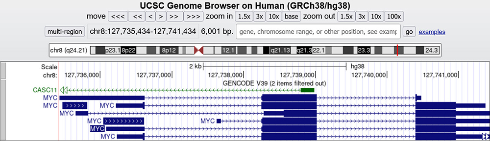

# Module 2: Lab Assignment 1
---

## What is a genome browser? [1]

Genome browsers *integrate genomic sequence and annotation data* from different sources and provide a platform to search, browse, retrieve, and analyze genomic data.

They *differ from ordinary biological databases* in that they display data in a graphical format, with genome coordinates on one axis with annotations or space-filling graphics to show analyses of the genes, such as the frequency of the genes, their expression profiles, etc.

**What is meant by annotation of data?**

- Annotation means attaching biological information to sequences.

[1]:https://www.youtube.com/watch?v=s3JkAEAhkt8

---

## Importance of Genome Browser [1]

- *Supports text and sequence-based searches* that provide quick, precise access to any region of interest.
- *Visualize and browse entire genomes* with annotated data including gene prediction and structure, proteins, expression, regulation, variation, comparative analysis, etc. Annotated data is usually from multiple diverse sources.
- *View and interpret the many different types of data* that can be anchored to genomic positions. These include variation, transcription.
- Many large genomic projects also incorporate genome browsers into their web portals to enable users to easily search and view the data. These include:
    1. GTEx
    2. gnomAD

[1]:https://www.youtube.com/watch?v=s3JkAEAhkt8

---

## Direction of arrows: 5’ > 3’ of a gene [2]<\sup>

 
 
 

[2]: https://genome.ucsc.edu/training/education/fivePrime.html

---

## Find the UTRs [2]

 
 
 

[2]: https://genome.ucsc.edu/training/education/fivePrime.html

---

## Identify strand direction and exon [2]

 
 
 

[2]: https://genome.ucsc.edu/training/education/fivePrime.html

---

## Find disease variants using OMIM track

Different variants of PLP1 are associated with different disease states [3]

[3]: http://genome.ucsc.edu/s/education/hg19_PLP1

---

## Find tissue-specific gene expression using GTEx V8 track

> ### Tissue Specificity of Human Disease Module [4]
> - Disease-associated genes are more likely to exhibit tissue-specific expression than non-disease-associated genes 
> - The integration of gene expression, disease manifestation, molecular network connectivity, and tissue specificity data leads to better predictions of novel disease-gene candidates than any of these elements alone

[4]: https://doi.org/10.1038/srep35241 "Kitsak, M., Sharma, A., Menche, J. et al. Tissue Specificity of Human Disease Module. Sci Rep 6, 35241 (2016)."

---

## Find tissue-specific gene expression using GTEx V8 track

- How do gene expression at specific tissues relate to the clinically expressed symptoms of this disease?

---

## Locate regulatory elements using ENCODE Tracks[5]

 
- Data is an overlay from **seven different cell lines**.

[5]: https://genome.ucsc.edu/s/alicewchen/hg38_KMT2A

---
## Locate regulatory elements using ENCODE Tracks[5]

- **H3K Tracks: Height represents intensity** of acetylation of lysine on the H3 histone.
    - Higher peaks = more acetylation
    - High histone acetylation often indicates regulatory elements.
- **DNase I Hypersensitivity Track:** peaks indicate potential regulatory or promoter regions

[5]: https://genome.ucsc.edu/s/alicewchen/hg38_KMT2A

---

## Find conserved regions using Conservation Tracks[5]

- Highly conserved sequences often have important biological functions
    - Exons are highly conserved across species.
- Most pathogenic variants are located at conserved positions (high positive phyloP scores)[6]

[5]: https://genome.ucsc.edu/s/alicewchen/hg38_KMT2A
[6]: https://doi.org/10.1038/s41598-018-38189-9

---

## Lab Assignment 1 Instructions

- You are assigned to a group.  Each group is responsible for one genetic disease from Module 14.
- Use the gene of interest for your group's genetic disease to complete Lab Assignment 1.

---