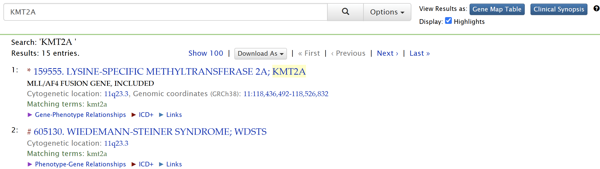

# Lab 1: Understanding the Genetic Basis of Diseases Using Public Resources

---

| Database | Purpose |
|----|----|
| [UCSC Genome Browser](http://genome.ucsc.edu/) | Provides genomic and epigenomic data, including visualization tools for genome annotations. |
| [OMIM](https://www.omim.org/) | A database of human genes and genetic disorders. Use this to investigate gene-disease relationships and find information on genetic disorders. |
| [GeneCards](https://www.genecards.org/)| Integrates information about genes, their functions, expression, and and relevance to diseases. |
| [GeneReviews](https://www.ncbi.nlm.nih.gov/books/NBK1116/)| Expert-authored summaries on genetic conditions, including diagnostic and treatment guidelines.|

---

## What is a genome browser? [1]

Genome browsers *integrate genomic sequence and annotation data* from different sources and provide a platform to search, browse, retrieve, and analyze genomic data.

They *differ from ordinary biological databases* in that they display data in a graphical format, with genome coordinates on one axis with annotations or space-filling graphics to show analyses of the genes, such as the frequency of the genes, their expression profiles, etc.

**What is meant by annotation of data?**

- Annotation means attaching biological information to sequences.

[1]:https://www.youtube.com/watch?v=s3JkAEAhkt8

---

## Gene Transcription

- Transcription starts at transcription start site (TSS) upstream of translation start site.
- Must end downstream of translation stop site (stop codon)
- 5' UTR is transcribed but not translated
- Enhancers are transcription factor binding sites that helps promoter to bind

---

## Gene Transcription

- Genes have promoters upstream of TSS (+1).
- Most promoters range from 100 to 1000 bp in length.
- Transcription can also be affected by **enhancers** and **repressors**. Both enhancers and repressors bind remotely from the ‘core promoter’ (up to 2–3 Mbp in some genomes)

---

## 3' UTR and Transcription Termination

- Bacteria don't have 3' UTR. They use use hairpins and U-rich sequence to terminate
transcription.
- Eukaryotes remove part of the 3’ end and add poly(A) tail to transport transcripts out of the nucleus.

---

## Find the UTRs [2]

[2]: https://genome.ucsc.edu/training/education/fivePrime.html

---

## Identify strand direction and exon [2]

- Direction of arrows: 5’ > 3’ of a gene
- Exons: solid blue bars
 

---

## Find disease variants using OMIM track

Different variants of PLP1 are associated with different disease states [3]

[3]: http://genome.ucsc.edu/s/education/hg19_PLP1

---

## Find tissue-specific gene expression using GTEx V8 track

> ### Tissue Specificity of Human Disease Module [4]
>
> - Disease-associated genes are more likely to exhibit tissue-specific expression than non-disease-associated genes
> - The integration of gene expression, disease manifestation, molecular network connectivity, and tissue specificity data leads to better predictions of novel disease-gene candidates than any of these elements alone

[4]: https://doi.org/10.1038/srep35241 "Kitsak, M., Sharma, A., Menche, J. et al. Tissue Specificity of Human Disease Module. Sci Rep 6, 35241 (2016)."

---

## Find tissue-specific gene expression using GTEx V8 track

- Genes can be expressed ubiquitously or only in a specific cell type
- How do gene expression at specific tissues relate to the clinically expressed symptoms of this disease?

---

## Distribution of histone modifications on active genes[5]

- Acetylated histones are found at or around most actively transcribed regions.
- High levels of active modifications such as acetylations and methylation of H3K4 indicate an actively transcribed gene.

[5]:http://dx.doi.org/10.1016/j.tibs.2010.05.006 "Barth, T.K. & Imhof, A. Fast signals and slow marks: the dynamics of histone modifications. Trends Biochem. Sci. 35, 618–626 (2010)."
<!-- # Speaker notes: An external signal can lead to the activation of kinases (orange) in the nucleus, which can then phosphorylate (yellow circles) histones as well as transcription factors (TF, red) to elicit an appropriate physiological response. The transcription factors will then bind DNA at the promoter and facilitate the docking of RNA polymerase II (RNAPII, green). At this point, transcription can begin. Elongating RNA polymerase II, which is highly phosphorylated on its C-terminal domain, can interact with histone modifiers (pink), for example Set2, which methylates H3K36 [75], and thus introduce active modifications into chromatin at this locus. In particular, nucleosomes within the promoters of actively transcribed genes carry high levels of active modifications such as acetylations and methylation of H3K4. At the transcriptional start site there is a nucleosomedepleted region (NDR) within the promoter. Active modifications such as methylation of H3K79 are present in the body of these genes. -->

---

## Distribution of histone modifications on active genes[5]

- The acetylation or the phosphorylation of histones serve to modulate gene expression in response to external signals rather than by establishing a stable gene expression pattern.
- The methylation of histones plays a key role in the stabilization of epigenetic traits.
  - Genetics mutations affecting histone lysine methyltransferases or proteins that bind to methylated lysines frequently lead to major developmental defect. (e.g. KMT2A)

---

## Distribution of histone modifications on silenced genes[5]

- H3K9 methylation and H4K20 methylation are silencing modifications that are evenly distrbuted across inactive genes.
- H3K27 methylation is enriched in the promoter.

---

## Locate regulatory elements using ENCODE Tracks[6]

- Data is an overlay from **seven different cell lines**.

[6]: https://genome.ucsc.edu/s/alicewchen/hg38_KMT2A

---

## Locate regulatory elements using ENCODE Tracks[5]

- **H3K Tracks: Height represents intensity** of acetylation of lysine on the H3 histone.
  - Higher peaks = more acetylation
  - High histone acetylation often indicates regulatory elements.
- **DNase I Hypersensitivity Track:** indicate where chromatin is hypersensitive to cutting by the DNase enzyme
  - peaks indicate potential regulatory or promoter regions

---

## Evolutionary conservation of human DNA sequences

- Highly conserved sequences often have important biological functions.
- Sometimes functionally relevant sequences can be poorly conserved due to rapid evolution.

---

## Find conserved regions using Conservation Tracks[5]

- Most pathogenic variants are located at conserved positions (high positive phyloP scores)[6]

---

## OMIM

- OMIM focuses on the relationships between phenotypes and genes.
- Not all genes have allelic variants; not all phenotypes are mapped; not all phenotypes have Clinical Synopses; and mapped phenotypes are not necessarily part of a Phenotypic Series.

---

## OMIM

1) Search by name of the gene or genetic disorder.

---

2) There are a few ways to view the search results. This is the default view.

---

3) Select "Gene Map Table"

Now, you can see more information (e.g. phenotype and inheritance pattern)

---

## OMIM: Disease Variants

- You can find disease-causing variants in the **Allelic Variants** section of gene entries.

---
* Note any relevant information
  - the first mutation to be discovered,
  - high population frequency,
  - distinctive phenotype,
  - historic significance,
  - unusual mechanism of mutation,
  - unusual pathogenetic mechanism,
  - distinctive inheritance

---

## Lab Assignment 1 Instructions

- You are assigned to a group.  Each group is responsible for one genetic disease from Module 14.
- Use the gene of interest for your group's genetic disease to complete Lab Assignment 1.
