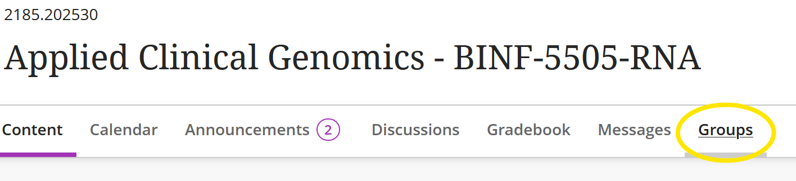

# Module 2: Disease Inheritance and Expression

---

## Lesson Outline

- Monogenic Inheritance
- Variable expression of monogenic diseases
- Polygenic Inheritance
- Variable expression of polygenic diseases

---

## Categories of Heritable Diseases

- Chromosome disorders: cased by change in dosage of genes located on entire chromosomes or chromosome segments (e.g. Down Syndrome)
- **Monogenic disorder**: caused by pathogenic mutations in individual genes.
- **Polygenic diseases**: results from the combined impact of variants in many different genes

---

## Monogenic Inheritance

Core Mendelian principles underlying monogenic inheritance patterns:

- **Law of Segregation**: each individual carries two alleles for a given gene, one from each parent, and these alleles segregate during the formation of gametes
  - explains how a single genetic variant (**allele**) from one parent can influence the traits of an offspring
- **Law of Independent Assortment**: the inheritance of one gene does not affect the inheritance of another, as long as they are on separate chromosomes

---

## Autosomal Dominant Disorder

- Caused by a mutation in a single allele of a gene located on one of the autosomal chromosomes
- An affected person has one normal allele and one mutant allele.
- Both males and females are equally affected because autosomes are not sex-linked.
- Example: Huntington's Disease

---

## Autosomal Recessive Disorder

- Caused by mutations in both alleles of a gene located on an autosomal chromosome (usually leading to a loss of function)
- Individuals with only one mutant allele (**heterozygotes**) are **carriers** and typically asymptomatic.
- **Consanguinity** (mating between close relatives) increases the probability of recessive disorders
- Example: Cystic fibrosis, sickle cell anemia

---

## X-Linked Dominant Disorder

- Caused by a mutation in one allele of a gene located on the X chromosome.
- One copy of the mutant allele in either males or females is enough.
- Males tend to be more severely affected because they have only one X chromosome
- Affected females may have a milder phenotype due to **X-chromosome inactivation**, where some cells randomly inactivate the X chromosome carrying the mutant allele

---

## X-Linked Recessive Disorder

- Primarily expressed in males. Since they have only one X chromosome, a single mutant allele on the X chromosome is enough.
- Females are typically carriers and may not show symptoms due to the presence of a second, normal X chromosome.

---

## Y-Linked Disorder

- The trait is caused by a mutation in one allele of a gene located on the Y chromosome.
- These traits do not affect females as they do not inherit the Y chromosome.
- **Male-to-male transmission**
- Example: Some forms of male infertility

<!-- # Speaker notes: 
Since only males inherit the Y chromosome from their fathers, Y-linked traits are passed exclusively from father to son but none to the daughter.
-->
---

## Mitochondrial DNA Inheritance

- Mitochondrial inheritance **does not** follow typical Mendelian rules.
- Disorders typically affect high-energy tissues like muscles and the brain due to mitochondria’s role in energy production.
- **Matrilineal inheritance**: Affected mothers pass the mtDNA mutation to all of their children (both sons and daughters), but only females pass it on to the next generation. Affected males do not transmit the disorder.
- Examples:
  - **Leber’s Hereditary Optic Neuropathy (LHON)**: Causes vision loss due to mitochondrial dysfunction.
  - **Myoclonic Epilepsy with Ragged-Red Fibers (MERRF)**: Affects muscles and the nervous system.

---

# Variable Expression in Genetic Disorders

1. X-chromosome Inactivation
2. Mosaicism
3. Genomic Imprinting
4. Non-Penetrance and Age-Related Penetrance
5. Heteroplasmy

---

<main id="main" style="display: flex; border: 1px; padding: 1px;">

<left style="flex: 1; padding-right: 1px;background-color:rgb(255, 255, 255);" markdown="span">

## 1. X-chromosome Inactivation

- Some cells in females randomly inactivate one of the X chromosomes carrying the mutant allele during early embryonic development
- **Unbalanced/skewed X inactivation** occurs when the fraction of cells in various tissues of carrier females in which the normal or pathogenic allele happens to remain active deviate substantially from the expected 50%

</left>
<right id="col_right" style="flex: 1; padding-left: 1px;background-color:rgb(255, 255, 255);font-size:14pt" markdown="span">

Mosaic expression of a mutant X-linked gene, such as FoxP3, in females depends on X chromosome inactivation. Growth of cells carrying a mutant allele can be actively suppressed by negative selection resulting in skewed X inactivation.[1]

</right>
</main>

[1]:(https://doi.org/10.1016/j.cell.2007.06.008) "Medema, R. H. & Burgering, B. M. T. The X Factor: Skewing X Inactivation towards Cancer. Cell 129, 1253-1254 (2007). https://doi.org/https://doi.org/10.1016/j.cell.2007.06.008"

<!--Depending on the pattern of random inactivation of the two X chromosomes, two female heterozygotes for an X-linked disease may have very different clinical presentations because they differ in the proportion of cells that have the pathogenic allele on the active X in a relevant tissue-->
---

## 2. Mosaicism
<main id="main" style="display: flex; border: 1px; padding: 10px;">

<left style="flex: 1; padding-right: 1px;background-color:rgb(255, 255, 255);" markdown="span">

- Occurs when at least two cell lineages that differ genetically but are derived from a single zygote are expressed in an individual or a tissue
- Many types of expression: pure somatic, pure germline, or both
- **Segmental mosaicism**: occurs when the mutation affects morphogenesis and manifests as a segmental or patchy abnormality

[Image source](https://doi.org/10.1038/nrg906)

</left>
<right id="col_right" style="flex: 1; padding-left: 1px;background-color:rgb(255, 255, 255);" markdown="span">

</right>
</main>

<!--    
- Pure somatic: present in some tissues of the embryo but not in the gametes 
- Pure germline: restricted to the gamete lineage only and nowhere else 
- Present in both somatic lineages and the germline
Schematic representation of a mutation occurring after conception, during mitotic cell divisions . Such a mutation can lead to a proportion of cells carrying the mutation – that is, to either somatic or germline mosaicism, depending on the stage of embryonic or postnatal development where the mutation occurred.
-->
---

## 3. Genomic Imprinting

<main id="main" style="display: flex; border: 1px; padding: 1px;">

<left style="flex: 1; padding-right: 1px;background-color:rgb(255, 255, 255);" markdown="span">

- Occurs when the sex of the parent who transmits the pathogenic allele determines whether there is expression of the disorder in a child.
- Methylation marks the imprinted genes differently in egg and sperm, and inheritance of these epigenetic marks leads to differential gene expression.
- Examples: Prader-Willi syndrome, Angelman syndrome

</left>

<right id="col_right" style="flex: 1; padding-left: 1px;background-color:rgb(255, 255, 255);" markdown="span">

[Image source](https://doi.org/10.1038/35047554)

</right>
</main>

---

## 4. Non-Penetrance and Age-Related Penetrance

- **Non-Penetrance**: Occurs when an individual carries a disease-causing genetic mutation but does not exhibit any symptoms of the disease.
  - Example: Some carriers of BRCA1/BRCA2 mutations never develop breast or ovarian cancer despite having high-risk mutations.
  - Mechanisms:
    - Other genes that suppress/enhance the expression of the mutation.
    - Lifestyle factors or exposures that mitigate disease development.
    - Epigenetic modifications modulating gene expression without altering DNA sequence.

---

## 4. Non-Penetrance and Age-Related Penetrance

- **Age-Related Penetrance**: The likelihood of expressing a genetic trait increases with age.
  - Example: Neurodegenerative symptoms of Huntington's disease typically appear between ages 30 and 50.
  - Mechanisms:
    - Cumulative exposure: Prolonged exposure to environmental factors.
    - Biological aging: Age-related decline in cellular repair mechanisms.
    - Late-onset gene activation: Some genes are expressed or become problematic only later in life.

---

## 5. Heteroplasmy

- The expression of a pathogenic variant in mtDNA depends on the relative proportions of normal and variant mtDNA in the cells making up different tissues
- Most pathogenic variants in mtDNA are only present and transmitted in a state of heteroplasmy
  - Exceptions: disorders that are either incompletely penetrant or are not reproductively lethal (e.g. Leber hereditary optic neuropathy)

<!-- Replicative segregation of a heteroplasmic mitochondrial variant . Random partitioning of variant and wild-type mtDNA through multiple rounds of mitosis produces a collection of daughter cells with wide variation in heteroplasmy. Cell and tissue dysfunction results when the fraction of mitochondria that are carrying a variant exceeds a threshold level. N , Nucleus. Since the # of mitochondria per cell can vary widely and some individuals may have a mixture of normal and mutant mitochondria within their cells, this can result in variability in disease expression and severity among individuals, even within the same family.-->

---

## Polygenic Diseases

- Results from the combined effect of variants in many different genes
- Each variant may cause, protect from, or predispose to a serious defect, often in concert with or triggered by environmental factors
- The same genetic variants can lead to different phenotypic expressions among individuals
  - Does not follow Mendelian inheritance patterns
- Examples: Breast and ovarian cancer, diabetes and inflammatory bowel diseases

---

## Variable Expression through Genetic Factors

- **Allelic Variability**: Different combinations of disease variants can lead to varying disease severity.
- **Gene-Gene Interactions** (Epistasis): One gene's effect can be modified by one or several other genes.
- **Copy Number Variations**: Differences in the number of copies of a particular gene can influence expression.

**(We will go through these in more detail in later modules)**

---

## Variable Expression through Gene-Environment Interaction

- Environmental factors can modify gene expression and disease risk,  so the same combinations of disease variants can lead to different outcomes based on environmental exposures.
- Lifestyle factors: diet, physical activity, substance use
- Physical environment: pollutants, toxins, climate, geography
- Psychosocial factors: stress, socioeconomic status

**(We will go through these in more detail in later modules)**

---

## Variable Expression through Epigenetic Effects

- **Gene regulation**: Epigenetic modifications can activate or repress genes, leading to variability in disease phenotypes among individuals with similar genetic backgrounds.
- **Environmental interactions**: Lifestyle factors like diet, stress, and exposure to toxins can induce epigenetic changes influencing disease risk.
- **Intergenerational effects**: Some epigenetic marks can be transmitted to offspring, affecting their susceptibility to diseases.

**(We will go through these in more detail in later modules)**

---

## Lab 1a: Navigating Public Databases

The class is assigned into 6 groups of 4-5 students. You can find your group on Blackboard.

---

## Lab 1a: Navigating Public Databases

Each group is assigned a monogenic/polygenic disease (see **Module 14: Case Study Topics** for more details). 

For Lab 1a, you will be using the gene associated with your assigned disease. You may work with your group but the lab assignment must be submitted individually.