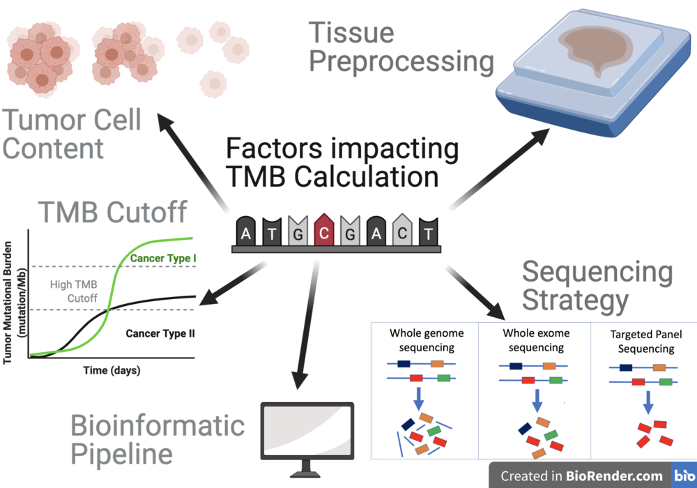
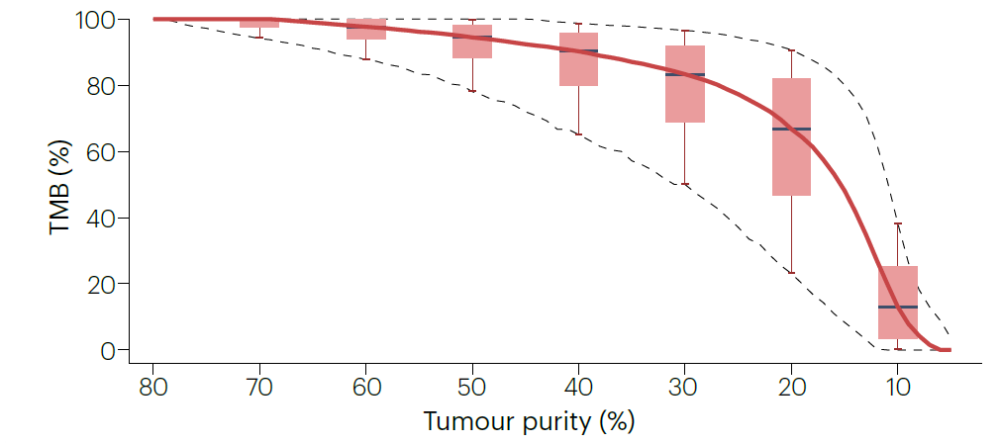
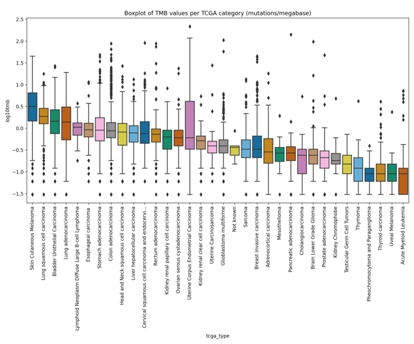
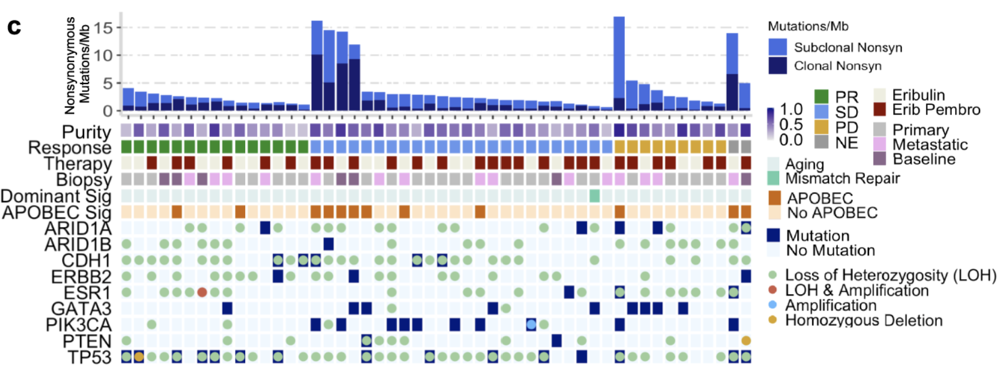
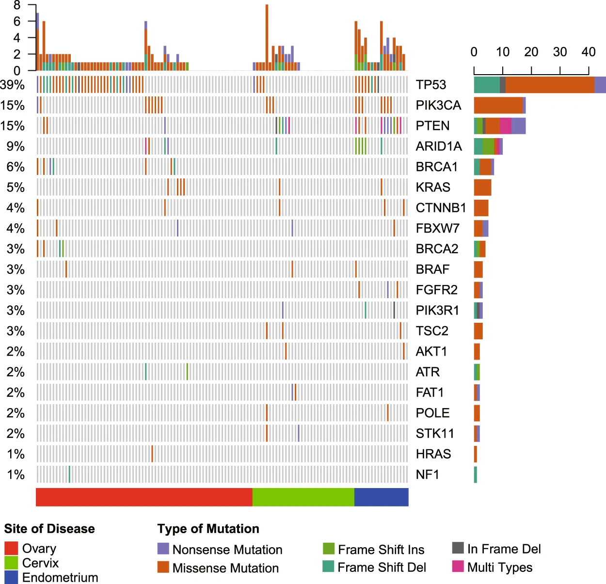
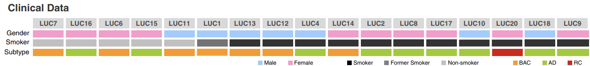
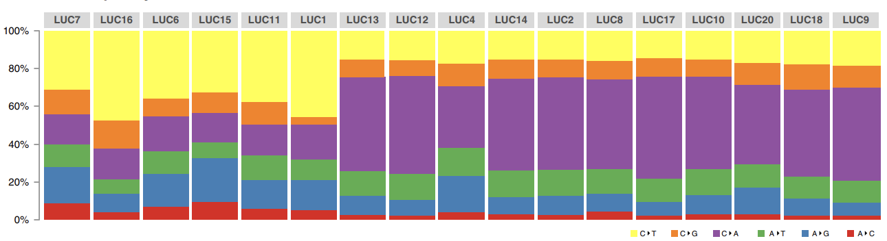

# Lab 1b: GenVisR

----

## What is GenVisR? [1]

- Bioconductor package ([link](https://www.bioconductor.org/packages/3.3/bioc/html/GenVisR.html), [intro](https://www.bioconductor.org/packages/3.3/bioc/vignettes/GenVisR/inst/doc/GenVisR_intro.html))
- Github repo ([link](https://github.com/griffithlab/GenVisR))
- Highly customizable, publication-quality graphics focused on cohort level genome analyses.
- The package is maintained by the Griffith lab.
- [license](https://creativecommons.org/licenses/by-sa/4.0/)

[1]:https://doi.org/10.1093/bioinformatics/btw325 "Skidmore ZL, Wagner AH, Lesurf R, Campbell KM, Kunisaki J, Griffith OL, Griffith M. GenVisR: Genomic Visualizations in R. Bioinformatics. 2016 Oct 1;32(19):3012-4. doi: 10.1093/bioinformatics/btw325."

----

## waterfall()

### What does it do?

• Visualize the types of mutations within a cohort
• Visualize the **mutation burden** in a data set
• Visualize the proportion of samples with a mutated gene
• Visualize clinical data

### Why do we care?

• Determine mutually exclusive or co-occurring genomic events
• Recognize patterns within clinical data
• See if the mutation burden conforms to expectations

----

### Mutation Burden

Generically defined as the total number of mutations (changes) found in the DNA of cancer cells, but different studies use different formulas [2]

The `Waterfall()` function uses the following formula to estimate mutation burden:

`(# of mutations)/(coverage space) * 1,000,000`

#### Why do we care?

- Knowing the tumor mutational burden may help plan the best treatment.
- Tumors that have a high number of mutations appear to be more likely to respond to certain types of immunotherapy (e.g. [Keytruda](https://www.cancer.org/cancer/latest-news/fda-approves-first-drug-for-cancers-with-a-high-tumor-mutational-burden.html)). Tumor mutational burden (TMB) is being used as a type of biomarker. [3]

[2]:(https://doi.org/10.1186/s12885-022-09897-3) "Makrooni, M.A., O’Sullivan, B. & Seoighe, C. Bias and inconsistency in the estimation of tumour mutation burden. BMC Cancer 22, 840 (2022)."
[3]:(https://doi.org/10.21037/tlcr.2018.08.02) "Meléndez, B., Van Campenhout, C., Rorive, S., Remmelink, M., Salmon, I., & D'Haene, N. (2018). Methods of measurement for tumor mutational burden in tumor tissue. Translational lung cancer research, 7(6), 661–667."

----

### Mutation Burden

<main id="main" style="display: flex; border: 1px; padding: 10px;">

<left style="flex: 1; padding-right: 1px;background-color:rgb(255, 255, 255);" markdown="span">

#### Factors that influence TMB calculation

[Image Source](https://commons.wikimedia.org/wiki/File:Factors_influencing_TMB_Calculation.png)

</left>
<right id="col_right" style="flex: 1; padding-left: 1px;background-color:rgb(255, 255, 255);" markdown="span">

- Greater tumor cell content and sequencing coverage enable more accurate TMB calculation.[3]

</right>
</main>

----

### Mutation Burden

<main id="main" style="display: flex; border: 1px; padding: 10px;">

<left style="flex: 1; padding-right: 1px;background-color:rgb(255, 255, 255);" markdown="span">

#### Factors that influence TMB calculation

[Image Source](https://commons.wikimedia.org/wiki/File:Factors_influencing_TMB_Calculation.png)

</left>
<right id="col_right" style="flex: 1; padding-left: 1px;background-color:rgb(255, 255, 255);" markdown="span">

- Tumor tissues are fixated in formalin to preserve tissue and cellular morphology in the formalin-fixed paraffin-embedded (FFPE) protocols have sequence artifacts that can affect TMB calculations.[3]

</right>
</main>

----

### Mutation Burden

<main id="main" style="display: flex; border: 1px; padding: 10px;">

<left style="flex: 1; padding-right: 1px;background-color:rgb(255, 255, 255);" markdown="span">

#### Factors that influence TMB calculation

[Image Source](https://commons.wikimedia.org/wiki/File:Factors_influencing_TMB_Calculation.png)

</left>
<right id="col_right" style="flex: 1; padding-left: 1px;background-color:rgb(255, 255, 255);" markdown="span">

- The greater number of genes (e.g. WES, WGS) sequenced the greater the confidence of TMB estimation.[3]
- TMB calculations generally filter out  synonymous variants and germline variants.[3] **Did your variant calling pipeline do this?**
  - The choice of variant callers and other software in the downstream analyses may also affect TMB calculation.[3]

</right>
</main>

----

#### TMB Cut-off

TMB varies by cancer type, so there is no single best TMB cut-off threshold

----

## How to read a waterfall plot

<main id="main" style="display: flex; border: 1px; padding: 1px;">

<left style="flex: 3; padding-right: 1px;background-color:rgb(255, 255, 255);font-size:18pt" markdown="span">

Source: [Keenan *et al.* Nat Commun (2021)](https://doi.org/10.1038/s41467-021-25769-z)

</left>
<right id="col_right" style="flex: 1; padding-left: 1px;background-color:rgb(255, 255, 255);font-size:18pt" markdown="span">

NE=not evaluable; PD=progressive disease; PR=partial response; SD=stable disease

</right>
</main>

- Some samples have high mutational loads dominated by clonal mutations (suggesting early events in tumor evolution) or subclonal mutations (indicating later events).

----

## How to read a waterfall plot

<main id="main" style="display: flex; border: 1px; padding: 1px;">

<left style="flex: 3; padding-right: 1px;background-color:rgb(255, 255, 255);font-size:18pt" markdown="span">

Source: [Keenan *et al.* Nat Commun (2021)](https://doi.org/10.1038/s41467-021-25769-z)

</left>
<right id="col_right" style="flex: 1; padding-left: 1px;background-color:rgb(255, 255, 255);font-size:18pt" markdown="span">

NE=not evaluable; PD=progressive disease; PR=partial response; SD=stable disease

</right>
</main>

- Genes like PIK3CA and GATA3 show frequent mutation (high % samples with mutation)

----

## How to read a waterfall plot

<main id="main" style="display: flex; border: 1px; padding: 1px;">

<left style="flex: 1; padding-right: 1px;background-color:rgb(255, 255, 255);font-size:18pt" markdown="span">

Source: [Wang *et al.* Sci Rep (2018)](https://doi.org/10.1038/s41598-018-25583-6)

</left>
<right id="col_right" style="flex: 1; padding-left: 1px;background-color:rgb(255, 255, 255);font-size:22pt" markdown="span">

- The mutations in TP53 and PIK3CA are mostly missense mutations.
- BRCA1 and BRCA2 mutations occurred in affected ovary tissues but not in cervix and endometrium tissues.

</right>
</main>

----

## How to read a waterfall plot

<main id="main" style="display: flex; border: 1px; padding: 1px;">

<left style="flex: 1; padding-right: 1px;background-color:rgb(255, 255, 255);font-size:18pt" markdown="span">

Source: [Wang *et al.* Sci Rep (2018)](https://doi.org/10.1038/s41598-018-25583-6)

</left>
<right id="col_right" style="flex: 1; padding-left: 1px;background-color:rgb(255, 255, 255);font-size:22pt" markdown="span">

- TP53 is the most frequently mutated gene. It has a high number of missense mutations (orange) and some nonsense mutations (purple), which is consistent with its role as a tumor suppressor gene.  Most of the cancers demonstrate a biallelic loss-of-function mutation in TP53.[4]

</right>
</main>

[4]:(https://www.ncbi.nlm.nih.gov/books/NBK532243/) "Joyce C, Rayi A, Kasi A. Tumor-Suppressor Genes. [Updated 2023 Aug 28]. In: StatPearls [Internet]. Treasure Island (FL): StatPearls Publishing; 2025 Jan-."

----

## Ti/Tv plot

### What does it do?

• Visualize Transition and Transversion proportions
• Visualize Transition and Transversion frequencies
• Compare these proportions with expectations

### Why do we care?

• Visualize mutation profile patterns
• Ex. Smoking tends to increase G>T or C>A transversions due to oxidative damage
• Practical application verify smoking status of patients with lung carcinomas

----

## Ti/Tv plot

Source: [Tan *et al.* Cell Reports Medicine (2023)](https://doi.org/10.1016/j.xcrm.2023.101335)

----

## Lab 1b Instructions

- Lab 1b runs on R kernel in a Jupyter notebook, but you may create an `.R`/`.rmd` file to run your code using the RStudio IDE on CoCalc (see instructions [here](https://doc.cocalc.com/R_IDE.html))
- Do make sure your final code is in `lab_1b.ipynb`. This is version that I'll collect.
- You may work in groups, but the final submission is individual.
- If you complete the lab early, you may work on **Group Assignment #1**.

----

## Lab 1b Correction: Mutation Burden in Waterfall plot

"If a cancer has a high tumor mutation burden level of **10 mut/Mb** or greater, it’s more likely to respond to immunotherapy medication. This means that a specific drug type—immune checkpoint inhibitors—may activate the immune system to help the body recognize cancer cells. With more mutations, the higher the chance that one of the mutations will be able to identify and target cancer cells."

"Cancers with low tumor mutation burden levels of **10 mut/Mb** or lower may be less successful in activating the immune system to identify and target cancer cells."

#### Ignore the numeric TMB cut-off threshold
