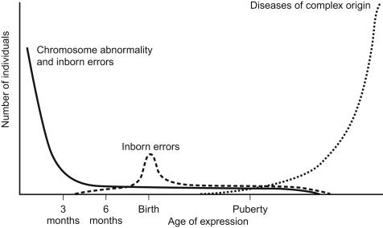

----

## Useful Resources for Continuous Learning

- [Clinical Genomics Guide App](https://www.genomicsapps.org/)
- [EuroGMS](https://www.eurogems.org/): a guide to approximately 110 selected genomic online educational sources

----

## Human Mortality Curve [2]

- Monogenic diseases are most commonly expressed in early childhood and later in life due to strong selection against disease expression during peak reproductivity age.
- After puberty, most genetic diseases are polygenic and only lead to disease expression when combined with other "nongenetic" triggers—like lifestyle or environmental factors.
<!--
- Monogenic diseases are most common in early childhood and then again later in life, with fewer cases during the reproductive years (young adulthood) due to strong selection against these diseases when they appear at an age that could affect an individual’s ability to reproduce.
- After puberty, most genetic diseases that show up are not due to monogenic (single-gene) causes alone. Instead, they’re often due to more complex genetic factors that only lead to disease when combined with other "nongenetic" triggers—like lifestyle or environmental factors.
-->
[2]:(https://doi.org/10.1016/B978-0-12-812537-3.00001-9) "Pyeritz, R. E. Medicine in a genetic and genomic context. In Emery and Rimoin's Principles and Practice of Medical Genetics and Genomics (7th edn) (eds. Pyeritz, R. E., Korf, B. R. & Grody, W. W.) 1–20 (Academic Press, 2019)."

----