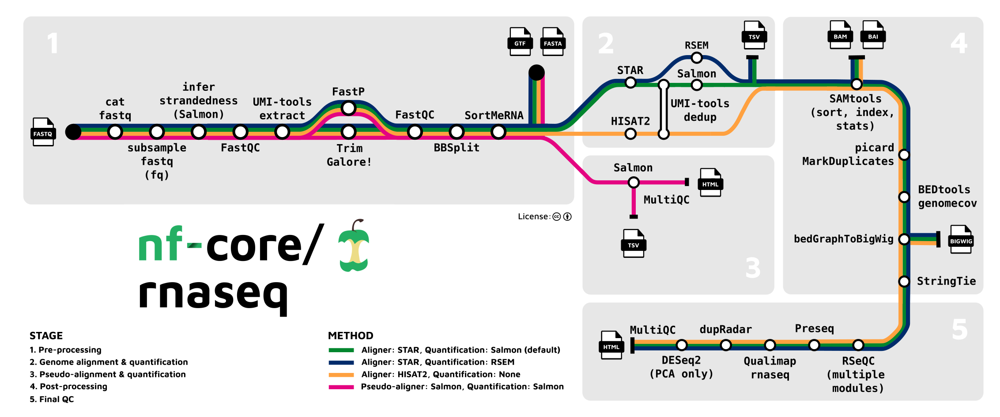

<style scoped>
h1 {
  font-weight: bold;
  font-size: 48;
}
</style>

# Module 1: Getting Started

----

## Course Overview

- Every Thursday: 1 hour lecture
- Every Monday: 3 hour lab (starting from Jan 13)
- Thursday (March 27): Invited lecturer(s)
- Email: alice.chen@humber.ca
- Respond within 4-6 business hours

----

## Course Overview

<main id="main" style="display: flex; border: 1px; padding: 10px;">
<left style="flex: 1; padding-right: 10px;background-color:rgb(255, 255, 255);" markdown="span">

| Assessment                          | Weight |
|-------------------------------------|--------|
| In-Class Participation              | 10%    |
| Group Discussion Assignments        | 15%    |
| Lab Assignments                     | 50%    |
| Group Report – Clinical Case Study  | 25%    |
| **Total**                          | **100%** |

</left>
<right id="col_right" style="flex: 1; padding-left: 10px;background-color:rgb(255, 255, 255);" markdown="span">

### Class Participation
- Weekly class poll
- 1% per class * (10 out of 12 classes)
- Week 12 is mandatory attendance
        
</right>
</main>

----

## Course Overview

<main id="main" style="display: flex; border: 1px; padding: 10px;">
<left style="flex: 1; padding-right: 10px;background-color:rgb(255, 255, 255);" markdown="span">

| Assessment                          | Weight |
|-------------------------------------|--------|
| In-Class Participation              | 10%    |
| Group Discussion Assignments        | 15%    |
| Lab Assignments                     | 50%    |
| Group Report – Clinical Case Study  | 25%    |
| **Total**                          | **100%** |

</left>

<right id="col_right" style="flex: 1; padding-left: 10px;background-color:rgb(255, 255, 255);" markdown="span">

### Group Discussion Assignments 

- Complete as a group after class
- 3 assignments x 5%
- Use the content to build knowledge towards completing the final group report
        
</right>
</main>

----

## Course Overview

<main id="main" style="display: flex; border: 1px; padding: 10px;">

<left style="flex: 1; padding-right: 10px;background-color:rgb(255, 255, 255);" markdown="span">

| Assessment                          | Weight |
|-------------------------------------|--------|
| In-Class Participation              | 10%    |
| Group Discussion Assignments        | 15%    |
| Lab Assignments                     | 50%    |
| Group Report – Clinical Case Study  | 25%    |
| **Total**                          | **100%** |

</left>
<right id="col_right" style="flex: 1; padding-left: 10px;background-color:rgb(255, 255, 255);" markdown="span">

### Lab Assignments

- 5 lab assignments x 10%
- Each assignment is split into two parts (Part A and B) and due on the Friday 11:59 PM after Part B
- For each assignment, 
total mark of the assignment = total of Part A + total of Part B.
        
</right>
</main>

----

## Course Overview

<main id="main" style="display: flex; border: 1px; padding: 10px;">

<left style="flex: 1; padding-right: 10px;background-color:rgb(255, 255, 255);" markdown="span">

| Assessment                          | Weight |
|-------------------------------------|--------|
| In-Class Participation              | 10%    |
| Group Discussion Assignments        | 15%    |
| Lab Assignments                     | 50%    |
| Group Report – Clinical Case Study  | 25%    |
| **Total**                          | **100%** |

</left>
<right id="col_right" style="flex: 1; padding-left: 10px;background-color:rgb(255, 255, 255);" markdown="span">

### Group Report - Clinical Case Study

- Run a RNASeq pipeline as a group and write a case study report.
- The lab on March 31 is reserved for group work and technical troubleshooting.
        
</right>
</main>

----

## Missed and Late Evaluation Policy

- All students requesting an extension must follow the missed and late evaluation policy.
- **(Mandatory)** Complete this [form](https://forms.office.com/r/8tD3Xtvms9) for each missed assignment at least 24h before the assignment deadline.
- Evaluation of missed and late assignments is subjected to my approval.

----

## Class Policy on AI Usage
- Humber College's AI Policy ([link](https://humber.ca/academic-division/academic-integrity/statement-on-ai))
- Contends that un-cited and/or other unauthorized use of AI in assessments and assignments constitutes academic misconduct as defined in Humber’s Academic Regulations.
- **Do not provide ChatGPT (or any other AI tool) human information that is not open access.**
- **Cite which tool you used and its contribution to your assignment.**
- **You are responsible for the accuracy of your answers.**

----
## Class Policy on AI Usage

### Lab Assignments
Code Example:
```
def foo():
    # some code here
    return answer

# Source: My code was generated by claude
```
Short Answer Example:
```
This figure shows that Gene A in fruit fly is upregulated in the treatment group.
Source: I made ChatGPT read the figure.
```
----

## Class Policy on AI Usage

### Group Assignments & Group Report
-  Communicate with your group members how you used AI tools in your contributions
- Cite this information at the end of your group submission

```markdown
AI Sources:
- Member A used ChatGPT to proofread the Introduction section
```

----

## Learning Strategies

- Coding is a technical skill that requires continuous learning.
- Software manuals and documentations are your friends.
- Use your creativity to find answers ethically. Most knowledge is publicly available.

----

## Applications of genomics in clinical medicine <sup>[1]</sup>

- ***Clinical diagnosis***: Used as diagnostics criteria for medical conditions.
- ***Disease gene identification***: Identify the role of specific genes in heritable diseases.
- ***Cancer genomics***: Used to understand how genomic variants in somatic cells are involved in the initiation and progression of cancer.
- ***Disease treatment***: Inform targeted gene therapies to treat patient monogenic disorders in personalized medicine.
- ***Prenatal diagnosis***: Risk assessment for genetic disorders in pregnancies.

[1]:(https://doi.org/10.1016/B978-0-12-812537-3.00001-9) "Pyeritz, R. E. Medicine in a genetic and genomic context. In Emery and Rimoin's Principles and Practice of Medical Genetics and Genomics (7th edn) (eds. Pyeritz, R. E., Korf, B. R. & Grody, W. W.) 1–20 (Academic Press, 2019)."

----

## Critical Path

- The lecture materials provide information to support the lab components:
  - Understanding the genetic basis of heritable diseases using public resources
  - RNASeq using Nextflow
  - Gene expression profiling using Nextflow
  - Somatic variant analysis using Nextflow
  - Linkage analysis and clinical applications of GWAS
- Find more details in the Critical Path pdf

----

## RNA Sequencing <sup>[2]</sup>

<main id="main" style="display: flex; border: 1px; padding: 10px;">

<left style="flex: 1; padding-right: 10px;background-color:rgb(255, 255, 255);" markdown="span">

<p style="text-align:center"></p>

</left>
<right id="col_right" style="flex: 1; padding-left: 10px;background-color:rgb(255, 255, 255);" markdown="span">

- **Bulk RNA-Seq** provides an average measure of gene expression across the entire population of cells.
- **scRNA-Seq** analyzes gene expression at the single-cell level, which helps to study cellular diversity and identify unique cell types
- **Spatial RNA-Seq** profiles gene expression with spatial resolution in a 3D context within tissue samples.
        
</right>
</main>

[2]:(https://doi.org/10.7150/ijbs.92525) "Yan H, Ju X, Huang A, Yuan J. Advancements in technology for characterizing the tumor immune microenvironment. Int J Biol Sci. 2024 Mar 25;20(6):2151-2167. doi: 10.7150/ijbs.92525. PMID: 38617534; PMCID: PMC11008272."

----

## Bulk RNASeq using Nextflow <sup>[3]</sup>

<p style="text-align:center"></p>

[3]:(https://nf-co.re/rnaseq/3.18.0/)
----

## Differential Expression Analysis using Nextflow <sup>[4]</sup>

<main id="main" style="display: flex; border: 1px; padding: 10px;">

<left style="flex: 1; padding-right: 10px;background-color:rgb(255, 255, 255);" markdown="span">

<p style="text-align:center"></p>

</left>
<right id="col_right" style="flex: 1; padding-left: 10px;background-color:rgb(255, 255, 255);" markdown="span">

<p style="text-align:center"></p>
        
</right>
</main>

[4]:(https://nf-co.re/rnaseq/3.18.0/)
----

## Clinical workflow for tumor genome analysis <sup>[5]</sup>

<p style="text-align:center"></p>

[5]:(https://doi.org/10.1200/JCO.2013.48.7215) "Van Allen EM, Wagle N, Levy MA. Clinical analysis and interpretation of cancer genome data. J Clin Oncol. 2013;31(15):1825-1833. doi:10.1200/JCO.2013.48.7215"
----

## Somatic Variant Analysis using Nextflow <sup>[6]</sup>

<p style="text-align:center"></p>

[6]:(https://nf-co.re/sarek/3.5.0/)
----

## Linkage Analysis <sup>[7]</sup>
<main id="main" style="display: flex; border: 1px; padding: 10px;">

<left style="flex: 1; padding-right: 10px;background-color:rgb(255, 255, 255);" markdown="span">

<p style="text-align:center"></p>

</left>
<right id="col_right" style="flex: 1; padding-left: 10px;background-color:rgb(255, 255, 255);" markdown="span">

<p style="text-align:center"></p>
        
</right>
</main>


[7]:(https://doi.org/10.1038/nrg3908) "Ott J, Wang J, Leal SM. Genetic linkage analysis in the age of whole-genome sequencing. Nat Rev Genet. 2015;16(5):275-284. doi:10.1038/nrg3908"
----

## GWAS <sup>[8]</sup>

<main id="main" style="display: flex; border: 1px; padding: 10px;">

<left style="flex: 1; padding-right: 10px;background-color:rgb(255, 255, 255);" markdown="span">

**(1) Polygenic Risk Score**
<p style="text-align:center"></p>

</left>
<right id="col_right" style="flex: 2; padding-left: 10px;background-color:rgb(255, 255, 255);" markdown="span">

**(2) Functional Analysis**
<p style="text-align:center"></p>

</right>
</main>

[8]:(https://doi.org/10.1038/s43586-021-00056-9) "Uffelmann, E., Huang, Q.Q., Munung, N.S. et al. Genome-wide association studies. Nat Rev Methods Primers 1, 59 (2021)."

----

# Class Survey (1%)

What do you want to learn from this course? \([link](https://forms.office.com/r/MDdTj1ncrV)\)