

# Module 10: Inheritance of Polygenic Diseases

----

## Key Concepts

- Linkage Analysis
- HWE and Allele Frequency
- Genome Wide Association Studies
- Applications

----

## Recombination[1]

<main id="main" style="display: flex; border: 1px; padding: 1px;">

<left style="flex: 0.5; padding-right: 1px;background-color:rgb(255, 255, 255); font-size:20pt" markdown="span">

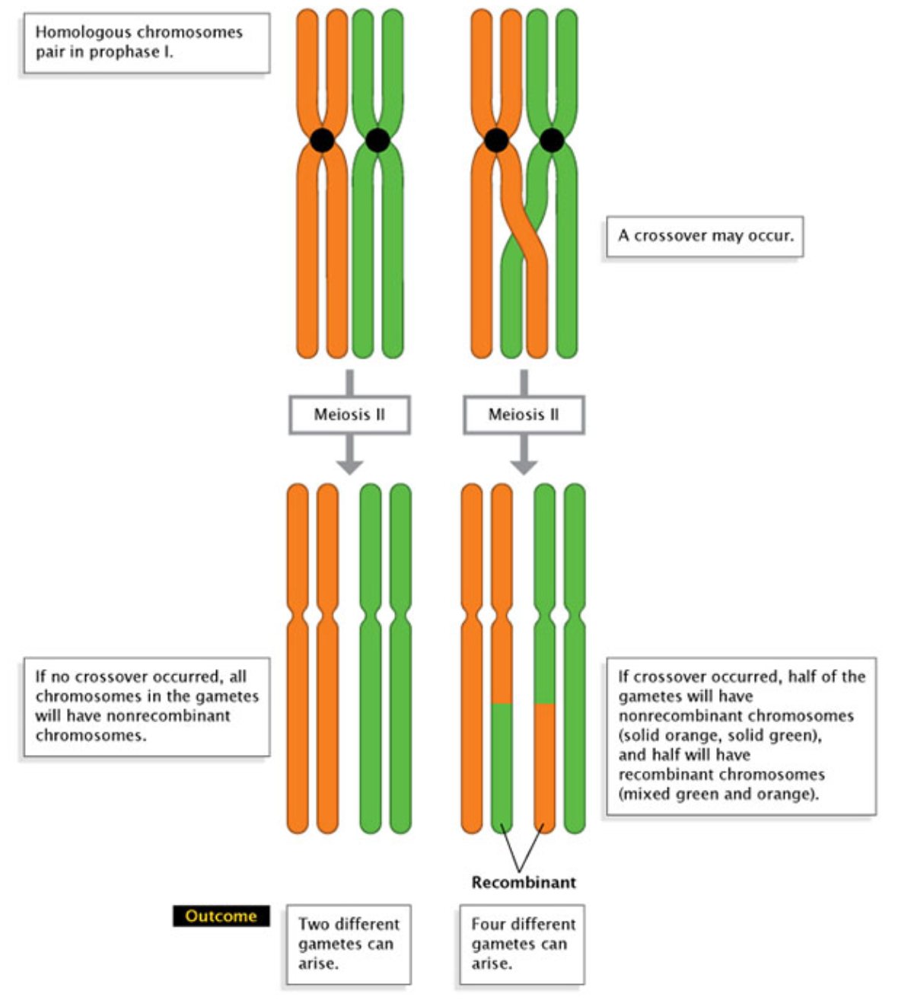

</left>
<right id="col_right" style="flex: 0.5; padding-left: 1px;background-color:rgb(255, 255, 255);font-size:24pt" markdown="span">

- Alleles recombine during crossover events in meiosis

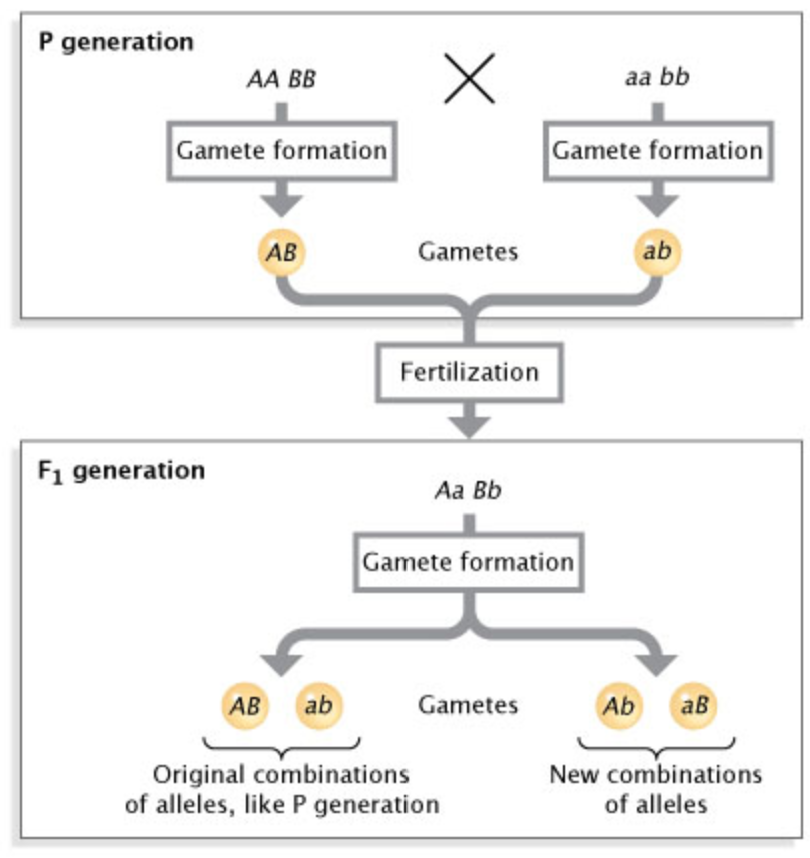

</right>
</main>

[1]:(https://www.nature.com/scitable/topicpage/thomas-hunt-morgan-genetic-recombination-and-gene-496/) "Lobo, I. & Shaw, K. (2008) Thomas Hunt Morgan, genetic recombination, and gene mapping. Nature Education 1(1):205"

----

## Genetic Linkage

- The frequency of recombination is related to the distance between the genes on a chromosome.[1]
- Violation of Mendel’s law of independent assortment[1]

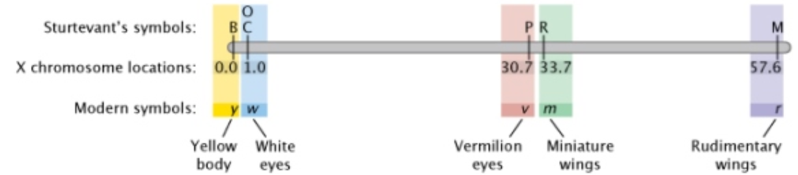

----

## Genetic Linkage

- The **closer** two genes were to one another on a chromosome, the **greater** their chance of being inherited together.[1]
- Genes located **farther** away from one another on the **same** chromosome were **more likely to be separated** during recombination.[1]

----

## Linkage Map

<main id="main" style="display: flex; border: 1px; padding: 1px;">

<left style="flex: 0.3; padding-right: 1px;background-color:rgb(255, 255, 255); font-size:20pt" markdown="span">

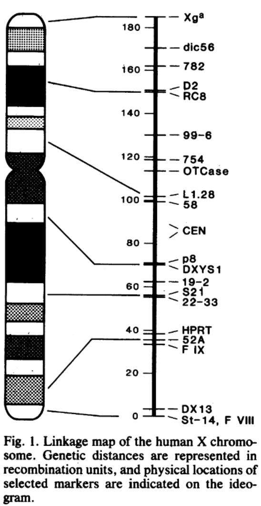

</left>
<right id="col_right" style="flex: 0.7; padding-left: 1px;background-color:rgb(255, 255, 255);font-size:24pt" markdown="span">

- **Linkage map**: (also called genetic map) the order and the linear distances between the linked genes[1]
- **Map unit** (mu): arbitrary unit of distance representing a recombination frequency of 1%[1]
  - renamed as **centimorgan (cM)**
- Completely linked genes = 0 mu
- Unlinked genes > 50 mu
- Linked genes < 50 mu

[Drayna & White (1985)](https://doi.org/10.1126/science.4059909)

</right>
</main>

[2]:(https://jamanetwork.com/journals/jamaneurology/fullarticle/775035) "Pulst SM. Genetic Linkage Analysis. Arch Neurol. 1999;56(6):667–672. doi:10.1001/archneur.56.6.667"

----

## Linkage Map

<main id="main" style="display: flex; border: 1px; padding: 1px;">

<left style="flex: 0.7; padding-right: 1px;background-color:rgb(255, 255, 255); font-size:20pt" markdown="span">

</left>
<right id="col_right" style="flex: 0.3; padding-left: 1px;background-color:rgb(255, 255, 255);font-size:24pt" markdown="span">

- On average 1 cM corresponds to 1 million base pairs.[2]
- Linkage map is **NOT** the same as a cytogenetic map (karyotype)[3]

</right>
</main>

[3]:(https://www.genome.gov/genetics-glossary/Genetic-Map)

----

## Two-point linkage

- Calculate the linkage between a putative disease locus and a single marker locus

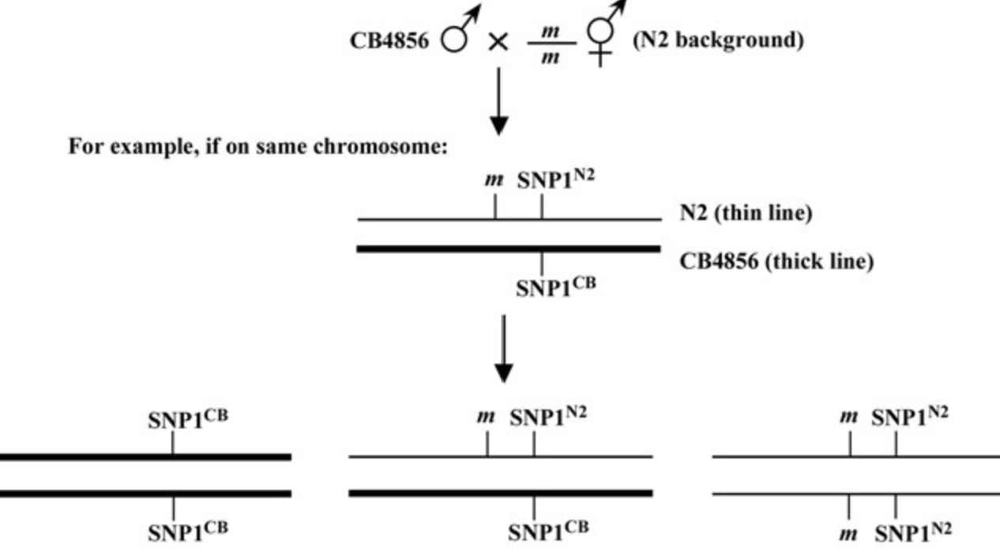

----

## Linkage Analysis: Next Steps

- To identify the smallest region of the genome that should contain the disease gene, the minimum‐candidate region (MCR), we can perform:
  1. Haplotype analysis or
  2. Multipoint linkage analysis

----

<main id="main" style="display: flex; border: 1px; padding: 1px;">

<left style="flex: 0.4; padding-right: 1px;background-color:rgb(255, 255, 255); font-size:12pt" markdown="span">

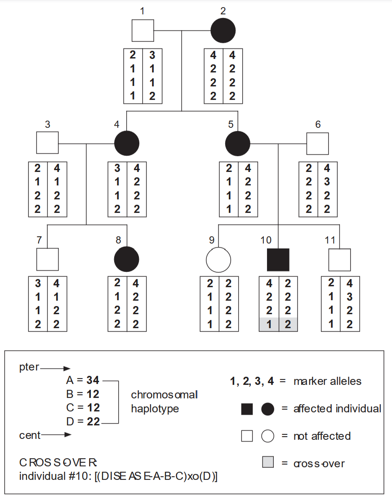

</left>
<right id="col_right" style="flex: 0.6; padding-left: 1px;background-color:rgb(255, 255, 255);font-size:22pt" markdown="span">

## Haplotype Analysis[7]

- **Haplotype**: the arrangement of alleles on sister chromatids
- Construct haplotyes by examining the ordered markers genotyped in an individual and arranging them by chromatid, on the basis of parental types

</right>
</main>

----

## Haplotype Analysis[7]

- After summarizing all cross-over individuals in the study, the most likely region for the disease gene is the region where no cross-overs are found.

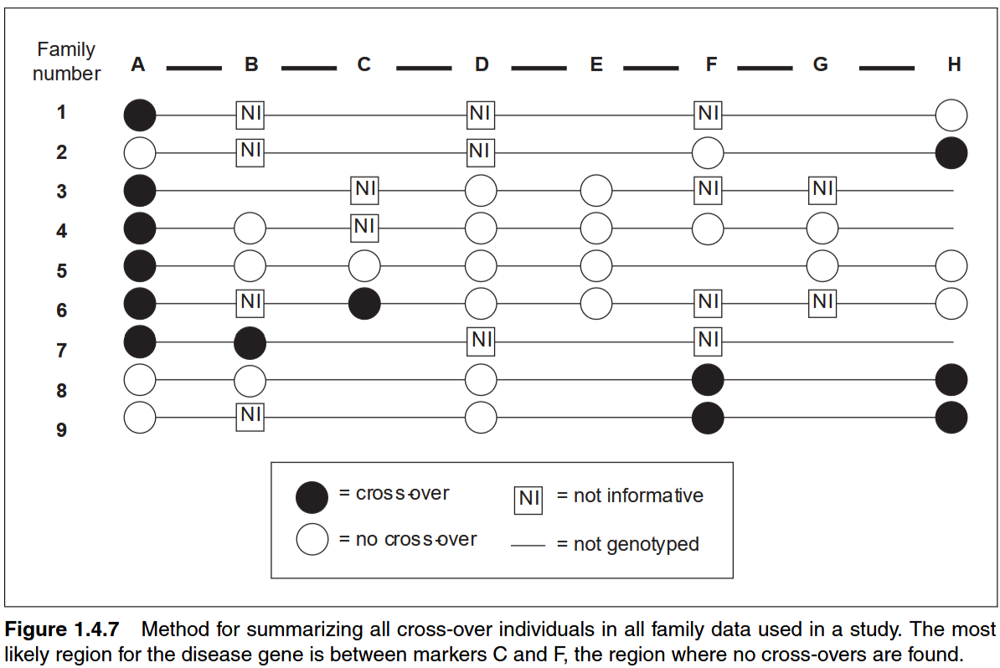

----

## Multipoint analysis - Parametric[4]

- Assume a model describing the probability of phenotype given genotype at the disease locus
- Calculate the likelihood ratio under the hypothesis that a disease gene is at x, versus the hypothesis that it is unlinked to x.

  LOD score: $Z(x) = \log_{10} \left( \frac{L(x)}{L(\infty)} \right)$ where
- $L(x)$ = Likelihood of the disease locus at position $(x)$ on the marker map
= the probability of **linkage** at a given recombination fraction ($\theta$)
- $L(\infty)$ = Likelihood of the disease locus being infinitely far from a set of markers
= the probability of **no linkage** ($\theta$ = 0.5)

[4]:(https://doi.org/10.1038/nrg3908) "Ott, J., Wang, J. & Leal, S. Genetic linkage analysis in the age of whole-genome sequencing. Nat Rev Genet 16, 275–284 (2015)."

----

## How to use LOD score?[5]

- LOD score of 3 means the odds are 1,000:1 that the two genes are linked and therefore inherited together.
- **LOD score>3.3** → Strong evidence for linkage (genome-wide significance p<0.05)
  - Will still require replication with independent dataset
- 3.3>LOD score>1.86 → Suggestive linkage
- LOD score < 1.86 → Nominal linkage

[5]:(https://doi.org/10.1086/303029) "Nyholt DR. All LODs are not created equal. Am J Hum Genet. 2000 Aug;67(2):282-8. doi: 10.1086/303029. Epub 2000 Jul 6. PMID: 10884360; PMCID: PMC1287176."

----

<main id="main" style="display: flex; border: 1px; padding: 1px;">

<left style="flex: 0.4; padding-right: 1px;background-color:rgb(255, 255, 255); font-size:18pt" markdown="span">

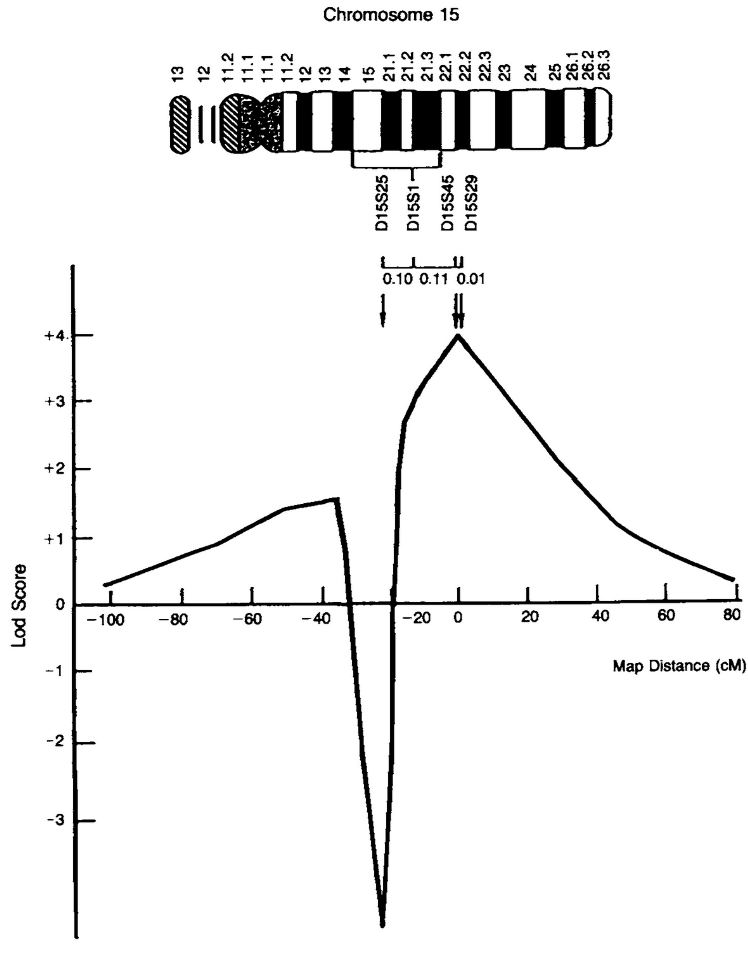

</left>
<right id="col_right" style="flex: 0.6; padding-left: 1px;background-color:rgb(255, 255, 255);font-size:20pt" markdown="span">

## Multipoint analysis

- **Multipoint LOD scores** generate a curve across a chromosome to identify the **likely position of a disease gene** (maximum of the curve) **given that the max. LOD score >=3.3**.[4]

- (Figure) Shows proof of linkage for Marfan Syndrome (autosomal dominant) in 5 families (LOD score = 3.92, $\theta$ = 0.0±0.11). The most probable location of the gene for the disease is D15S45 (LOD score = 3.32, $\theta$ = 0.0±0.12).[6]

</right>
</main>

[6]:(https://doi.org/10.1056/NEJM199010043231402) "Kainulainen, K., Pulkkinen, L., Savolainen, A., Kaitila, I. & Peltonen, L. Location on Chromosome 15 of the Gene Defect Causing Marfan Syndrome. N. Engl. J. Med. 323, 935–939 (1990)."

----

## LOD scoring algorithms[7]

### Lander-Green algorithm

- Scales **linearly** with ***m* markers** , but **exponentially** with ***n* individuals** in the pedigree.
- More suitable for **smaller** pedigrees with **many markers**.
- Tool: MERLIN

### Elston-Stewart algorithm

- Scales **linearly** with ***n* individuals**, but **exponentially** with ***m* markers**.
- More suitable for **large** pedigrees.
- Tool: FASTLINK (inbred pedigrees; multiple founder pairs), VITESSE (without loops, one founder pair)

[7]:() "Dueker, N.D. and Pericak-Vance, M.A. (2014), Analysis of Genetic Linkage Data for Mendelian Traits. Current Protocols in Human Genetics, 83: 1.4.1-1.4.31."

----

## Multipoint analysis - Non-parametric[7]

- Doesn't assume the mode of inheritance so it is suitable for complex traits
- **Assumptions:**
  - The trait has some genetic component.
  - The genes involved follow Mendelian laws of inheritance
- Significantly less than the power of parametric analysis
- **Use case**: Complex diseases with completely unknown inheritance model

----

## Multipoint analysis - Non-parametric[7],[8]

Quantifies the degree to which related individuals “share” alleles at the marker loci

1. Identity by state (IBS)
2. Identity by descent (IBD)

<main id="main" style="display: flex; border: 1px; padding: 1px;">

<left style="flex: 0.7; padding-right: 1px;background-color:rgb(255, 255, 255); font-size:18pt" markdown="span">

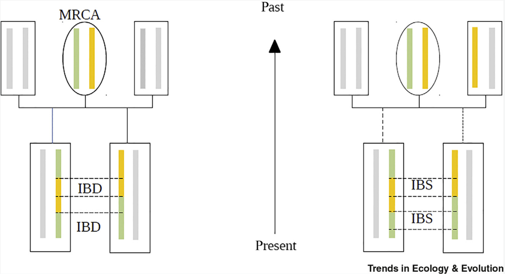

</left>
<right id="col_right" style="flex: 0.3; padding-left: 1px;background-color:rgb(255, 255, 255);font-size:20pt" markdown="span">

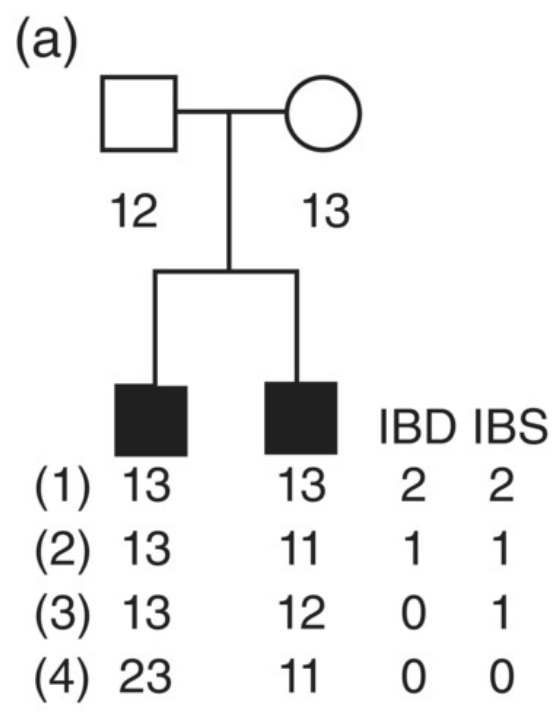

</right>
</main>

[8]:(https://doi.org/10.1016/j.tree.2019.10.012) "Leitwein, M., Duranton, M., Rougemont, Q., Gagnaire, P.-A. & Bernatchez, L. Using Haplotype Information for Conservation Genomics. Trends in Ecology & Evolution 35, 245-258 (2020)."

----

## Genome-Wide Linkage Analysis

<main id="main" style="display: flex; border: 1px; padding: 1px;">

<left style="flex: 0.4; padding-right: 1px;background-color:rgb(255, 255, 255); font-size:18pt" markdown="span">

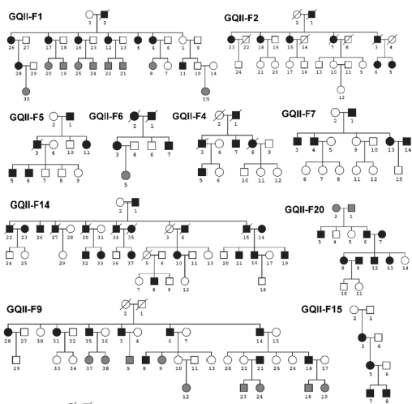

</left>
<right id="col_right" style="flex: 0.6; padding-left: 1px;background-color:rgb(255, 255, 255);font-size:20pt" markdown="span">

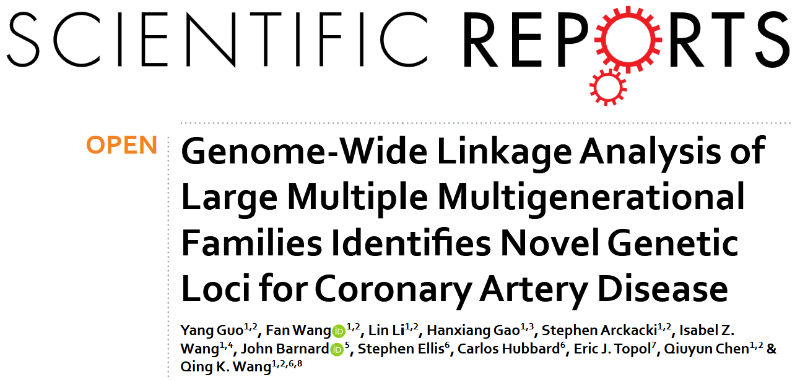

- 24 large and multigenerational families with 433 family members
- All family members were genotyped with markers spaced by every 10 cM

</right>
</main>

----

## Genome-Wide Linkage Analysis

- The threshold of significant linkage is NPL ≥4.08

<main id="main" style="display: flex; border: 1px; padding: 1px;">

<left style="flex: 0.4; padding-right: 1px;background-color:rgb(255, 255, 255); font-size:18pt" markdown="span">

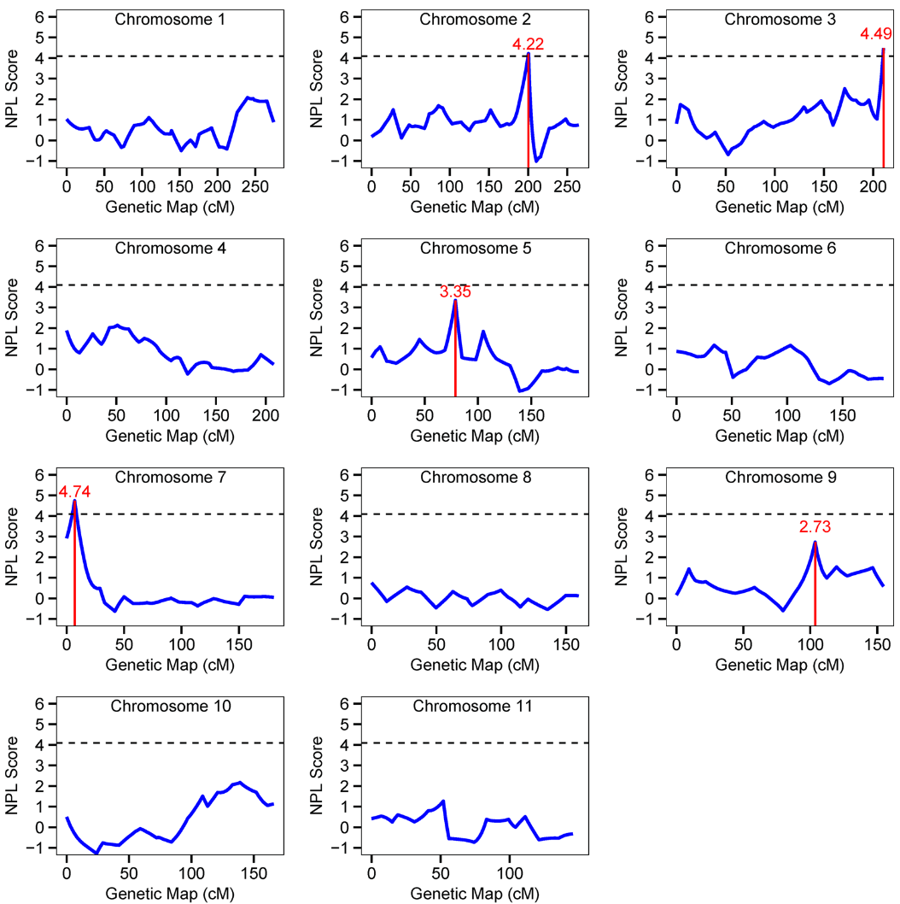

</left>
<right id="col_right" style="flex: 0.6; padding-left: 1px;background-color:rgb(255, 255, 255);font-size:20pt" markdown="span">

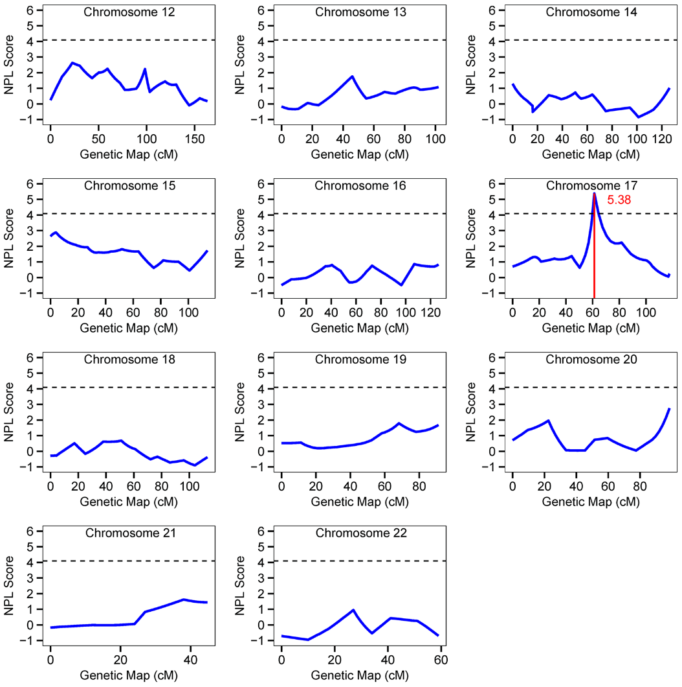

</right>
</main>

----

## Genome-Wide Linkage Analysis

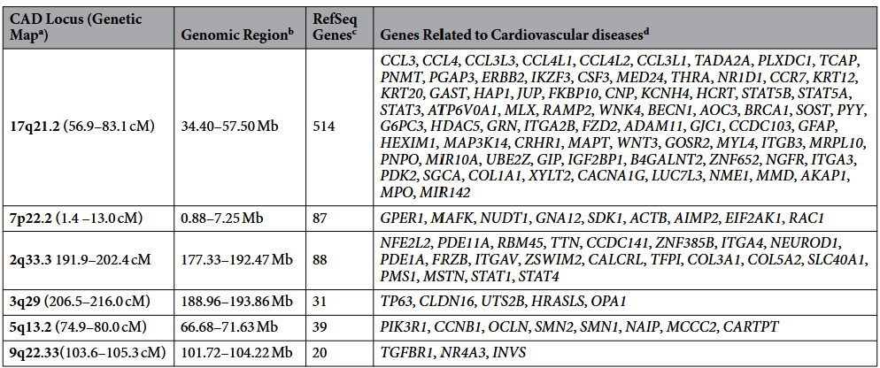

----

## Applications of Linkage Analysis in Clinical Genomics

- Historically used in **family-based studies** to identify **Mendelian disease genes**.
- Previously required **sequencing candidate regions**, but now NGS allows rapid follow-up of suggestive linkage signals.

----

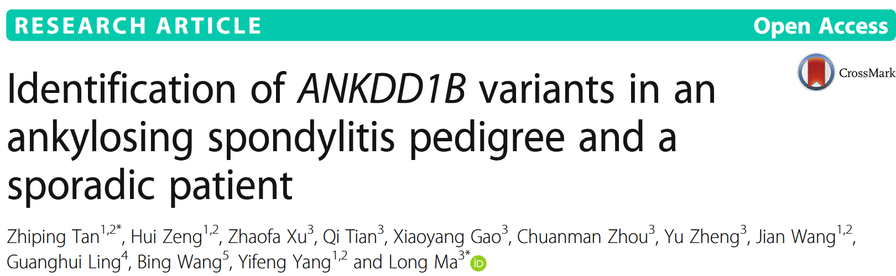
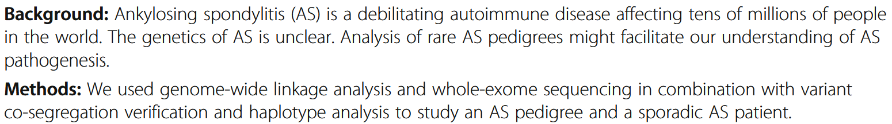

----

<main id="main" style="display: flex; border: 1px; padding: 1px;">

<left style="flex: 0.5; padding-right: 1px;background-color:rgb(255, 255, 255); font-size:20pt" markdown="span">

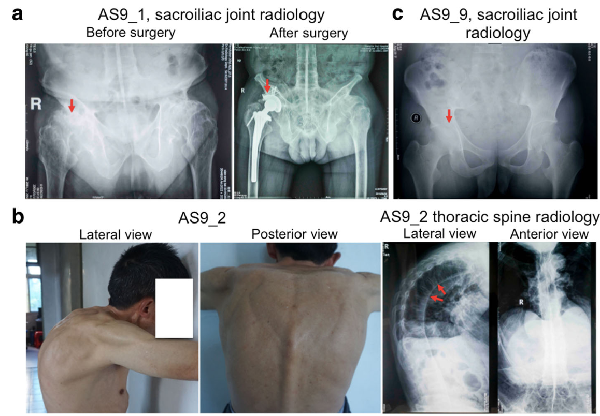

</left>
<right id="col_right" style="flex: 0.5; padding-left: 1px;background-color:rgb(255, 255, 255);font-size:24pt" markdown="span">

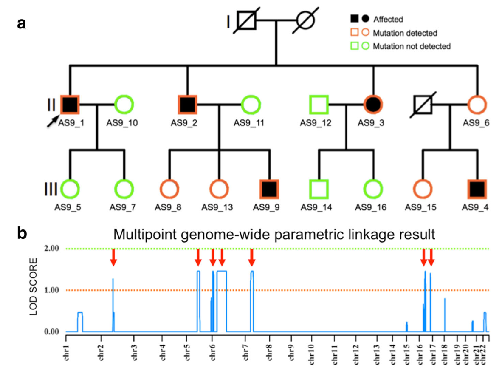

</right>
</main>

----

## Population Genetics

The quantitative study of the distribution of genetic variation in populations and of how the frequencies of genes and genotypes are maintained or change over time both within and between populations.
- HWE and Allele Frequency
- Genome Wide Association Studies

----

## Hardy-Weinberg Equilibrium

The genetic variation in a population will remain constant from one generation to the next in the absence of disturbing factors.

Assumes:
- Large population
- Random mating
- Allele frequencies remain constant over time because there are no mutations, natural selection, nonrandom mating, genetic drift, and gene flow.

----

## Hardy-Weinberg Equilibrium

$$
p^2 + 2pq + q^2 = 1
$$

where:

- $p$ and $q$ are **allele frequencies**.
- $p^2$, $2pq$, and $q^2$ are **genotype frequencies**.

----

## Factors That Disturb HWE: Nonrandom Mating

In human populations, nonrandom mating may occur due to: stratification, assortative mating, consanguinity.

----

## Factors That Disturb HWE: Mutation

- Selection pressure on mutations determines the allele frequencies in the population.
- Fitness is the outcome of the joint effects of survival and fertility. 
- When a genetic disorder limits reproduction so severely that the fitness is zero
(i.e., s = 1), it is thus referred to as a **genetic lethal**.

----

## Factors That Disturb HWE: Genetic Drift

- Random effects of environment or other chance occurrences can change the frequency of the disease allele when the population is small. 
- **Founder effect**: the loss of genetic variation that occurs when a new population is established by a very small number of individuals from a larger population

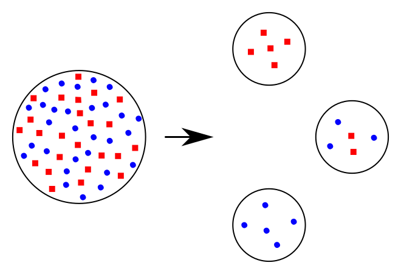

----

## Factors That Disturb HWE: Migration and Gene Flow

- Migration can change allele frequency by the process of **gene flow** (the slow diffusion of genes across a barrier).
- **Genetic admixture**: the genes of migrant populations with their own allele frequencies are gradually merged into the gene pool of the population into which they have migrated.

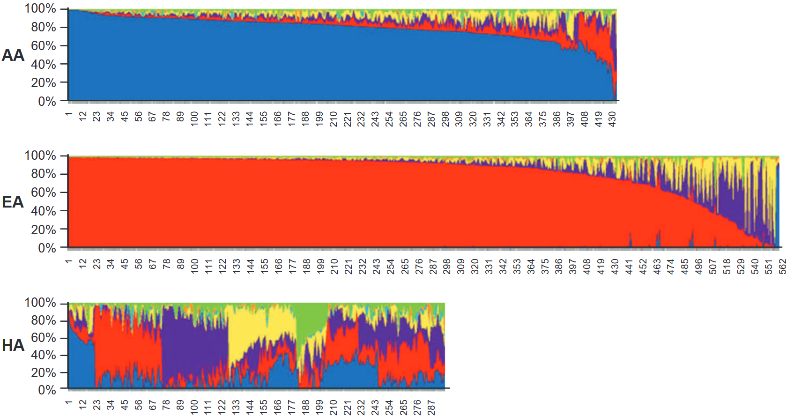

----

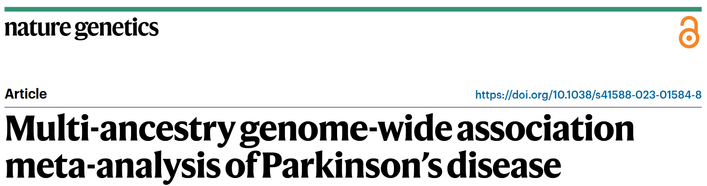

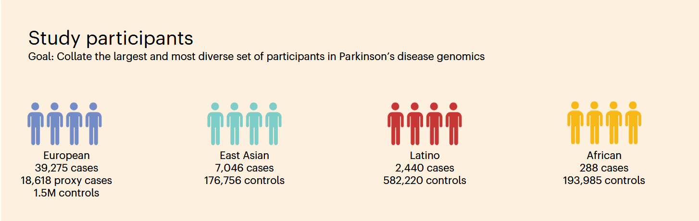

----

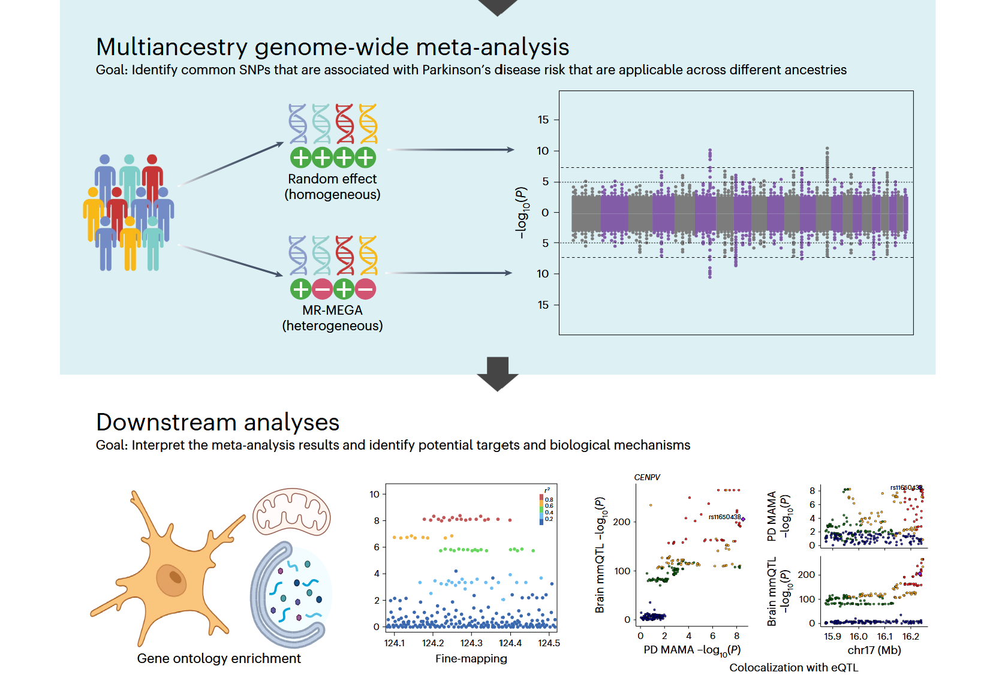

----

## Manhattan Plot

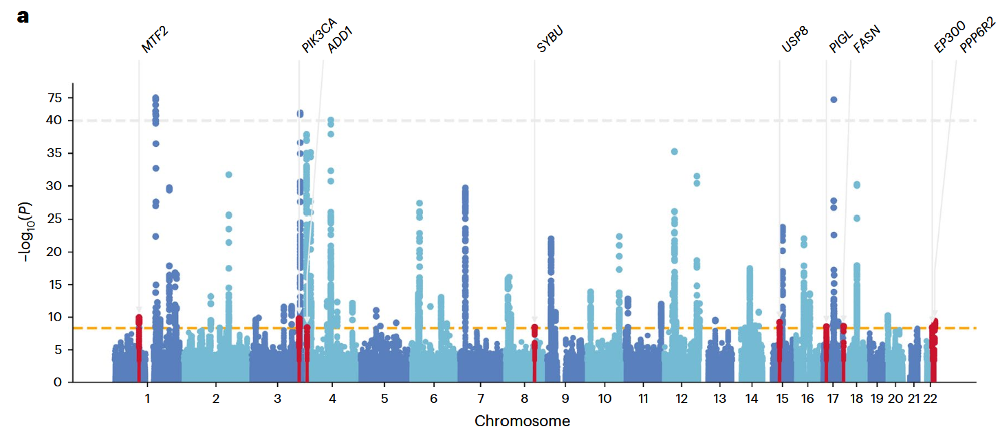

----

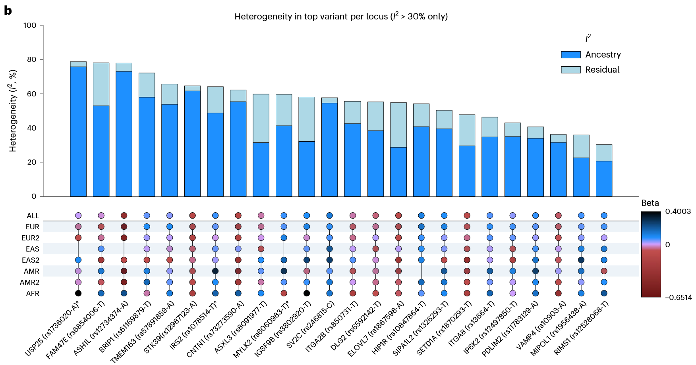

---

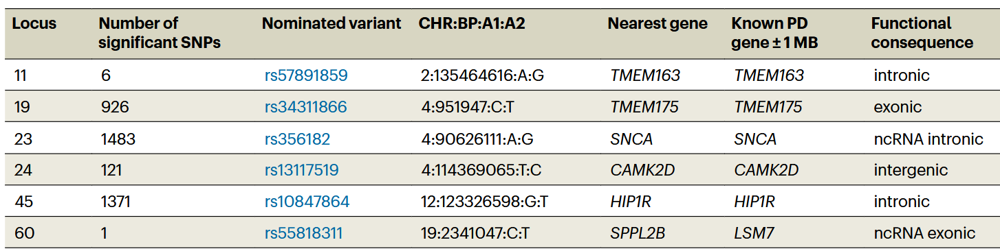

----

## Clinical Application of GWAS

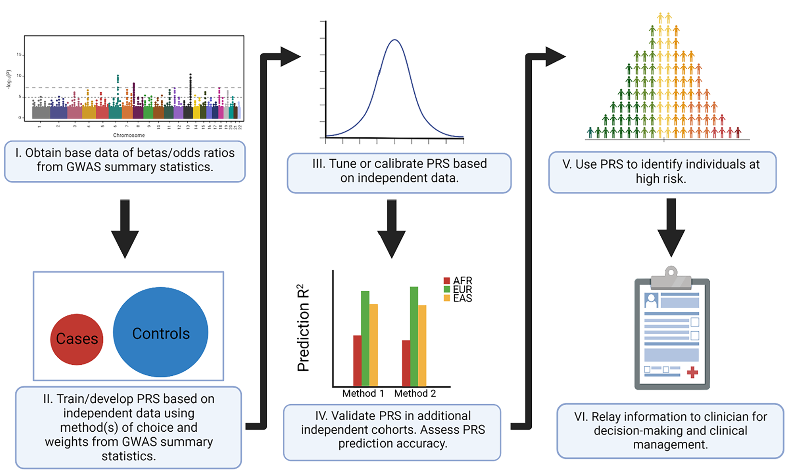

----

## Polygenic Risk Score

<main id="main" style="display: flex; border: 1px; padding: 1px;">

<left style="flex: 0.5; padding-right: 1px;background-color:rgb(255, 255, 255); font-size:18pt" markdown="span">

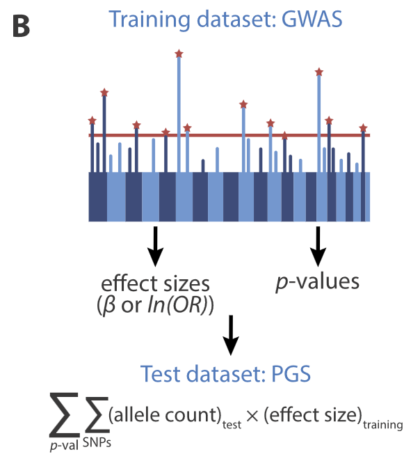

</left>
<right id="col_right" style="flex: 0.5; padding-left: 1px;background-color:rgb(255, 255, 255);font-size:24pt" markdown="span">

- Sum of the weighted allele counts of independent SNPs found to be associated with a trait or disorder in a GWAS
- For quantitative traits, the weights are the linear regression effect sizes, i. e., the β coefficients. 
- For case/control phenotypes, the
weights are the natural logarithm of the odds ratio, ln(OR).
</right>
</main>

