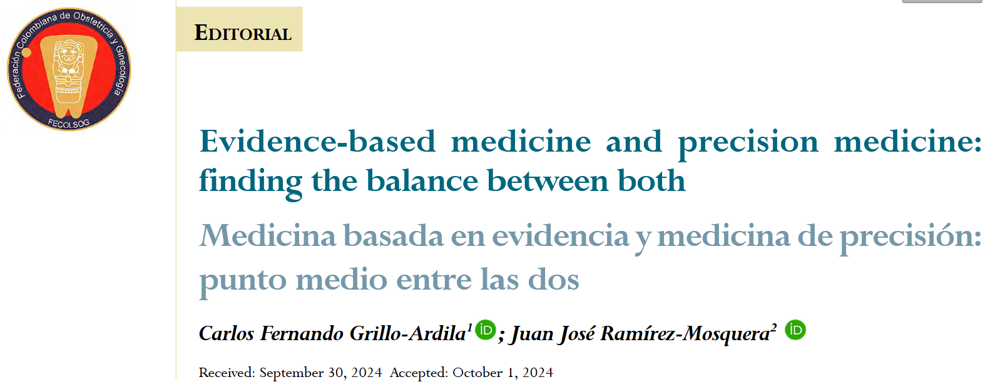

# Module 11: Ethics in Clinical Genomics

----

## Key Concepts

- Principles of biomedical ethics
- Privacy and confidentiality
- Genetic testing and screening
- Discrimination and societal impact

----

## Four Cardinal Principles of Biomedical Ethics

1. **Beneficence**
2. **Nonmaleficence**
3. **Justice**
4. **Autonomy**

----

## Principles of Biomedical Ethics

### 1. Beneficence
- To always act for the benefit of the patient – and can be extended to the subject of medical attention
- To safeguard an individual’s rights to control own medical care and medical information, free of coercion

### 2. Nonmaleficence
- The obligation to not harm patients
- Requires healthcare providers to weigh benefits against harms and choose best course of treatment​
- Important particularly during end-of-life treatment

----

## Principles of Biomedical Ethics

### 3. Justice
- Aims to ensure fair and equitable access to healthcare​
- **Distributive justice**: Fair distribution of available goods or resources​
    - Available goods or resources are accessed on a first-come-first-served basis
- **Procedural justice**: Fair rules for the distribution of available goods or resources​
    - When there are extenuating circumstances/mitigating factors, these factors are weighed into decisions for the distribution of available goods or resources​

----

## Principles of Biomedical Ethics

### 4. Autonomy
- All persons have intrinsic value as rational beings who have the power – or agency – for self-determination through making reasoned decisions and ethical choices ​
- Focus on autonomy is most intense where patient competency and/or arguments of a subject’s status as a person are in question​
- Autonomy has two relational principles: ​
    1. Informed consent​
    2. Truth-telling​

----

## Principles of Biomedical Ethics: Informed Consent

- Informed consent has emerged as a most pressing modern ethical issue​
- Informed consent requires:​
    - Competence to understand and make decision​
    - Is given full disclosure of relevant information​
    - Can comprehend information​
    - Can act voluntarily and so give voluntary consent​
​
----

## Principles of Biomedical Ethics: Truth-Telling and Confidentiality

- Is necessary for trust and full disclosure to satisfy conditions for informed consent​
- Truth-telling has the relational principle of:​
    - **Confidentiality**​: the obligation to not disclose information provided by the patient/subject without patient’s/subject’s authorization​
- One exception is where there is information about harm of others

----

## Ethics in Bioinformatics

- Aims to support decision-making and policy in the collection, storage, computational analysis and interpretation, security, sharing and actual and potential use of human biological data​
- Much biological data collected does not directly benefit a patient (re: beneficence) and may mainly benefit other and far into the future
– ​Or (re: justice) When a thief steals a computer vs. stealing personal data​

----

## Ethical Considerations in Bioinformatics 

- Patient/Subject privacy​
- Consent and autonomy​
- Confidentiality​
- Access to data​
- Ownership of data​
- Genetic profiling, discrimination and bias

----

## Computer Ethics: Data Privacy and Confidentiality

The most common considerations regarding computer storage, access, sharing, manipulation, and use of biological data that are discussed ethics review committees (ERC) have been:​

- Privacy and confidentiality​
- Informed consent ​
- Fairness and justice ​
- Trust ​
- Data ownership​
- Transparency*...So, do we need a different ethics to discuss these in bioinformatics?

----

## Major Ethical and Policy Issues in Medical Genetics

- Genetic Testing
- Privacy of Genetic Information
- Misuse of Genetic Information
- Genetic Screening

----

## Personhood, Ethics, Law, and Genetic Research

In the U.S. the Presidential Commission for the Study of Bioethical Issues (PCSBI, 2012) recommends giving privileges to police and defense forces to access bio-specimens without consent only in exceptional circumstances.​

We have already encountered debates regarding these exceptional cases, with one USA-based genetic company having shared individuals’ genetic data with FBI without informing its customers.

----

## Personhood, Ethics, Law, and Genetic Research

- In 2018,  it was revealed that FamilyTreeDNA had been sharing user information with U.S. federal investigators ​
    - More than 2 million samples in the companies database were opened for scrutiny​

 - Investigators have long used the site GEDmatch, which is free for users’, but FamilyTreeDNA is the first site to provide access without user consent or a warrant​

*“The news underscored the lack of universal regulations governing direct-to-consumer genetic testing in the United States and how companies can use their data without consumers’ knowledge” - Matthew Haag (2019, [NYT](https://www.nytimes.com/2019/02/04/business/family-tree-dna-fbi.html)*)

----

## Personhood, Ethics, Law, and Genetic Research

As Brenda McPhail, director of the Canadian Civil Liberties Association's privacy, surveillance and technology program, commented on the “Septic Tank Sam” discovery:​

*"Our genetic information is quite literally the most personal, intimate information that there is about us, which means that it's deserving of the highest level of protection that we can provide it“*

----

## Genetic Testing

- Prenatal diagnosis, especially for nondisease traits or sex
- Testing asymptomatic adults for genotypes that predispose to late onset disease
- Testing asymptomatic children for genotypes that predispose to adult onset diseases
- Secondary and incidental findings and the right “not to know” about clearly deleterious variants that will cause diseases that could be ameliorated or prevented if the risk were known 

----

##  Other Ethical and Policy Issues

**Privacy of Genetic Information**
- Duty to warn and permission to warn family members

**Misuse of Genetic Information**
- Insurance/employment discrimination based on an employee’s genotype
- Discrimination in life and health insurance underwriting based on a person’s genotype 

**Genetic Screening**
- Expansion of screening programs
- Privacy 

----

## Artificial Intelligence and Increased Digitization

- Applications of AI in clinical genomics:
    - Data mining and retrieval from scientific literature
    - Assessing linkages
    - Pattern detection

----

## Discrimination

- AI models learn from existing data to make predications that can translate into treatments and prevention that improve human health
- If the existing literature and biological data is biased:
    - What are the limits of our interpretations of the the model outcome?
    - How do these limitations translate into treatments and prevention recommendations?

----

## Group Assignment #3

- As a clinical genomics expert, the fundamental principle is to not cause harm while maximizing knowledge-driven benefits for the patients. Read this [paper](http://ref.scielo.org/syqqw9), and discuss about the following questions: 
    - What are some ethical considerations with how you source the information in the process of practicing evidence-based medicine and precision medicine? 
    - How do biases in the literature and existing evidence limit the interpretation of your analysis? 
    - How do these limitations translate to ethic-conscious clinical recommendations? 

- Max. of 1/2 single-spaced page in 12-point Calibri, Arial, or Aptos font.

----

----

## Canadian Regulations

- **Genetic Non-Discrimination Act (2017)**: Similar to GINA in U.S. and forbids any contract requiring genetic testing and/or disclosure of test results​
- **Tri-Council Policy Statement: Ethical Conduct for Research Involving Humans (2017, updated 2022)**:  Stipulates an ethical framework for human research along with guidelines for conducting research and data management policy​
- **TCPS 2: CORE-2022 (Course on Research Ethics)** is available at: https://tcps2core.ca/welcome

----

## Canadian Regulatory Law, Research Ethics, and Bioinformatics​

- The **Tri-Council Policy Statement: Ethical Conduct for Research Involving Humans (2017, updated 2022)** is the most pertinent set of regularity guidelines for bioinformatics​
- This is an ethical framework for human research along with guidelines for conducting research and data management policy when funded by the Canadian Institutes of Health Research (CIHR), the Natural Sciences and Engineering Research Council of Canada (NSERC), and the Social Sciences and Humanities Research Council of Canada (SSHRC)​

----

## Tri-Council Policy Statement: Ethical Conduct for Research Involving Humans* (Highlights)​

- Note: While the Tri-Council Policy Statement applies to publicly funded institutions and research, it serves as the blueprint / best practices for research conducted in the private sector​
- Chapter 1: Three “Core Principles”​
    - **Respect for Persons**: Autonomy and Informed Consent​
    - **Concern for Welfare**: Mitigate Risks and Harm​
    - **Justice**: Fairness, Equity, Non-discrimination, Protection of the Vulnerable

----

## International Regulations

**United Nations Educational, Scientific and Cultural Organization (UNESCO) Universal Declaration on Bioethics and Human Rights (2006)** ([pdf](https://unesdoc.unesco.org/ark:/48223/pf0000146180​)) is comprehensive in affirming 28 Articles that range from:​
- Article 6: Consent​
- Article 9: Privacy and confidentiality​
- Article 11: Non-discrimination and non-stigmatization​
- Article 18: Decision-making and addressing biomedical ethical issues

----

## International Regulations

**HUGO Ethics Committee Statement on Benefit Sharing (2019)**:​
- Recognition that the human genome is part of the common heritage of humanity ​
- Adherence to international norms of human rights ​
- Respect for the values, traditions, culture, and integrity of participants​
- Acceptance and upholding of human dignity and freedom 

----

## Key Takeaways

### Ethical Considerations:

- Biological data storage and processing
- Interpretation of statistical results
- Actionable recommendations for disease treatment and prevention
- Legal compliance