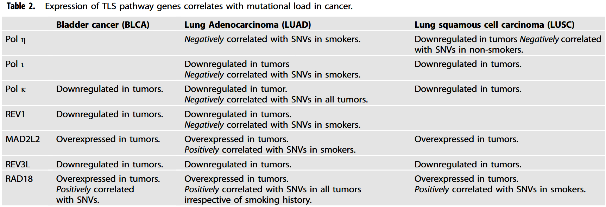
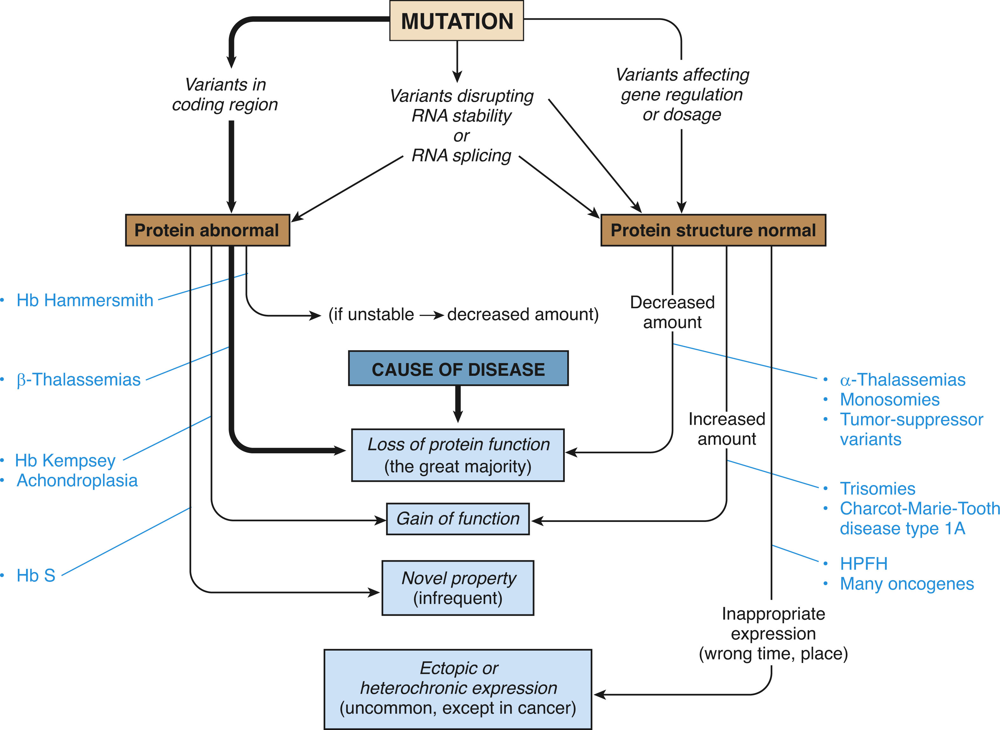
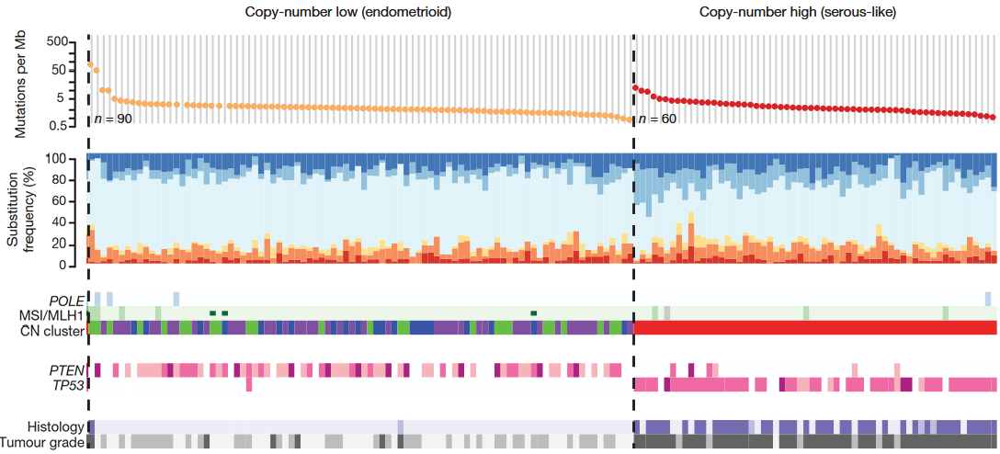

<style scoped>
h1 {
  font-weight: bold;
  font-size: 48;
}
</style>

# Module 3: Human genetic variation

---

## Key concepts

- Origins of sequence variation
- Mechanisms of pathogenesis
- Pathogenic variants
- Protein polymorphism
- Variable expression of polygenic diseases

---

<main id="main" style="display: flex; border: 1px; padding: 10px;">
<left style="flex: 1; padding-right: 10px;background-color:rgb(255, 255, 255);" markdown="span">

## Origins of sequence variation <sup>[1]</sup>

1. Chemical damage to DNA
2. DNA replication/repair errors
3. Chromosome segregation and recombination errors

</left>
<right id="col_right" style="flex: 1; padding-left: 10px;background-color:rgb(255, 255, 255);" markdown="span">

<p style="text-align:center"></p>

</right>
</main>

[1]:(http://genomemedicine.com/content/5/9/87) "Harris. Cancer mutation signatures, DNA damage mechanisms, and potential clinical implications. Genome Medicine
2013 5:87."

---

### 1. Chemical damage to DNA <sup>[2]</sup>


[2]:(https://doi.org/10.1016/j.cell.2019.02.051) "A. Gonzalez-Perez, R. Sabarinathan, N. Lopez-Bigas, Local Determinants of the Mutational Landscape of the Human Genome. Cell 177, 101-114 (2019)."

---

### 2. DNA replication and repair errors <sup>[3]</sup>

- **Replicate slippage**: DNA polymerases occasionally insert the wrong nucleotide resulting in a **base mismatch** leading to a misalignment between template and newly synthesized strands

<p style="text-align:center"></p>

[3]:(https://doi.org/10.1002/9780470015902.a0029422) "Johnston, M.O. (2025). Mutations and New Variation: Overview. In eLS, John Wiley & Sons, Ltd (Ed.)."

---

### 2. DNA replication and repair errors <sup>[2]</sup>


---

### 3. DNA replication/repair errors <sup>[4]</sup>

- Dysregulation in DNA polymerases contribute to the mutational load associated with tumors. 



[4]: (https://doi.org/10.1038/s41388-021-02032-9) "Vaziri, C., Rogozin, I.B., Gu, Q. et al. Unravelling roles of error-prone DNA polymerases in shaping cancer genomes. Oncogene 40, 6549–6565 (2021)."

---

### 3. Chromosome segregation and recombination errors <sup>[5]</sup>

- Errors in chromosome segregation changes chromosomal DNA copy number
- Sometimes chromatids can misalign during recombination and subsequent crossovers results in duplication/deletion
- **Example**: Individuals with Down syndrome has a third copy of chromosome 21.

<p style="text-align:center"></p>

[5]:(https://www.downsyndromedallas.org/about-down-syndrome-1)

----

## Mechanisms of pathogenesis

<p style="text-align:center"></p>

----

## Types of Variation in Human Genetic Disease

| **Type of Variation**                                                                                                     | **Percentage** |
|---------------------------------------------------------------------------------------------------------------------------|---------------|
| Missense variants (amino acid substitutions)                                                                              | 40%           |
| Nonsense variants (premature stop codons)                                                                                 | 10%           |
| RNA processing variants (destroy consensus splice sites, cap sites, and polyadenylation sites or create cryptic sites)    | 10%           |
| Splice-site variants leading to frameshift mutations and premature stop codons                                            | 10%           |
| Long-range regulatory variants                                                                                            | Rare          |

---

### Pathogenic Variants - Indels <sup>[6]</sup>

- **Example**: The most common mutation type for tumor, caused by DNA polymerase errors, is a substitution from cytosine to thymine in a CpG dinucleotide (CpG>TpG)


[6]:(https://doi.org/10.1038/s41588-024-01945-x) "Tomkova, M., McClellan, M.J., Crevel, G. et al. Human DNA polymerase ε is a source of C>T mutations at CpG dinucleotides. Nat Genet 56, 2506–2516 (2024)."

---

## Pathogenic Variants - Indels <sup>[6]</sup>

- Each polygenic disease has a unique mutational signature.

<p style="text-align:center"></p>


---

## Why does the type of pathogenic variant matter? <sup>[7]</sup>

<p style="text-align:center"></p>

[7]:(https://doi.org/10.1038/s41431-021-00903-z) "Houge, G., Laner, A., Cirak, S. et al. Stepwise ABC system for classification of any type of genetic variant. Eur J Hum Genet 30, 150–159 (2022)."

---

## Loss of Function Variants

- **Loss of function (LoF) variant**: the complete loss of a protein encoded from the allele, due to loss of the allele, unstable mRNA or unstable and inactive protein.

<p style="text-align:center"></p>

---

## Gain of Function Variants

1. Variants that increase the production of a normal protein.

    - **Example**: Extra copy of chromosome 21 in Down Syndrome

2. (Rare) Variants that improves the normal function of a protein.

    - Example: a missense variant that creates hemoglobin Kempsey locks hemoglobin into its high oxygen affinity state, thereby reducing oxygen delivery to tissues.

---

**Gene dosage** is the number of copies of a particular gene present in a genome.<sup>[8],[9]</sup>

<main id="main" style="display: flex; border: 1px; padding: 10px;">
<left style="flex: 1; padding-right: 10px;background-color:rgb(255, 255, 255);" markdown="span">

<p style="text-align:center"></p>

</left>
<right id="col_right" style="flex: 2; padding-left: 10px;background-color:rgb(255, 255, 255);" markdown="span">


<p style="text-align:center"></p>

</right>
</main>

[8]:(https://doi.org/10.3390/cells11091530) "Chunduri NK, Barthel K, Storchova Z. Consequences of Chromosome Loss: Why Do Cells Need Each Chromosome Twice? Cells. 2022; 11(9):1530."

[9]:(https://doi.org/10.1038/s41588-019-0562-0) "Rodriguez-Martin, B., Alvarez, E.G., Baez-Ortega, A. et al. Pan-cancer analysis of whole genomes identifies driver rearrangements promoted by LINE-1 retrotransposition. Nat Genet 52, 306–319 (2020)."


---

## Mutation hierarchy <sup>[8]</sup>

- Functional consequence determines the **mutation hierarchy** in **GenVisR**

```
mutHierarchy <- c("nonsense", "frameshift", "splice_site", "missense")
waterfall(brcaMAf,..., mutationHierarchy = mutHierarchy)
```


---

## Protein polymorphism <sup>[9],[10]</sup>

<main id="main" style="display: flex; border: 1px; padding: 10px;">
<left style="flex: 1; padding-right: 10px;background-color:rgb(255, 255, 255);" markdown="span">

<p style="text-align:center"></p>

</left>
<right id="col_right" style="flex: 1; padding-left: 10px;background-color:rgb(255, 255, 255);" markdown="span">

<p style="text-align:center"></p>

</right>
</main>

[9]:(https://doi.org/10.1038/s41573-024-01025-z) "Kjer-Hansen, P., Phan, T.G. & Weatheritt, R.J. Protein isoform-centric therapeutics: expanding targets and increasing specificity. Nat Rev Drug Discov 23, 759–779 (2024)."

[10]:(https://doi.org/10.1093/bib/bbad284) "Wang, Robert et al. “Splicing defects in rare diseases: transcriptomics and machine learning strategies towards genetic diagnosis.” Briefings in bioinformatics vol. 24,5 (2023): bbad284."

---

## Protein polymorphism<sup>[11]</sup>


[11]:(https://doi.org/10.1126/science.aad9417) "Li, Yang I et al. “RNA splicing is a primary link between genetic variation and disease.” Science (New York, N.Y.) vol. 352,6285 (2016): 600-4. doi:10.1126/science.aad9417"

---

## Case Study: Variable expression of complex diseases

- An integrated genomic, transcriptomic and proteomic characterization of 373 endometrial carcinomas <sup>[11]</sup>

<main id="main" style="display: flex; border: 0px; padding: 0px;">

<left style="flex: 1; padding-right: 10px;background-color:rgb(255, 255, 255);" markdown="span">

<p style="text-align:center"></p>

</left>
<right id="col_right" style="flex: 1; padding-left: 10px;background-color:rgb(255, 255, 255);" markdown="span">


</right>
</main>

[11]:(https://doi.org/10.1038/nature12113) "Levine, D., The Cancer Genome Atlas Research Network. Integrated genomic characterization of endometrial carcinoma. Nature 497, 67–73 (2013)."

---

## Mutation spectra across four groups of endometrial carcinoma<sup>[11]</sup>

<main id="main" style="display: flex; border: 0px; padding: 0px;">

<left style="flex: 1; padding-right: 10px;background-color:rgb(255, 255, 255);" markdown="span">


</left>
<right id="col_right" style="flex: 1; padding-left: 10px;background-color:rgb(255, 255, 255);" markdown="span">

1. POLE (ultramutated): 
    - unusually high mutation rate
    - high frequency of C>A transversions

2. MSI (hypermutated):
    - high mutation rate
    - MLH1 promoter methylation

</right>
</main>

---

## Mutation spectra across four groups of endometrial carcinoma<sup>[11]</sup>


<main id="main" style="display: flex; border: 0px; padding: 0px;">

<left style="flex: 1.5; padding-right: 10px;background-color:rgb(255, 255, 255);" markdown="span">




</left>
<right id="col_right" style="flex: 1; padding-left: 10px;background-color:rgb(255, 255, 255);" markdown="span">

3. Copy-number low: 
    - lower mutation frequency
    - microsatellite stable (MSS) 

2. Copy-number high:
    - low mutation rate
    - high copy number (CN cluster 4)
    - TP53 mutation

</right>
</main>

---

## Gene expression across subtype clusters in endometrial carcinomas<sup>[11]</sup>

<main id="main" style="display: flex; border: 0px; padding: 0px;">

<left style="flex: 1; padding-right: 10px;background-color:rgb(255, 255, 255);" markdown="span">


<p style="text-align:center"></p>
<p style="text-align:center"></p>

</left>
<right id="col_right" style="flex: 1; padding-left: 10px;background-color:rgb(255, 255, 255);" markdown="span">

- **POLE cluster**: signature genes mostly involved in cellular metabolism
- **MSI cluster**: decreased MLH1 expression (probably due to its promoter methylation)
- **Copy-number low cluster**: increased progesterone receptor (PGR) expression suggests responsiveness to hormonal therapy


</right>
</main>

---

## Gene expression across subtype clusters in endometrial carcinomas<sup>[11]</sup>

<main id="main" style="display: flex; border: 0px; padding: 0px;">

<left style="flex: 1; padding-right: 10px;background-color:rgb(255, 255, 255);" markdown="span">


<p style="text-align:center"></p>
<p style="text-align:center"></p>

</left>
<right id="col_right" style="flex: 1; padding-left: 10px;background-color:rgb(255, 255, 255);" markdown="span">


- **Copy-number high cluster**: increased expression in genes involved with
cell cycle deregulation (CCNE1, PIK3CA, MYC, CDKN2A)

---

## Protein expression across subtype clusters in endometrial carcinomas<sup>[9]</sup>

<main id="main" style="display: flex; border: 0px; padding: 0px;">

<left style="flex: 1; padding-right: 10px;background-color:rgb(255, 255, 255);" markdown="span">

<p style="text-align:center"></p>

</left>
<right id="col_right" style="flex: 1; padding-left: 10px;background-color:rgb(255, 255, 255);" markdown="span">


- TP53 was frequently mutated in the copy-number high group and its protein expression was
also increased. 
- **(Class poll Q1)** These mutations are probably _____ of function variants.

</right>
</main>

---

## Protein expression across subtype clusters in endometrial carcinomas<sup>[11]</sup>

<main id="main" style="display: flex; border: 0px; padding: 0px;">

<left style="flex: 1; padding-right: 10px;background-color:rgb(255, 255, 255);" markdown="span">

<p style="text-align:center"></p>

</left>
<right id="col_right" style="flex: 1; padding-left: 10px;background-color:rgb(255, 255, 255);" markdown="span">


- PTEN had high mutation rates in the remaining groups, but their protein expression was decreased.
- **(Class poll Q2)** The mutations in these genes are probably _____ of function variants.

</right>
</main>
