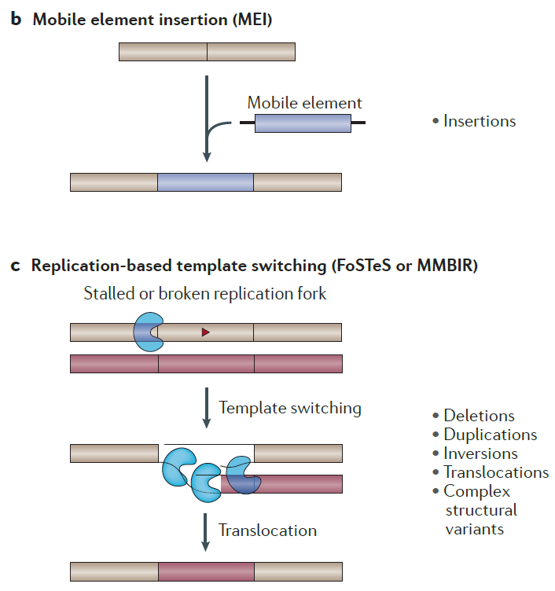

# Module 3: Human genetic variation

----

----

----

----

## Origins of sequence variation - mutation  mechanisms

<main id="main" style="display: flex; border: 1px; padding: 10px;">
<left style="flex: 1; padding-right: 10px;background-color:rgb(255, 255, 255);" markdown="span">

1. DNA Replicatin Errors

- DNA polymerases occasionally insert the wrong nucleotide resulting a in **base mismatch**
- **Replicate slippage**: Occasionally misalignment between template and newly synthesized strands occur in regions of short tandem oligonucleotide repeats

</left>
<right id="col_right" style="flex: 1; padding-left: 10px;background-color:rgb(255, 255, 255);" markdown="span">

</right>
</main>

----

## Origins of sequence variation - mutation  mechanisms

2. Chromosome segregation and recombination errors

- Errors in chromosome segregation changes chromosomal DNA copy number
- Sometimes chromatids can misalign during recombination and subsequent crossovers results in duplication/deletion

3. Exogenous chemical damage to DNA

- **Mutagens**, such as radiation and harmful chemicals are external agents that can induce mutation.

----

## Origins of sequence variation - mutation  mechanisms

4. Endogenous chemical damage to DNA

- Base deletion through hydrolytic damage
- Oxidative damage due to reactive oxygen species (ROS) causing breakage of DNA strands or base modification.
  - ROS are generated in different cellular pathways and play important roles in intercelullular and intracellular signalling paths.  
- Aberrant DNA methylation: sometimes methyltransferase can inappropriately methylate DNA to produce harmful bases

----

<main id="main" style="display: flex; border: 1px; padding: 1px;">
<left style="flex: 1; padding-right: 10px;background-color:rgb(255, 255, 255);" markdown="span">

Genetic mechanisms of pathogenesis

</left>
<right id="col_right" style="flex: 1; padding-left: 10px;background-color:rgb(255, 255, 255); font-size:20pt" markdown="span">

- Variants in the coding region result in structurally abnormal proteins that have a loss or gain of function or a novel property that causes disease.
- Variants in noncoding sequences include (1) those that alter the stability or splicing of the messenger RNA (mRNA) and (2) those that disrupt regulatory elements or change **gene dosage**.
- Variants in regulatory elements alter the abundance of the mRNA or the time or cell type in which the gene is expressed.
</right>

</main>

----

## Types of Variation in Human Genetic Disease - Nucleotide Substitutions

| **Type of Variation**                                                                                                     | **Percentage** |
|---------------------------------------------------------------------------------------------------------------------------|---------------|
| Missense variants (amino acid substitutions)                                                                              | 40%           |
| Nonsense variants (premature stop codons)                                                                                 | 10%           |
| RNA processing variants (destroy consensus splice sites, cap sites, and polyadenylation sites or create cryptic sites)    | 10%           |
| Splice-site variants leading to frameshift mutations and premature stop codons                                            | 10%           |
| Long-range regulatory variants                                                                                            | Rare          |

----

## Types of Variation in Human Genetic Disease - Deletions and Insertions

| **Type of Variation**                                                                                                                                          | **Percentage** |
|----------------------------------------------------------------------------------------------------------------------------------------------------------------|---------------|
| Addition or deletions of a small number of bases                                                                                                              | 25%           |
| Larger gene deletions, inversions, fusions, and duplications (may be mediated by DNA sequence homology either within or between DNA strands)                  | 5%            |
| Insertion of a LINE or Alu element (disrupting transcription or interrupting the coding sequence)                                                             | Rare          |
| Dynamic variants (expansion of trinucleotide or tetranucleotide repeat sequences)                                                                             | Rare          |

----

<main id="main" style="display: flex; border: 1px; padding: 1px;">
<left style="flex: 1; padding-right: 10px;background-color:rgb(255, 255, 255);" markdown="span">

Types of genetic mutations

</left>
<right id="col_right" style="flex: 1; padding-left: 10px;background-color:rgb(255, 255, 255); font-size:20pt" markdown="span">

Mechanisms

Recurrent structural variants can result from **non-allelic homologous recombination (NAHR)** which involves recombination between long highly similar low-copy-number repeats (blue and orange segments).

</right>
</main>

----

<main id="main" style="display: flex; border: 1px; padding: 1px;">
<left style="flex: 1; padding-right: 10px;background-color:rgb(255, 255, 255);" markdown="span">

</left>
<right id="col_right" style="flex: 1; padding-left: 10px;background-color:rgb(255, 255, 255);" markdown="span">

- Novel genomic insertions can involve **mobile element insertion** of transposable elements by
retrotransposition.

- DNA-replication-associated template-switching events, involving the **fork-stalling and template switching (FoSTeS)** and **microhomology-mediated break-induced replication (MMBIR) mechanisms**, can lead to simple or complex structural variants, frequently involving duplications.

</right>
</main>

----

<main id="main" style="display: flex; border: 1px; padding: 1px;">
<left style="flex: 1; padding-right: 10px;background-color:rgb(255, 255, 255);" markdown="span">

</left>
<right id="col_right" style="flex: 1; padding-left: 10px;background-color:rgb(255, 255, 255); font-size:20pt" markdown="span">

- **Non-homologous end joining (NHEJ)** is a process that repairs DNA double-strand breaks in the absence of extensive sequence homology and is often accompanied by the addition or deletion of several nucleotides in the form of a 'repair-scar' (small red bar).

- **Chromothripsis** is a phenomenon that involves chromosome shattering leading to numerous breakpoints, followed by error-prone DNA repair. This mechanism can lead to rare catastrophic rearrange-ments in cancer cells and also in the context of germline DNA rearrangements.

</right>
</main>

----

## Functional consequences of structural variants

Genes (boxes) are regulated by the collective and combinatorial input of regulatory elements, including tissue-specific enhancers (hexagons, with different colours indicating tissue specificity, and arrows pointing to the target gene) and insulators (black rectangles), which block the activity of regulatory elements.

----

## Functional consequences of structural variants

Structural variants (shown by square brackets) can have phenotypic consequences by altering coding regions.

- SVs can remove part of a coding region or fuse different coding regions after a duplication, resulting in aberrant transcripts.
- When the breakpoint of a deletion, insertion, or tandem duplication is located within a functional gene, it may interrupt the gene and cause a **loss of function** by inactivating a gene.

----

## Functional consequences of structural variants

- **Gene fusion** caused by genomic rearrangements between different genes or their regulatory sequences can generate a **gain-of-function** mutation.
- This mechanism is prominent among cancers associated with specific somatic chromosomal translocations.

----

## Functional consequences of structural variants

Deletions or duplications can lead to altered doses of otherwise functionally intact elements, resulting in altered regulatory input (left) or altered gene copy number (right).

----

## Functional consequences of structural variants

<main id="main" style="display: flex; border: 1px; padding: 1px;">
<left style="flex: 1; padding-right: 10px;background-color:rgb(255, 255, 255);" markdown="span">

</left>
<right id="col_right" style="flex: 1; padding-left: 10px;background-color:rgb(255, 255, 255); font-size:22pt" markdown="span">

SVs flanking genes can affect expression through position effects. A deletion of important regulatory elements can alter gene expression; similar effects could result from inversion or translocation of such elements.

</right>
</main>

----

## Functional consequences of structural variants

- The deletion of a functional element could unmask a functional polymorphism within an effector, which could have consequences for gene function.

----

## Loss of Function Variants

- Gene dosage: many variants have primarily quantitative ‘dosage’ consequences for the transcript and protein, that is, they cause a loss, reduction or increase of the gene product without introducing novel functional characteristics.
- Loss of function (LoF) variant: the complete loss of a protein encoded from the allele, due to loss of the allele, unstable mRNA or unstable and inactive protein.

----

## Gain of Function Variants

1. Variants that increase the production of a normal protein.

- The most common variants of this type are due to increased gene dosage, which generally results from duplication of part or all of a chromosome (e.g. Down Syndrome)

2. Variants that improves the normal function of a protein. (rare occurrence)

- Example: a missense variant that creates hemoglobin Kempsey locks hemoglobin into its high oxygen affinity state, thereby reducing oxygen delivery to tissues.

----

## Variable expression of complex diseases

| **Type**                | **Definition**                                                      | **Example**                                                                                  |
|-------------------------|---------------------------------------------------------------------|----------------------------------------------------------------------------------------------|
| Allelic heterogeneity   | The occurrence of more than one allele at a locus                   | βThalassemia                                                                                 |
| Locus heterogeneity     | The association of more than one locus with a clinical phenotype    | Thalassemia can result from variants in either the α-globin or β-globin genes                |
| Clinical or phenotypic  | The association of more than one phenotype with variants at a locus | Sickle cell disease and β-thalassemia each result from distinct β-globin gene variants       |

----

## Case Study Example: α-Thalassemia

----

<main id="main" style="display: flex; border: 1px; padding: 1px;">
<left style="flex: 1; padding-right: 10px;background-color:rgb(255, 255, 255);" markdown="span">

</left>
<right id="col_right" style="flex: 1; padding-left: 10px;background-color:rgb(255, 255, 255); font-size:18pt" markdown="span">

- Heterozygosity for a loss of function (LoF) variant (LoF/WT, typically 50% protein function) is often asymptomatic, reflecting recessive inheritance

- **Hypomorphic (Hyp) variants**: genetic variants that reduce but do not completely abolish the function of the encoded protein.

- Autosomal dominant diseases caused by quantitative variants are generally semi-dominant, with more severe consequences or lethality in the homozygous state.

</right>
</main>
