

# Module 4: RNASeq

----

## Class Poll: Lab 1

- Did you feel like you had enough time to complete Lab 1a and Lab 1b during the lab hours?

----

## Other Updates

- Lab 1 and Group Assignment #1 marks
- Error troubleshooting

----

## Typical RNA Experiment

<main id="main" style="display: flex; border: 1px; padding: 10px;">

<left style="flex: 1; padding-right: 1px;background-color:rgb(255, 255, 255);" markdown="span">

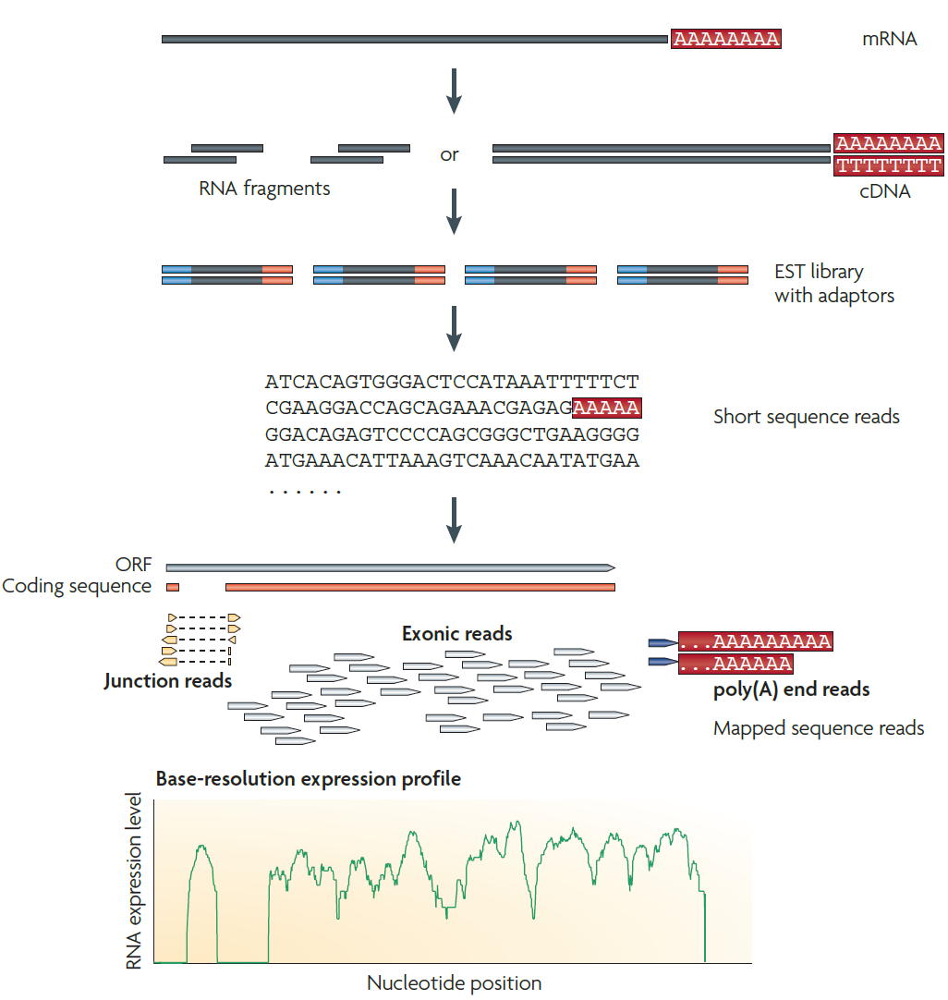

</left>
<right id="col_right" style="flex: 1; padding-left: 1px;background-color:rgb(255, 255, 255);" markdown="span">

1. Long RNAs are converted into a library of cDNA fragments through either RNA fragmentation or DNA fragmentation.
2. Sequencing adaptors (blue) are subsequently added to each cDNA fragment.
3. A short sequence is obtained from each cDNA using high-throughput sequencing technology.

</right>
</main>

----

## Typical RNA Experiment

<main id="main" style="display: flex; border: 1px; padding: 10px;">

<left style="flex: 1; padding-right: 1px;background-color:rgb(255, 255, 255);" markdown="span">

</left>
<right id="col_right" style="flex: 1; padding-left: 1px;background-color:rgb(255, 255, 255);" markdown="span">

4. The resulting sequence reads are aligned with the reference genome or transcriptome, and classified as three types: exonic reads, junction reads and poly(A) end-reads.
5. These three types are used to generate a base-resolution expression profile for each gene.

</right>
</main>

----

## Types of RNA Experiments [2]

1. **Bulk RNA sequencing**: allows genome-wide analysis across the whole transcriptome within a cell population using NGS technology
    - highly reproducible among technical replicates
2. **Single-cell RNA sequencing (scRNA-seq)**: enables the comparison of the transcriptomes of individual cells and the analysis of heterogeneity within a cell population
    - has a greater proportion of zeros, more variability, and a more complex distribution than bulk RNA-seq data
3. **High-throughput spatial transcriptomics (HST)**: provides gene expression profiles at the cell or close-to-cell level while also preserving spatial tissue context information

----

## Types of RNA Experiments [2]

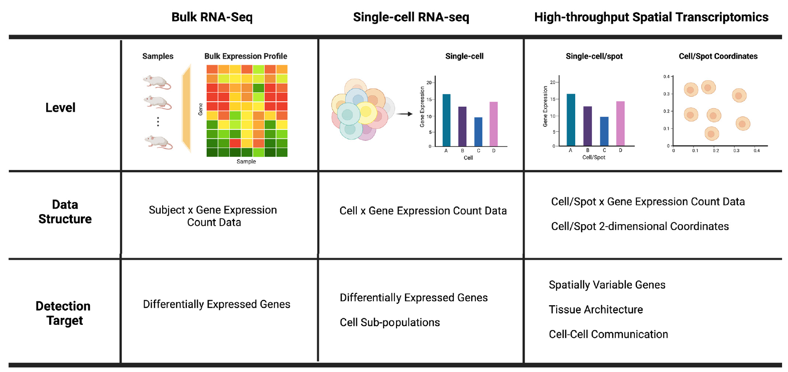

[2]: (https://doi.org/10.3390/biom13020221) "Jeon, H., Xie, J., Jeon, Y., Jung, K.J., Gupta, A., Chang, W. & Chung, D. Statistical power analysis for designing bulk, single-cell, and spatial transcriptomics experiments: review, tutorial, and perspectives. Biomolecules 13, 221 (2023)."
----

## A general pipeline for bulk RNA-seq analysis [3]

<main id="main" style="display: flex; border: 1px; padding: 10px;">

<left style="flex: 0.75; padding-right: 1px;background-color:rgb(255, 255, 255);" markdown="span">

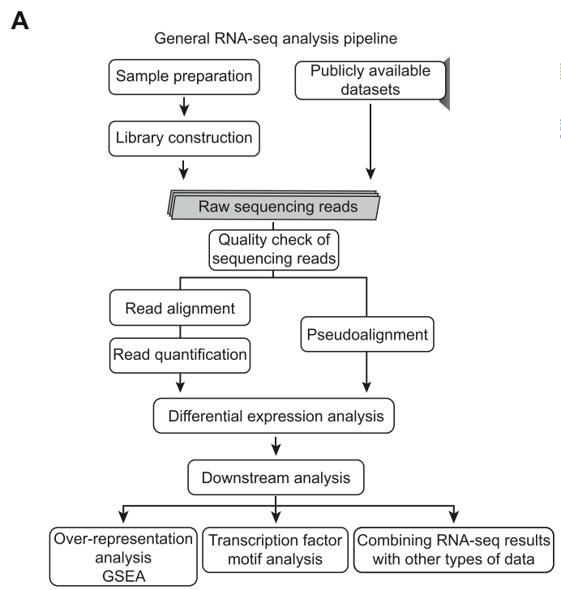

</left>
<right id="col_right" style="flex: 1; padding-left: 1px;background-color:rgb(255, 255, 255);" markdown="span">

- Raw sequencing reads can be obtained by preparing library or by accessing publicly available datasets.
- Raw sequencing reads can be processed to measure transcript levels by using:
    1. read alignment & quantification **or**
    2. pseudoalignment
- Quantified reads are then used to perform differential expression analysis

</right>
</main>

----

## A general pipeline for bulk RNA-seq analysis[3]

<main id="main" style="display: flex; border: 1px; padding: 10px;">

<left style="flex: 0.75; padding-right: 1px;background-color:rgb(255, 255, 255);" markdown="span">

</left>
<right id="col_right" style="flex: 1; padding-left: 1px;background-color:rgb(255, 255, 255);" markdown="span">

- Downstream signaling analysis  includes:
  - Gene set enrichment analysis (GSEA)
  - Transcription factor motif analysis
  - Combinatorial analysis with other types of datasets.

</right>
</main>

[3]: (https://doi.org/10.1016/j.mocell.2024.100060) "Lee, G.-Y., Ham, S., & Lee, S.-J. V. (2024). Brief guide to RNA sequencing analysis for nonexperts in bioinformatics. Molecules and Cells, 47(5), 100060."

----

## Common tools in RNASeq Analysis Pipeline [3]

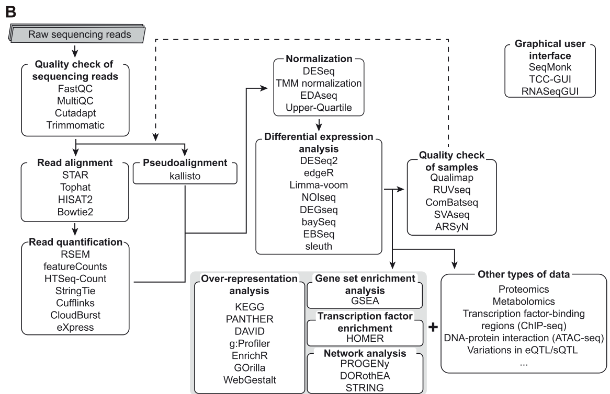

----

## Roadmap of RNASeq Analyses [4]

- Scientists plan experiments and adopt different analysis strategies depending on the organism being studied and their research goals.
- There is no optimal pipeline for the variety of different applications and analysis scenarios in which RNA-seq can be used.

----

## Roadmap of RNASeq Analyses [4]

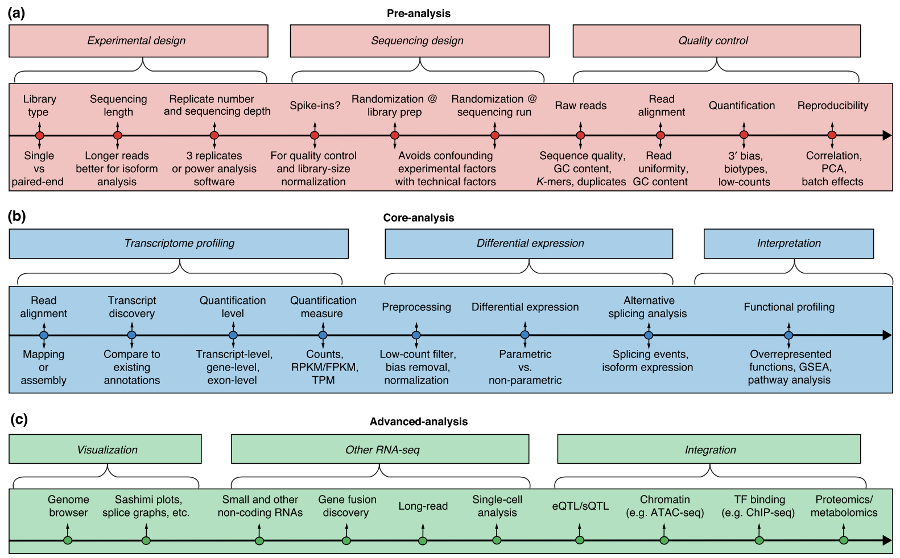

[4]: (https://doi.org/10.1186/s13059-016-0881-8) "Conesa, A., Madrigal, P., Tarazona, S. et al. A survey of best practices for RNA-seq data analysis. Genome Biol 17, 13 (2016)."

----

## Experimental Design

| Library Type      | Use Case                                                                                              |
|-----------------------|-------------------------------------------------------------------------------------------------------|
| Single-end (SE) Reads | Sufficient for studies of gene expression levels in well-annotated organisms.                        |
| Paired-end (PE) Reads | Preferable for de novo transcript discovery or isoform expression analysis, especially in poorly annotated transcriptomes. |

----

## Read Length [5]

<md id="col_right" style="flex: 1; font-size: 24px" markdown="span">

| Feature | Short Reads (50–600bp) | Long Reads (>5kbp)|
|---------|:----------------------:|:-----------------:|
| **Error Rate** |Lower  | Higher   |
| **Throughput** | Higher   | Lower                             |
| **Alignment** | Suffers from multi-mapping issues due to shorter lengths. | Easier to map accurately|
| **de novo assembly**   | Not ideal; they do not span shared regions or exon junctions.         | Preferred; eliminates ambiguity in the assembly step.|
| **Expression Quantification** | Preferred due to higher throughput, though requires advanced statistical methods. | Can cover entire transcripts, simplifying transcript determination for each read.              |

[5]: (https://doi.org/10.3389/fgene.2023.997383) "Deshpande, D. et al. RNA-seq data science: From raw data to effective interpretation. Frontiers in Genetics 14 (2023)."
</md>

----

## Sequencing Depth

- The number of sequenced reads for a given sample
- More transcripts detected and quantified as sequencing depth increases.

<md id="col_right" style="flex: 1; font-size: 24px" markdown="span">

| Use Case                 | Requirement|
|-------------------------|--------------------------------------------------------------------|
| Medium to highly expressed genes| >5 million reads|
| Low-expression genes    | Requires deeper sequencing (up to 100  million reads) for precise quantification.                           |
| Single-cell studies     | Reliable quantification achievable with 1 million reads; highly expressed genes detectable with 50,000 reads (or as few as 20,000 for splenic tissues). |

</md>

----

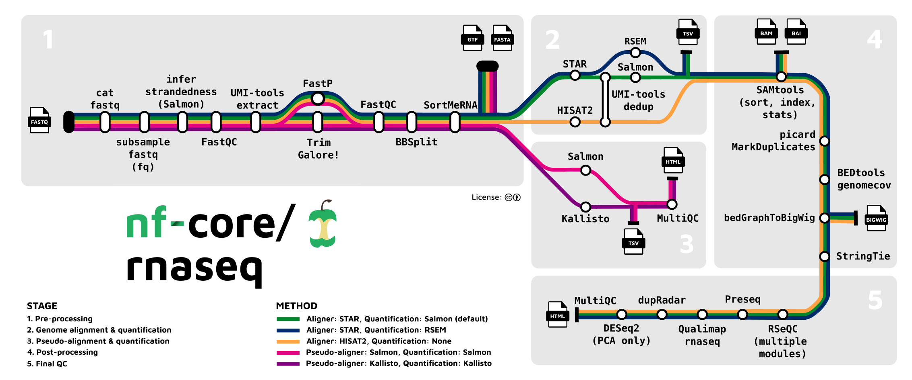

----

## Quality Control - Read Trimming

- Trim Galore: (default) a wrapper around Cutadapt and FastQC (quality control)
  - Cutadapt requires at least 3bp matching of the adapter sequence and the read for it to be recognized as an adapter
  - If the adapter is <3 bp, they won’t be detected, and usually will be reported as a mismatch or soft clip

----

## Quality Control - Read Trimming

- fastp: ultra-fast all-in-one FASTQ preprocessor for quality profiling, read filtering, read pruning, adapter trimming, polyG/polyX tail trimming, UMI preprocessing
  - can trim adapters with even only one base in the tail.
  - Assumes:
        1. there is only one adapter in the data and
        2. the second one is that adapter sequences are only in the read tails
  - the assumptions are valid for major next-generation sequencers like Illumina HiSeq series, NextSeq series and NovaSeq series.

- ([link](https://www.biorxiv.org/content/10.1101/274100v1.full.pdf)) Performance comparison between: cutadapt vs fastp, fastqc vs fastp

----

### Why do we care about PolyG trimming?

- PolyG is a common issue that can be observed from Illumina NextSeq and NovaSeq series (technical issue associated with sequencers).
- It can cause serious base content separation problem, which means A and T, or C and G have much different base content ratio.
- fastp also implements polyX tail trimming, where X means any base of A/T/C/G.

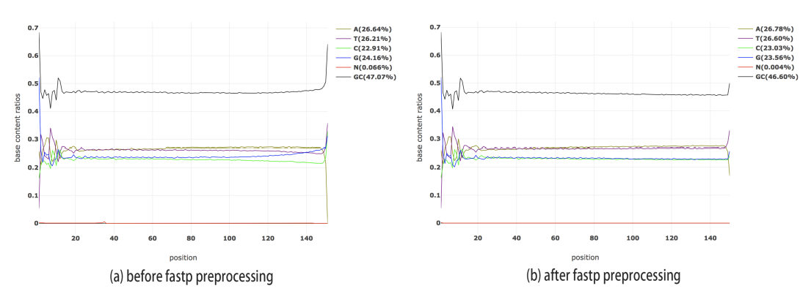

----

## Other QC tools

- [UMI-tools](https://doi.org/10.1101/gr.209601.116): scRNASeq
  - removes Unique Molecular Identifiers (UMIs)/Random Molecular Tags (RMTs) and single cell RNA-Seq cell barcode
  - identify PCR duplicates using the UMIs and perform different levels of analysis
- [BBSplit](https://jgi.doe.gov/data-and-tools/software-tools/bbtools/bb-tools-user-guide/bbmap-guide/): metagenomics
  - used for sorting reads based on their alignment to multiple reference genomes in metagenomics studies where samples may contain a mixture of organisms
  - Use case: separate host DNA from microbial DNA or differentiate between multiple microbial species.
- [SortMeRNA](https://doi.org/10.1093/bioinformatics/bts611): filter rRNA fragments from metatranscriptomic data

----

## Genome index - Why do we do this?

- Indexing the genome allows for more efficient mapping of the reads to the genome. Once index is built, it can be queried any number of times.
- When using `nf-core/rnaseq`, you should initialize genome indices for the alignmener(s)/pseudoaligner(s), especially if you plan to run the same dataset multiple times.
  - Hash-based (Salmon, Kallisto): Memory intensive and slower; simpler in design but more sensitive
  - Suffix arrays (Salmon, STAR): Requires large amount of memory to load the suffix array and genome sequence prior to alignment
  - Burrows-Wheeler transform (Bowtie2, BWA-MEM): non-splice aware;  not recommended

----

## Read alignment: Read Coverage

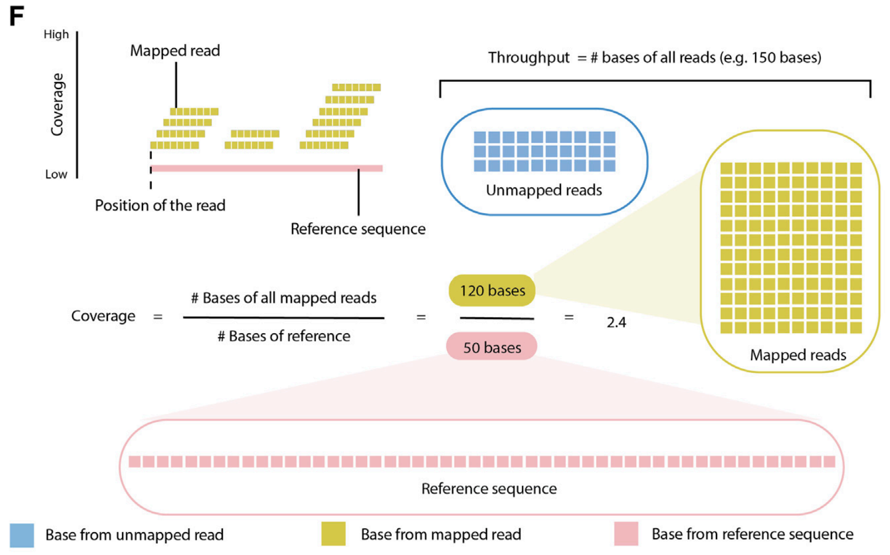

----

<md style="background-color:rgb(255, 255, 255); font-size:20pt" markdown="span">

## Read alignment: Tools

- The goal of the alignment is to find the locus in the reference sequence with the greatest match to each read.
- Generic aligners such as `BWA`, `bowtie2`, `BBMap`, etc., are not suitable for mapping RNAseq reads because they are not splice-aware.

</md>

<main id="main" style="display: flex; border: 1px; padding: 0px;">

<left style="flex: 1; padding-right: 1px;background-color:rgb(255, 255, 255);" markdown="span">

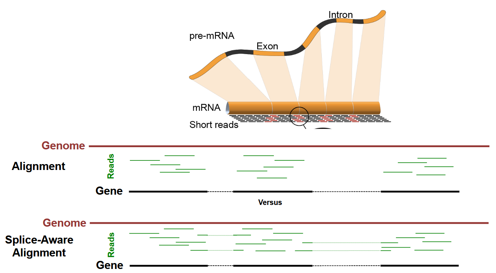

</left>
<right id="col_right" style="flex: 1; padding-left: 5px ;background-color:rgb(255, 255, 255);font-size:20pt" markdown="span">

### Why do we need splice-aware alignment for RNASeq?

RNAseq reads are mRNA reads that only contain exonic regions, hence mapping them back to the genome requires splitting the individual reads that span an intron. It can be done only by splice-aware mappers.

</right>
</main>

----

## Read alignment: Splice-Aware Aligner vs Pseudoaligner [6]

**Splice-Aware Aligner**: `star_salmon`, `star_rsem`, `hisat2`

- Ideal for detecting splicing events, fusion genes, and complex isoforms.
- Necessary if you want to do variant calling from RNA‐seq data.
- Typically used when analyzing small RNAs or low‐abundance transcripts.

**Pseudoaligner**: `salmon`, `kallisto`

- Best suited for rapid, large‐scale gene/transcript quantification (e.g., in large cohorts).
- Offers fast, memory‐efficient processing.
- Adequate for most standard mRNA‐seq experiments where detailed isoform/splicing analysis is not the main goal.

[6]:(https://www.lasseigne.org/education_resources/guides/rnaseqguide)

----

## Splice‐Aware Aligners[6]

| **Pros**                                                                                                                                              | **Cons**                                                                                                                  |
|:------------------------------------------------------------------------------------------------------------------------------------------------------|:--------------------------------------------------------------------------------------------------------------------------|
| Can identify novel splicing events, alternative isoforms, and fusion events.                     | Typically more time‐ and memory‐intensive due to the complexity of alignment.       |
|Often more sensitive to RNAs such as microRNAs or transcripts expressed at low levels.             |Reads that map equally well to multiple locations can be harder to resolve.          |
|Offers base‐by‐base alignment necessary for variant calling (SNP, indel) or fusion gene detection.             |                                                                                                                           |

----

## Pseudoaligners[6]

<md id="col_right" style="flex: 1; font-size: 26px" markdown="span">

|**Pros** | **Cons** |
|:------------------------------------------------------------------------------------------------------------------------------------------------------------------|:-------------------------------------------------------------------------------------------------------------------------------------------------------------------------------------------------|
|K‐mer‐based matching is faster and more memory‐efficient.                                                                                    | Less effective at detecting novel splicing events or complex isoforms, as no explicit alignment across exon–intron boundaries is performed.    |
|Ideal for large‐scale projects focusing on gene‐level or transcript‐level abundance estimates.                                                         | Lacks base‐by‐base alignments, making it inappropriate for detecting SNPs, indels, or other variants.                                              |
| Can achieve accuracy comparable to splice‐aware aligners in standard RNA‐seq for abundant transcripts.                                    | May underperform in quantifying microRNAs or very low‐abundance transcripts                         |

</md>

----

## Bias Correction: Sequence Bias [7]

- Caused by the differential binding efficiency of random hexamer primers during RNA-Seq library preparation
- Represented by biased distribution of reads related to the sequence content
- Affects the accuracy of quantifying isoforms

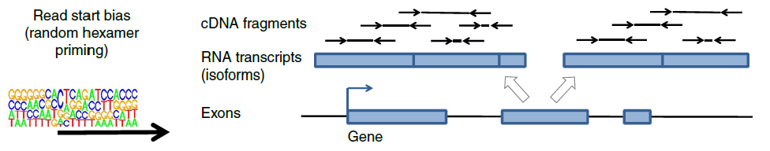

[7]:(https://doi.org/10.1038/nbt.3682) "Love, M., Hogenesch, J. & Irizarry, R. Modeling of RNA-seq fragment sequence bias reduces systematic errors in transcript abundance estimation. Nat Biotechnol 34, 1287–1291 (2016). "

----

## Bias Correction: GC Bias [8]

- Caused by the composition of the DNA molecule affecting many stages of the sequencing protocol such as the priming ([9](https://pmc.ncbi.nlm.nih.gov/articles/PMC3378858/#gks001-B9)), size selection ([10](https://pmc.ncbi.nlm.nih.gov/articles/PMC3378858/#gks001-B3)), PCR ([11](https://pmc.ncbi.nlm.nih.gov/articles/PMC3378858/#gks001-B10)) and probability of sequencing errors ([12](https://pmc.ncbi.nlm.nih.gov/articles/PMC3378858/#gks001-B11),[13](https://pmc.ncbi.nlm.nih.gov/articles/PMC3378858/#gks001-B13)).
- Represented by uneven counts of RNA-seq fragments (read coverage) along transcripts with increased coverage when the ends are AT rich
- Affects the accuracy of quantifying gene expression

[8]:(https://pmc.ncbi.nlm.nih.gov/articles/PMC3378858) "Benjamini Y, Speed TP. Summarizing and correcting the GC content bias in high-throughput sequencing. Nucleic Acids Res. 2012 May;40(10):e72. doi: 10.1093/nar/gks001. Epub 2012 Feb 9. PMID: 22323520; PMCID: PMC3378858."

----

## Bias Correction: Positional Bias [14]

Caused by:

1. RNA degradation: mRNA from different genes may degrade at different rates
    - RNA degradation can cause a 3' bias in read coverage along messenger RNA (mRNA) transcripts. Degraded samples may have an underrepresentation of long transcripts and an overrepresentation of short transcripts.
2. mRNA selection techniques: poly(A) selection in the sequencing protocol to mRNA enrichment

[14]: (https://doi.org/10.1186/s12864-022-08762-8) "Viscardi> MJ, Arribere JA. Poly(a) selection introduces bias and undue noise in direct RNA-sequencing. BMC Genomics. 2022 Jul 22;23(1):530. doi: 10.1186/s12864-022-08762-8. PMID: 35869428; PMCID: PMC9306060."

----

## Bias Correction: Positional Bias [14]

<main id="main" style="display: flex; border: 1px; padding: 0px;">

<left style="flex: 1; padding-right: 1px;background-color:rgb(255, 255, 255);" markdown="span">

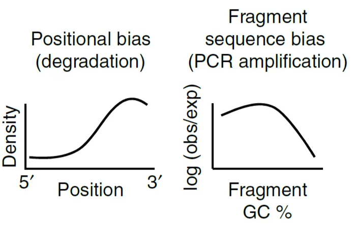

</left>
<right id="col_right" style="flex: 1; padding-left: 5px ;background-color:rgb(255, 255, 255)" markdown="span">

- RNA degradation: Represented by the non-uniform distribution of reads over different positions of a transcript
- poly(A) selection skews sequenced mRNAs toward longer poly(A) tail lengths

</right>
</main>

----

## Read Quantification

- **Salmon**: requires a set of target transcripts (either from a reference or de-novo assembly) in order to perform quantification
- **RSEM**: RSEM is one of the most accurate quantification tools for RNA-seq analysis
- **HISAT2**: uses Hierarchical Graph FM index (HGFM) combined with several alignment strategies, to enable rapid and accurate alignment of sequencing reads
  - good option if you have memory limitations
  - doesn't perform quantification in the `nf-core/rnaseq` pipeline

----

## Lab 2: RNASeq using Nextflow

- Due on **March 9 midnight**
- Lab 2a and 2b will be released at the same time
    - **Lab 2a**: Run the Nextflow pipeline using a *Drosophila* dataset
    - **Lab 2b**: How to interpret pipeline output
- I will release a sample output report so that you may work on Lab 2b while the Nextflow pipeline is running
- You may work together as a group, but lab submissions are individual.
