

# Module 5:  RNASeq (Part 2)

----

## Key concepts

- Quality control (continuation of Module 4)
- Gene-environment interactions
- Applications:
  - Alternative splicing events
  - Structural variant detection

----

## Sequence Quality

**Quality Score (Q)** = -10 log10(e), where **e** is the estimated probability of the base call being wrong.

- **Higher Q scores** → Smaller probability of error  
- **Lower Q scores** → Higher probability of error, leading to:
  - Unusable reads  
  - False-positive variant calls  
  - Inaccurate conclusions  

### Quality Score Thresholds

- **Q20**:  Error rate=1%; Call accuracy = **99%**
- **Q30**: Virtually all reads are error-free (**benchmark for NGS**)

----

<main id="main" style="display: flex; border: 1px; padding: 1px;">

<left style="flex: 0.5; padding-right: 10px;background-color:rgb(255, 255, 255);" markdown="span">

## GC Content

- The GC content of the reads should be similar to the expected % GC for the organism (see reference table [here](https://pmc.ncbi.nlm.nih.gov/articles/PMC2909565/)).
- The distribution should be normal unless over-represented sequences (sharp peaks on a normal distribution) or contamination with another organism (broad peak).

</left>
<right id="col_right" style="flex: 0.45; padding-left: 10px;background-color:rgb(255, 255, 255);" markdown="span">

#### What happens when you align the reads to the wrong reference genome? [1](https://www.biostars.org/p/434543/)

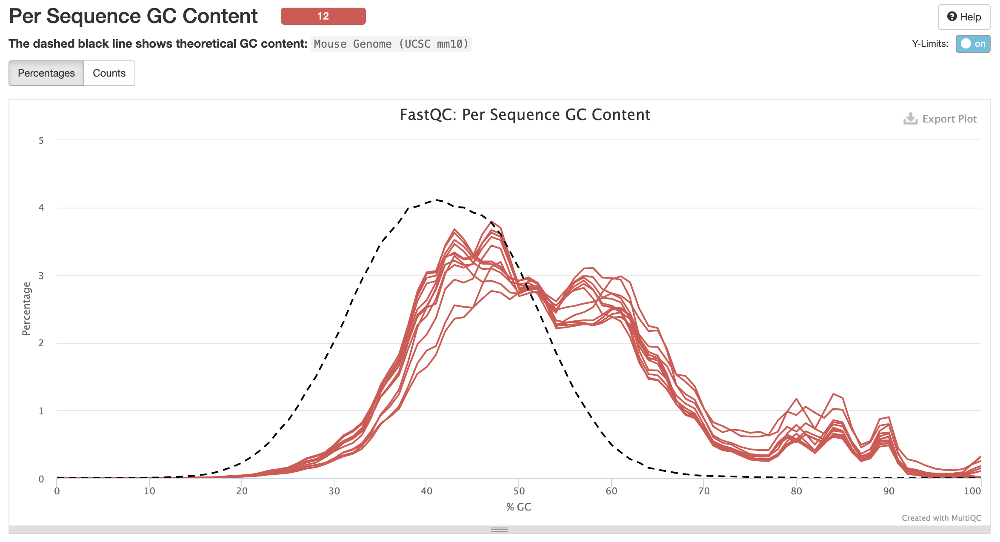

</right>
</main>

----

## Overrepresented sequences (K-mers)

- The sequences (at least 20 bp) that occur in more than 0.1% of the total number of sequences
- Overrepresented sequences are usually adapters from the library prep and requires adapter trimming using tools like `fastp` or `trimgalore`

----

## Read Duplication

<main id="main" style="display: flex; border: 1px; padding: 1px;">

<left style="flex: 0.5; padding-right: 1px;background-color:rgb(255, 255, 255);" markdown="span">

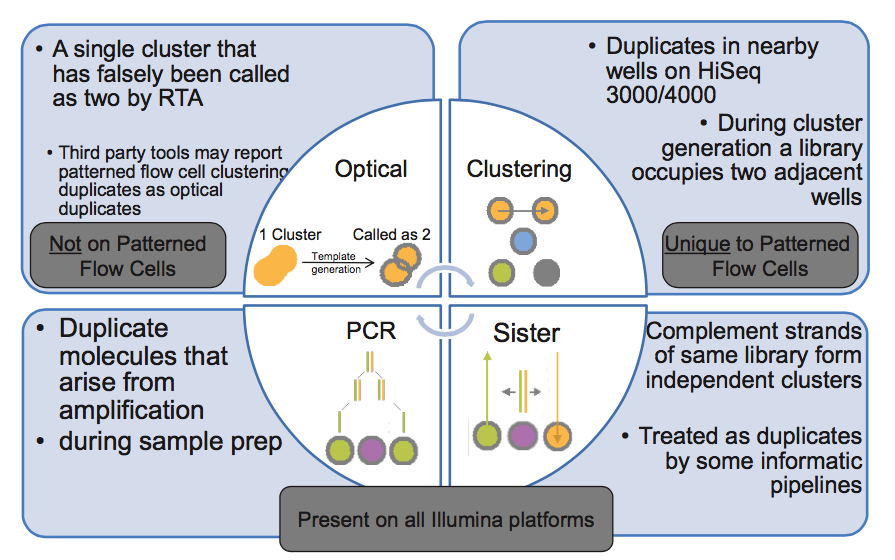

</left>
<right id="col_right" style="flex: 0.5; padding-left: 10px;background-color:rgb(255, 255, 255);" markdown="span">

- **Optical duplicate**: a duplicate read that occurs when a sequencer separates a single cluster into multiple clusters.
- Duplicates unique to patterned flow cells arise from when the library molecules from a cluster return to the surrounding solution and then act as a seed for second cluster in a nearby flow cell.[2]

</right>
</main>

[2]:(https://sequencing.qcfail.com/articles/illumina-patterned-flow-cells-generate-duplicated-sequences/)

----

## Read Duplication

<main id="main" style="display: flex; border: 1px; padding: 1px;">

<left style="flex: 0.5; padding-right: 1px;background-color:rgb(255, 255, 255);" markdown="span">

</left>
<right id="col_right" style="flex: 0.5; padding-left: 10px;background-color:rgb(255, 255, 255);" markdown="span">

- A **PCR duplicate** is a duplicate read that arises from occur in library preparation during the PCR amplification stage.
- Sister duplicates arise when the same DNA strand is used to form multiple clusters on the flow cell.

</right>
</main>

----

## Read Duplication

- **Single-end** reads tend to have higher duplication rate than **paired-end** reads.
- **Higher** sequencing depth usually lead to **higher** duplication rate.
- **High** duplication rate does not necessarily indicate problems with the library preparation.
- **Highly** expressed genes have many copies of mRNA molecules, thus are expected to have **many** duplicate reads in the library, while **lowly** expressed genes should not.

----

## Genotype × environment interactions (GxE)

GxE occur when the genetic effect on a phenotype varies depending on the environment or, vice versa, the effect of the environment on a phenotype varies depending on the individual’s genotype.

- Does a polygenic G × E interaction contribute to a human trait(and by how much) across one or more environmental contexts? [3]

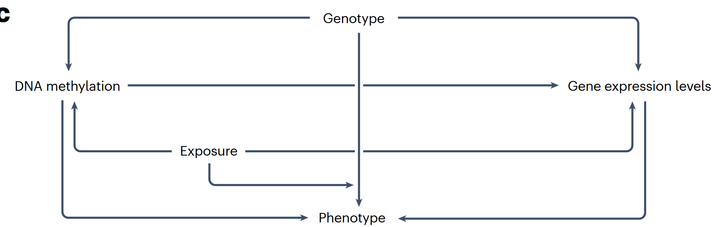

[3]:(https://doi.org/10.1038/s41576-024-00731-z) "Herrera-Luis, E., Benke, K., Volk, H. et al. Gene–environment interactions in human health. Nat Rev Genet 25, 768–784 (2024)."
----

## GxE interactions[4]

Different gene-regulatory mechanisms can be impacted by GxE.

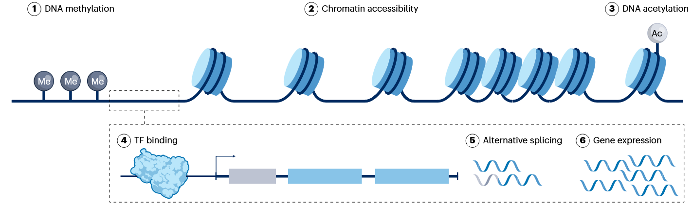

[4]:(https://doi.org/10.1038/s41588-024-01776-w) "Boye, C., Nirmalan, S., Ranjbaran, A. et al. Genotype × environment interactions in gene regulation and complex traits. Nat Genet 56, 1057–1068 (2024)."

----

## Epigenetics in complex diseases[5]

<main id="main" style="display: flex; border: 1px; padding: 1px;">

<left style="flex: 0.3; padding-right: 1px;background-color:rgb(255, 255, 255);" markdown="span">

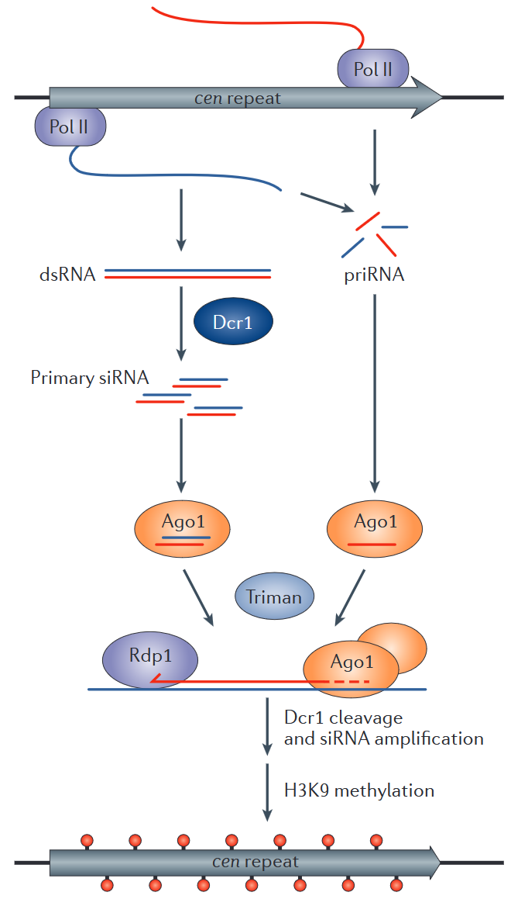

</left>
<right id="col_right" style="flex: 0.7; padding-left: 10px;background-color:rgb(255, 255, 255);" markdown="span">

**RNA interference (RNAi)**:  various RNA silencing pathways that use small RNAs, together with a member of the conserved Argonaute (AGO) and PIWI family of proteins, to target genes for inactivation at the post-transcriptional or transcriptional levels

- *Drosophila melanogaster* and mammals have small RNAs--PIWI-interacting RNAs (piRNAs)-- which mediate RNA degradation in the cytoplasm and DNA or histone methylation in the nucleus

</right>
</main>

----

## Epigenetics in complex diseases[5]

**Self-reinforcing positive feedback loops** are formed by the functional coupling of different types of signal generation events.

- You can understand the molecular basis of these coupling events by identifying the proteins that recognize either histone H3K9me2 and H3K9me3, or DNA cytosine methylation (DNA-5mC), and the proteins that recruit enzymes (e.g. siRNAs) which catalyse the other methylation events.

[5]:(https://doi.org/10.1038/nrg3863) "Holoch, D., Moazed, D. RNA-mediated epigenetic regulation of gene expression. Nat Rev Genet 16, 71–84 (2015)."

----

## GxE interactions: Study Designs[4]

<main id="main" style="display: flex; border: 1px; padding: 1px;">

<left style="flex: 0.5; padding-right: 1px;background-color:rgb(255, 255, 255);" markdown="span">

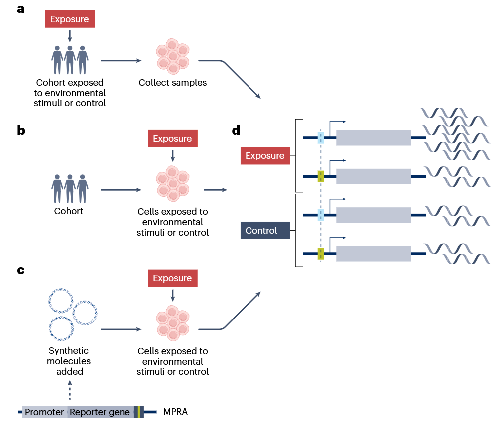

</left>
<right id="col_right" style="flex: 0.45; padding-left: 10px;background-color:rgb(255, 255, 255);" markdown="span">

**A.** The environment is measured in a cohort, biological samples are collected, and both molecular readouts (e.g., gene expression) and genotypes are assessed.

**B.** Biological samples are collected from a cohort, then deliberately exposed to an environment; afterwards, molecular readouts and genotypes are measured.

</right>
</main>

----

## GxE interactions: Study Designs[4]

<main id="main" style="display: flex; border: 1px; padding: 1px;">

<left style="flex: 0.5; padding-right: 1px;background-color:rgb(255, 255, 255);" markdown="span">

</left>
<right id="col_right" style="flex: 0.45; padding-left: 10px;background-color:rgb(255, 255, 255);" markdown="span">

**C.** Engineered constructs (carrying a minimal promoter, a reporter gene, and a sequence of interest) are introduced into cells, and molecular readouts are compared across different alleles and environmental conditions.

</right>
</main>

----

## Example:  Molecular GxE Studies using Immune Stimuli[6]

**Experimental objectives:**

- Understanding molecular mechanisms such as binding of transcription factors that are activated in  response to immune stimuli.
- Find complex interactions, such as GxE with sex or age, duration of the
exposure or cell type
- Determine interindividual differences in pathogen response and autoimmune
disorders

[6]:(https://doi.org/10.1038/s41588-024-01776-w) "Boye, C., Nirmalan, S., Ranjbaran, A. et al. Genotype × environment interactions in gene regulation and complex traits. Nat Genet 56, 1057–1068 (2024)."

----

## Example: Molecular GxE for environmental exposures[7]

<main id="main" style="display: flex; border: 1px; padding: 1px;">

<left style="flex: 0.6; padding-right: 1px;background-color:rgb(255, 255, 255);" markdown="span">

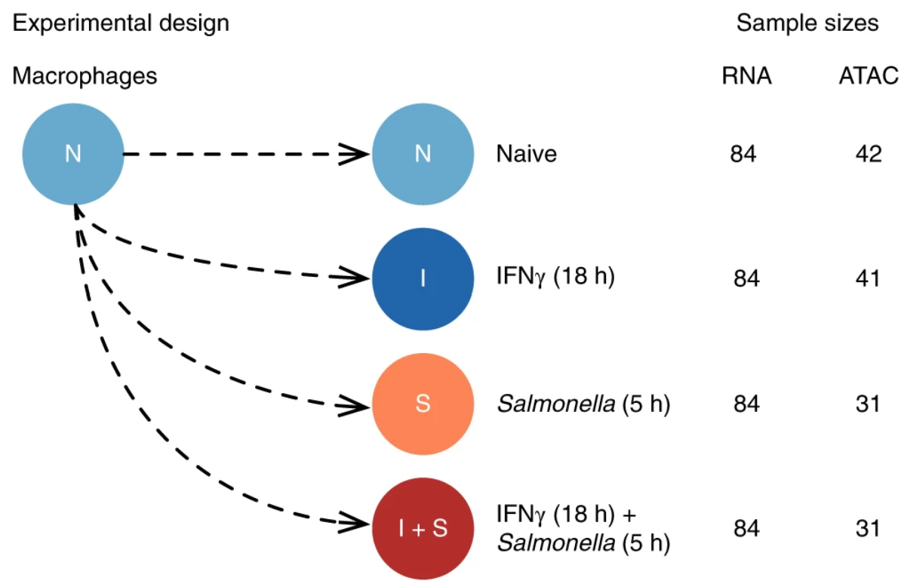

</left>
<right id="col_right" style="flex: 0.4; padding-left: 10px;background-color:rgb(255, 255, 255);" markdown="span">

What are the molecular mechanims for enhancer priming in immune response?

- Used ATAC-Seq and RNA-Seq to measure chromatin accessibility and gene expression in human macrophages exposed to IFNγ, Salmonella and IFNγ plus Salmonella

</right>
</main>

[7]:(https://doi.org/10.1038/s41588-018-0046-7) "Alasoo, K., Rodrigues, J., Mukhopadhyay, S. et al. Shared genetic effects on chromatin and gene expression indicate a role for enhancer priming in immune response. Nat Genet 50, 424–431 (2018)."

----

## Example: Molecular GxE for environmental exposures[7]

<main id="main" style="display: flex; border: 1px; padding: 1px;">

<left style="flex: 0.6; padding-right: 1px;background-color:rgb(255, 255, 255);" markdown="span">

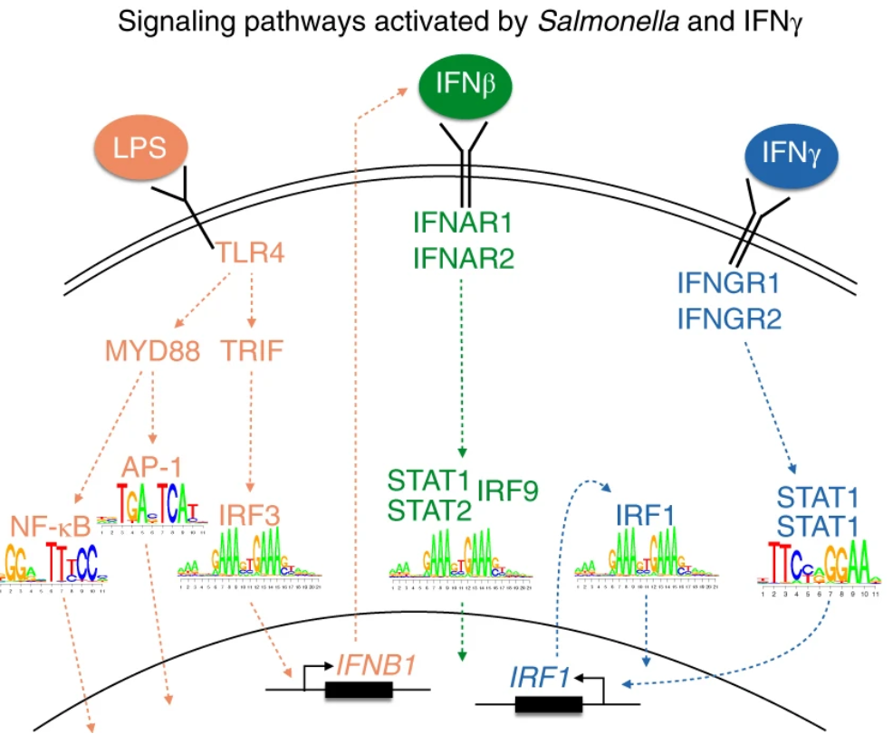

</left>
<right id="col_right" style="flex: 0.4; padding-left: 10px;background-color:rgb(255, 255, 255);" markdown="span">

Identified variants influencing the binding of cell-type-specific transcription factors, such as PU.1, which can then indirectly alter the binding of stimulus-specific transcription factors, such as NF-κB or STAT2.
</right>
</main>

----

## Example: Molecular GxE Studies using Immune Stimuli[8]

<main id="main" style="display: flex; border: 1px; padding: 1px;">

<left style="flex: 0.4; padding-right: 1px;background-color:rgb(255, 255, 255);" markdown="span">

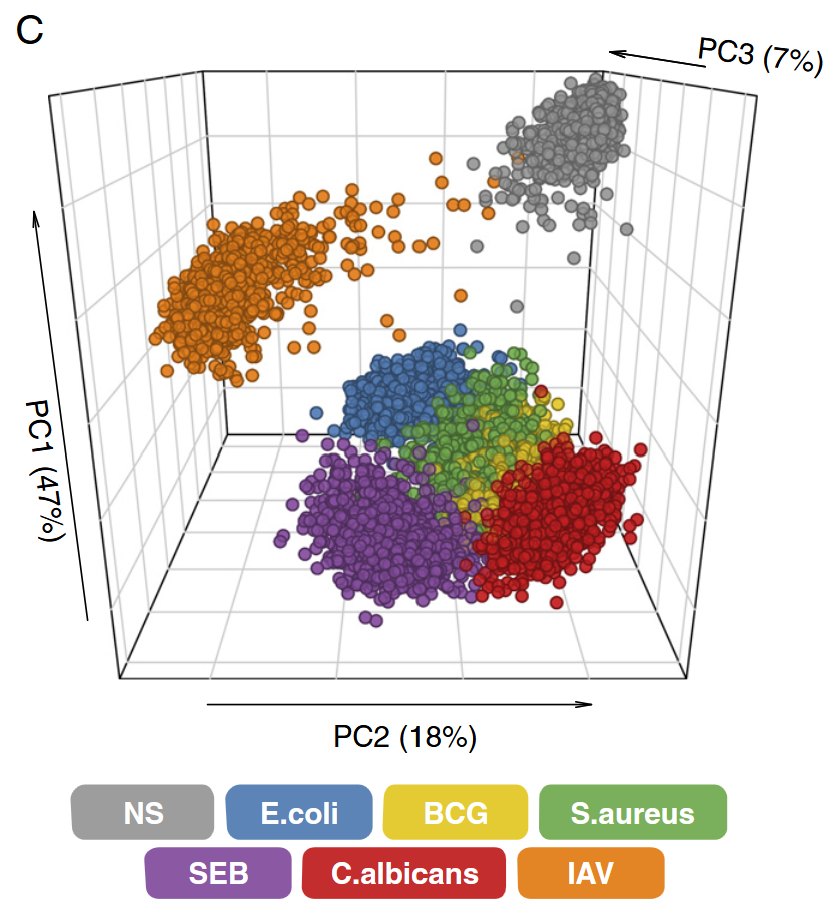

</left>
<right id="col_right" style="flex: 0.6; padding-left: 10px;background-color:rgb(255, 255, 255);" markdown="span">

Do age and sex influence the gene expression of immune-related genes upon immune stimuli?

- Stimulated whole blood samples with three bacteria (*E. coli*, *S. aureus*, and *B. Calmette–Guérin*); a fungus (*C. albican*); a live virus, *influenza A virus* (IAV); and a superantigen, *staphylococcal enterotoxin B* (SEB)
</right>

</main>

[8]:(https://doi.org/10.1073/pnas.1714765115) "Piasecka, Barbara et al. “Distinctive roles of age, sex, and genetics in shaping transcriptional variation of human immune responses to microbial challenges.” Proceedings of the National Academy of Sciences of the United States of America vol. 115,3 (2018): E488-E497."

----

## Example: Molecular GxE Studies using Immune Stimuli[9]

Is host genetic variation associated with variation in gene expression response to RV infections between individuals?

- OSA1 is a gene with known functions in viral response

<main id="main" style="display: flex; border: 1px; padding: 1px;">

<left style="flex: 0.75; padding-right: 20px;background-color:rgb(255, 255, 255);" markdown="span">

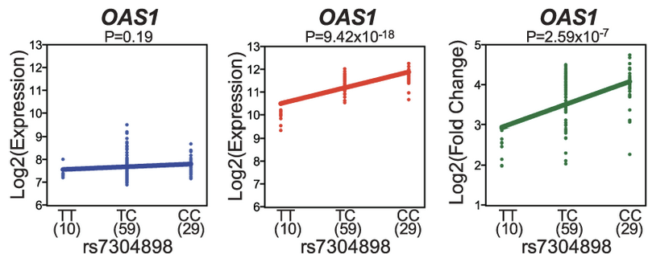

</left>
<right id="col_right" style="flex: 0.5; padding-left: 10px;background-color:rgb(255, 255, 255);" markdown="span">

- uninfected cells (blue)
- RV-infected cells (red)
- reQTLs (green): differences in gene expression response

</right>

</main>

[9]:(https://doi.org/10.1371/journal.pgen.1005111) "Çalışkan M, Baker SW, Gilad Y, Ober C (2015) Host Genetic Variation Influences Gene Expression Response to Rhinovirus Infection. PLoS Genet 11(4): e1005111"

----

## Applications: Alternative splicing events[10]

[10]: (https://doi.org/10.1093/bib/bbad468) "Alex C H Wong, Justin J-L Wong, John E J Rasko, Ulf Schmitz, SpliceWiz: interactive analysis and visualization of alternative splicing in R, Briefings in Bioinformatics, Volume 25, Issue 1, January 2024, bbad468"

----

## Applications: Alternative splicing events[10]

----

## Applications: Alternative splicing events[10]

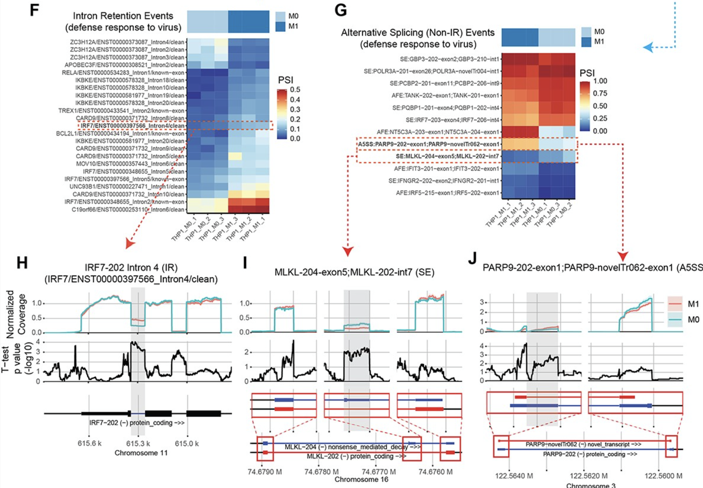

----

## Applications: Structural variant detection
- SVs are genomic alterations **larger than 50 base pairs**
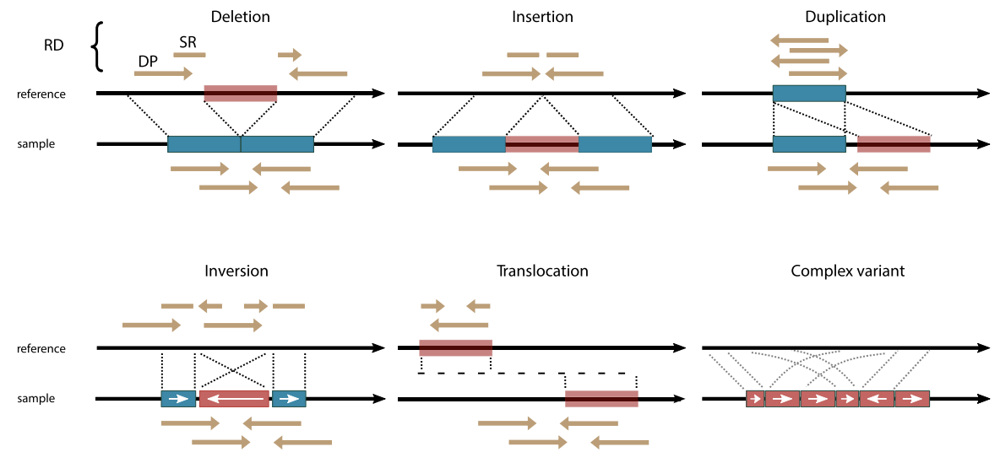

----
## Applications: Structural variant detection

- SVs often indicate disruptions in genome stability
- Useful for identifying structural changes in genetic disorders and understanding complex genome rearrangements
- Cancer genomics and evolution

---

## Applications: Structural variant detection (Patterns to look for)[11]

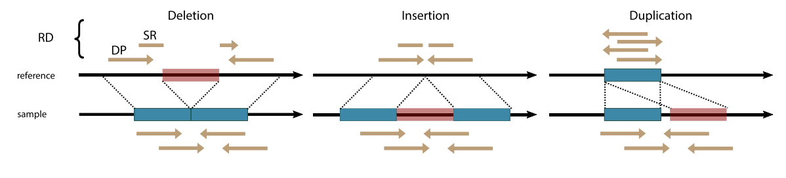

1. **Read Depth (RD):**
   - Changes in sequencing depth or coverage highlight larger duplications or deletions.
   - Primarily used to detect **Copy Number Variants (CNVs)**.

[11]: (https://doi.org/10.1038/s41698-021-00155-6) "van Belzen, I.A.E.M., Schönhuth, A., Kemmeren, P. et al. Structural variant detection in cancer genomes: computational challenges and perspectives for precision oncology. npj Precis. Onc. 5, 15 (2021)."

----

## Applications: Structural variant detection (Patterns to look for)[11]

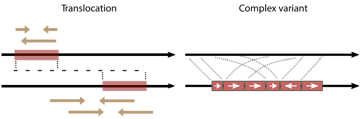

2. **Discordant Pairs (DP):**
   - Paired-end reads align to the reference at unexpected distances or orientations.
   - Best suited for detecting **large SVs** such as inter-chromosomal **translocations** and **inversions**.

----

## Applications: Structural variant detection (Patterns to look for)[11]

3. **Split Reads (SR):**
   - Reads span breakpoint regions and align partially to reference sequences.
   - Detects **small SVs** with **base-pair resolution**.

----

## References

1. Romiguier J, Ranwez V, Douzery EJ, Galtier N. Contrasting GC-content dynamics across 33 mammalian genomes: relationship with life-history traits and chromosome sizes. Genome Res. 2010 Aug;20(8):1001-9. doi: 10.1101/gr.104372.109.
2. Biostars. https://www.biostars.org/p/434543/ (accessed 2024).
3. Illumina Patterned Flow Cells Generate Duplicated Sequences. https://sequencing.qcfail.com/articles/illumina-patterned-flow-cells-generate-duplicated-sequences/ (accessed 2024).
4. Herrera-Luis, E., Benke, K., Volk, H. et al. Gene–environment interactions in human health. Nat. Rev. Genet. 25, 768–784 (2024). https://doi.org/10.1038/s41576-024-00731-z
5. Boye, C., Nirmalan, S., Ranjbaran, A. et al. Genotype × environment interactions in gene regulation and complex traits. Nat. Genet. 56, 1057–1068 (2024). https://doi.org/10.1038/s41588-024-01776-w
6. Holoch, D. & Moazed, D. RNA-mediated epigenetic regulation of gene expression. Nat. Rev. Genet. 16, 71–84 (2015). https://doi.org/10.1038/nrg3863
7. Alasoo, K., Rodrigues, J., Mukhopadhyay, S. et al. Shared genetic effects on chromatin and gene expression indicate a role for enhancer priming in immune response. Nat. Genet. 50, 424–431 (2018). https://doi.org/10.1038/s41588-018-0046-7
8. Piasecka, B. et al. Distinctive roles of age, sex, and genetics in shaping transcriptional variation of human immune responses to microbial challenges. Proc. Natl. Acad. Sci. U.S.A. 115, E488–E497 (2018). https://doi.org/10.1073/pnas.1714765115
9. Çalışkan, M., Baker, S.W., Gilad, Y. & Ober, C. Host genetic variation influences gene expression response to rhinovirus infection. PLoS Genet. 11, e1005111 (2015). https://doi.org/10.1371/journal.pgen.1005111
10. Wong, A.C.H., Wong, J.J.-L., Rasko, J.E.J. & Schmitz, U. SpliceWiz: interactive analysis and visualization of alternative splicing in R. Brief. Bioinform. 25, bbad468 (2024). https://doi.org/10.1093/bib/bbad468
11. van Belzen, I.A.E.M., Schönhuth, A., Kemmeren, P. et al. Structural variant detection in cancer genomes: computational challenges and perspectives for precision oncology. npj Precis. Onc. 5, 15 (2021). https://doi.org/10.1038/s41698-021-00155-6