

# Module 6: Differential Gene Analysis

---

## Key Concepts

- Differential gene analysis
- Pre-processing RNASeq data
  - Read count normalization and transformation
  - Gene filtering strategies
- Gene Set Enrichment Analysis
- Over-representation Analysis

---

## Differential gene analysis

- The aim of a differential gene analysis is to identify genes with difference in expression patterns under different experimental conditions (gene(s) versus condition(s) and vice versa) for a set of samples.  
- By asking “which genes change and by how much?” and then mapping those changes to **pathways, processes, and regulatory mechanisms**, we can generate hypotheses about the underlying biological mechanisms.
  - **Disease mechanisms** (e.g., identifying driver genes in cancer)  
  - **Therapeutic targets** or potential drug mechanisms  
  - **Biomarker discovery** for diagnosis and prognosis  
  - **Fundamental biology** of development, stress responses, or adaptation.

---

<main id="main" style="display: flex; border: 1px; padding: 1px;">

<left style="flex: 0.3; padding-right: 10px;background-color:rgb(255, 255, 255);" markdown="span">

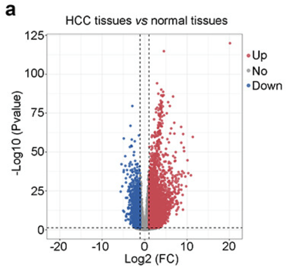

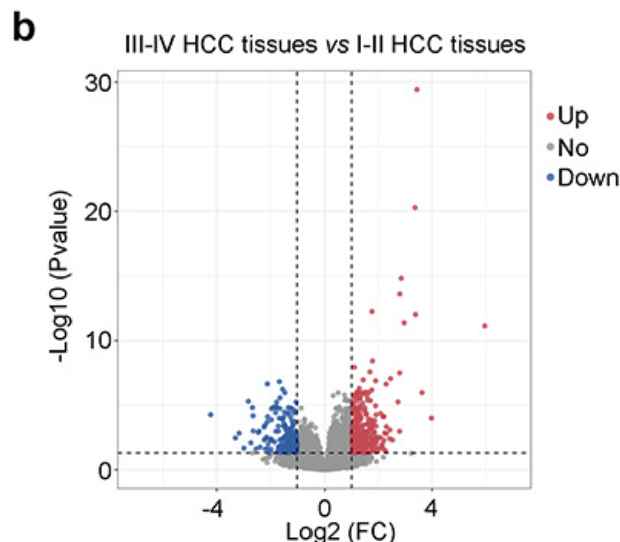

[Zeng *et al.* 2022](https://doi.org/10.1080/21655979.2022.2073943)

</left>
<right id="col_right" style="flex: 0.7; padding-left: 10px;background-color:rgb(255, 255, 255);" markdown="span">

### Which genes are up- or down-regulated in a given condition?

**Question**: Under condition A vs. condition B (e.g., treated vs. untreated), which genes show significant changes in expression levels?  

- The treatment can be drug exposure, knock-out mutation, or any external stimulus
- Identifying up-regulated genes can point toward processes or pathways that are activated under specific conditions, while down-regulated genes might indicate suppression or reduced activity of certain pathways.

</right>
</main>

---

### What pathways or biological processes are affected?

**Question**: Are the significantly differentially expressed genes enriched in specific functional categories, pathways, or Gene Ontology terms?  

- DGE results often feed into **gene set enrichment analysis (GSEA)** or pathway analysis (gProfiler) to reveal broader biological programs at play—like inflammation, cell cycle regulation, or metabolic shifts.

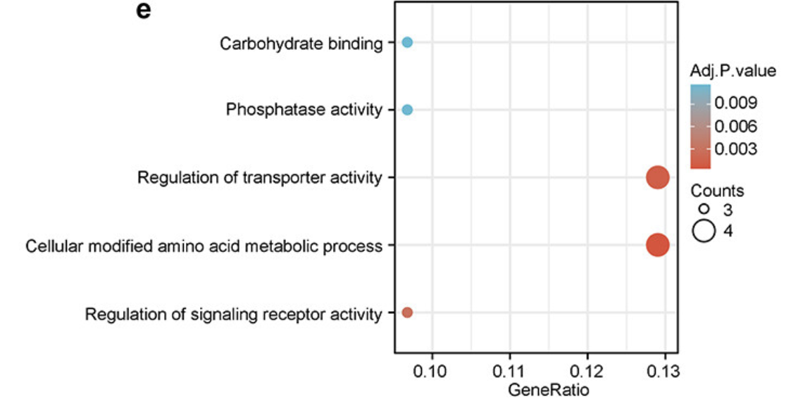

[Zeng *et al.* 2022](https://doi.org/10.1080/21655979.2022.2073943)

---
<main id="main" style="display: flex; border: 1px; padding: 1px;">

<left style="flex: 0.35; padding-right: 10px;background-color:rgb(255, 255, 255);" markdown="span">

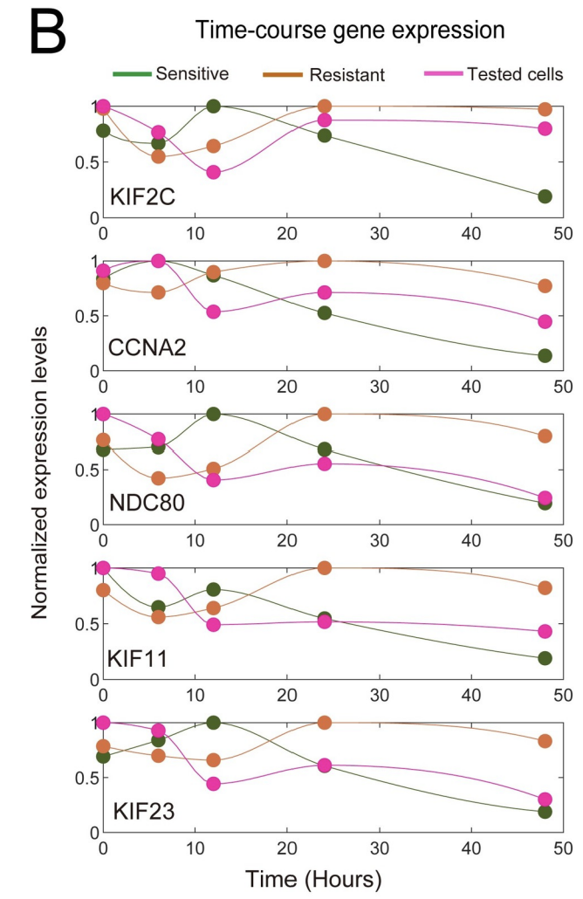
[Zhang *et al.* 2019](https://doi.org/10.1371/journal.pcbi.1007435)

</left>
<right id="col_right" style="flex: 0.55; padding-left: 10px;background-color:rgb(255, 255, 255);" markdown="span">

### How does gene expression change over time (time-course experiments)?

- **Question**: What genes are differentially expressed at early vs. late stages of a response, disease progression, or development?  
  - Time-course DGE studies can reveal **dynamic gene expression trends** that can help identify early-response genes, late-stage markers, or transitions in biological processes.

</right>
</main>

---

### Are there biomarker candidates for disease or treatment response?

- **Question**: Which genes consistently show differential expression in a disease state (e.g., tumor vs. normal tissue) or in response to a therapy?  
  - Such genes may serve as **potential biomarkers** for diagnostic, prognostic, or therapeutic monitoring purposes (e.g., predicting drug resistance or disease recurrence).

<main id="main" style="display: flex; border: 1px; padding: 1px;">

<left style="flex: 0.75; padding-right: 10px;background-color:rgb(255, 255, 255);" markdown="span">

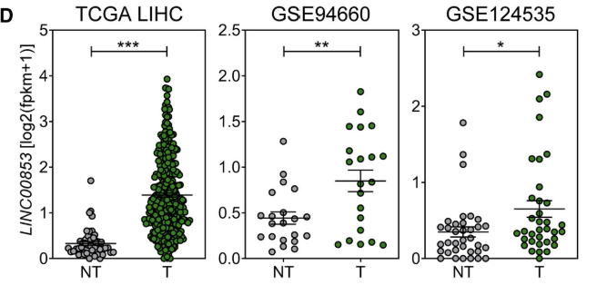

</left>

<right id="col_right" style="flex: 0.5; padding-left: 10px;background-color:rgb(255, 255, 255);font-size:20pt" markdown="span">

LINC00853 expression in the nontumor and the HCC cohorts in three HCC RNA-Seq datasets (TCGA_LIHC, GSE94660, and GSE124535).

</right>
</main>

---

<main id="main" style="display: flex; border: 1px; padding: 1px;">

<left style="flex: 0.7; padding-right: 1px;background-color:rgb(255, 255, 255); font-size:20pt" markdown="span">

### Can we classify or subtype biological samples based on gene expression profiles?

- **Question**: In a cohort of samples (e.g., different cancer subtypes), which sets of genes distinguish one subtype from another?  
  - Identifying **signature genes** for subtypes can guide more personalized treatment strategies

- **Example**: Different subtypes of breast cancer have very different expression profiles. These expression profiles are associated with different patient outcomes and with different treatment protocols. Different subtypes of breast cancer can be distinguished by using differential transcript isoform expression ([Stricker *et al.* 2017](https://doi.org/10.1371/journal.pgen.1006589)).

</left>

<right id="col_right" style="flex: 0.3; padding-left: 1px;background-color:rgb(255, 255, 255);font-size:20pt" markdown="span">

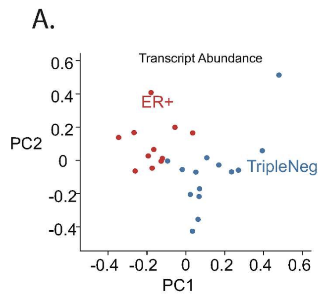

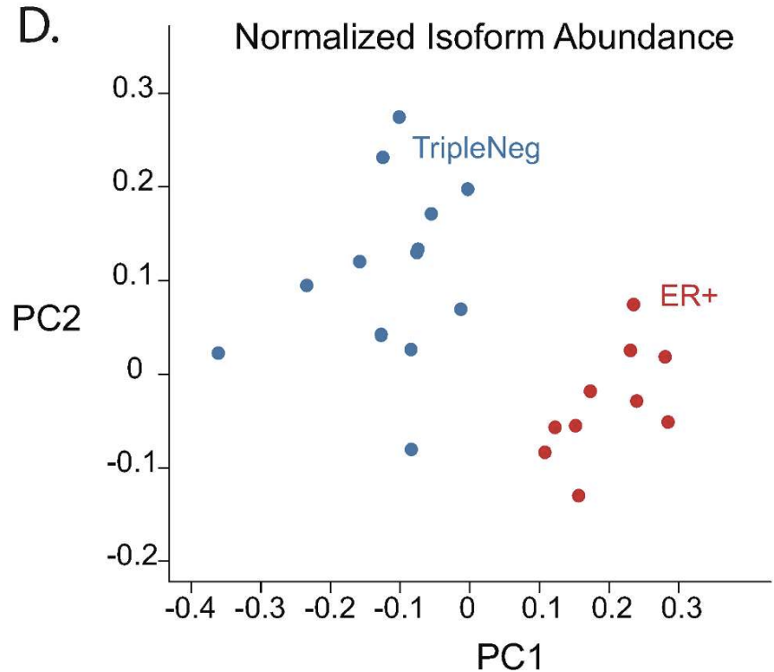

</right>
</main>

----

## DGE Tools

<tb id="tb" style="background-color:rgb(255, 255, 255);font-size:20pt" markdown="span">

| **Tool**   | **Statistical Model**                                                                            | **Key Strengths**                                                                                                                                                                                                                             | **When to Use**                                                                                                                                                                                                                                                               |
|------------|---------------------------------------------------------------------------------------------------|------------------------------------------------------------------------------------------------------------------------------------------------------------------------------------------------------------------------------------------------|----------------------------------------------------------------------------------------------------------------------------------------------------------------------------------------------------------------------------------------------------------------------------------|
| **DESeq2** | - Negative binomial with empirical Bayesian shrinkage of dispersion and fold changes   - Based on the hypothesis that most genes are not DE               | - Better handling of overdispersion   - Good documentation and built-in plotting (MA plots, PCA)   - Shrinkage of fold changes helps stabilize LFC for low-count genes                                                                                           | - Moderate sample sizes (≥3 replicates/condition)  - Typical RNA-seq designs (two-group or multi-factor)  - Ideal if you want an easy-to-follow pipeline with built-in diagnostics|

</tb>

----

## DGE Tools

<tb id="tb" style="background-color:rgb(255, 255, 255);font-size:20pt" markdown="span">

| **Tool**   | **Statistical Model**                                                                            | **Key Strengths**                                                                                                                                                                                                                             | **When to Use**                                                                                                                                                                                                                                                               |
|------------|---------------------------------------------------------------------------------------------------|------------------------------------------------------------------------------------------------------------------------------------------------------------------------------------------------------------------------------------------------|----------------------------------------------------------------------------------------------------------------------------------------------------------------------------------------------------------------------------------------------------------------------------------|
| **edgeR**  | - Negative binomial with empirical Bayes estimation of dispersion  - Based on the hypothesis that most genes are not DE                                  | - Highly flexible for complex or unbalanced designs   - Known to perform robustly even with smaller sample sizes   - Deep configurability for normalization, dispersion, and model setup                                                                                       | - Complex experimental designs (time series, multi-factor)  - Smaller datasets (though more replicates is still better)  - Prefer a “light-weight” approach with fine-grained control                                                                                     |

</tb>

----

## DGE Tools

<tb id="tb" style="background-color:rgb(255, 255, 255);font-size:20pt" markdown="span">

| **Tool**   | **Statistical Model**                                                                            | **Key Strengths**                                                                                                                                                                                                                             | **When to Use**                                                                                                                                                                                                                                                               |
|------------|---------------------------------------------------------------------------------------------------|------------------------------------------------------------------------------------------------------------------------------------------------------------------------------------------------------------------------------------------------|----------------------------------------------------------------------------------------------------------------------------------------------------------------------------------------------------------------------------------------------------------------------------------|
| **limma** (with **voom**) | Linear models with empirical Bayes shrinkage of variance estimates (after voom transformation)    | - Stable release (works with microarray data)   - Good for large datasets and complex designs   - Fast and memory-efficient; integrates well with other limma functions (e.g., contrasts, gene set testing)                                                        | - Already familiar with limma or microarray workflows  - Large sample sizes or multi-factor, repeated-measures designs  - Looking for flexible linear modeling framework and advanced downstream analyses (e.g., GSEA, contrasts)                                          |

</tb>

----

## Read Count Normalization: Why do we need to do this?[2]

<main id="main" style="display: flex; border: 1px; padding: 1px;">

<left style="flex: 0.35; padding-right: 10px;background-color:rgb(255, 255, 255); font-size:20pt" markdown="span">

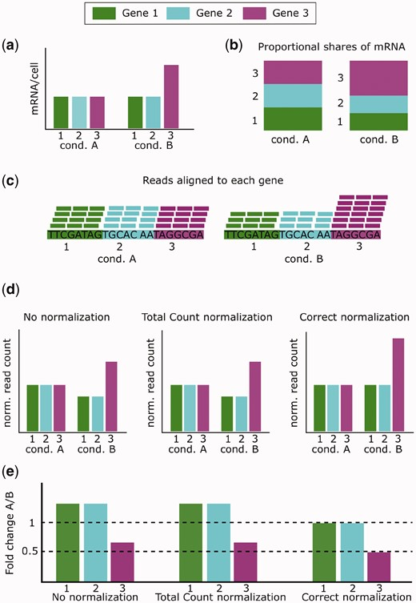

</left>

<right id="col_right" style="flex: 0.65; padding-left: 10px;background-color:rgb(255, 255, 255);font-size:22pt" markdown="span">

- The correct normalization method to use depends on which assumptions are valid for the biological experiment.
- Incorrect normalization leads to problems in downstream analysis, such as inflated false positives, that mean results cannot be trusted.
- **Example**: A small number of highly expressed genes creates the appearance that non-DE are DE, but the false DE calls may be corrected by normalizing read counts so that the expression levels of non-DE genes are equivalent.

</right>
</main>

[2]:(https://doi.org/10.1093/bib/bbx008) "Ciaran Evans, Johanna Hardin, Daniel M Stoebel, Selecting between-sample RNA-Seq normalization methods from the perspective of their assumptions, Briefings in Bioinformatics, Volume 19, Issue 5, September 2018, Pages 776–792"

---

## Read Count Normalization: Why do we need to do this?[2]

<main id="main" style="display: flex; border: 1px; padding: 1px;">

<left style="flex: 0.6; padding-right: 10px;background-color:rgb(255, 255, 255); font-size:20pt" markdown="span">

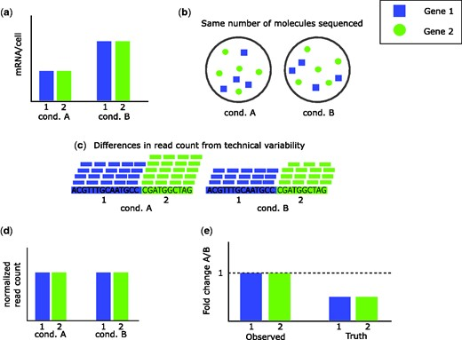

</left>

<right id="col_right" style="flex: 0.4; padding-left: 10px;background-color:rgb(255, 255, 255);font-size:20pt" markdown="span">

- In the case of a global shift in expression, it may appear that DE genes are non-DE or that up-regulated genes are down-regulated.

- It is necessary to take into account the differences in overall expression between conditions.

</right>
</main>

----

### Read Count Normalization: Normalization by Library Size[2]

<tb id="tb" style="background-color:rgb(255, 255, 255);font-size:20pt" markdown="span">

|    | **Details** |
|---------------|------------|
| **Use Case**  | When the total mRNA remains equal or within the same range across different treatments/conditions, even if there is some asymmetry. |
| **Assumptions** | - Total mRNA/cell is consistent across conditions.   - Differences in sequencing depth are the primary technical variability. |
| **Limitations** | - Cannot handle global shifts in expression (large asymmetry).   - Assumes minimal variability in the total mRNA/cell across samples. |

</tb>

<main id="main" style="display: flex; border: 1px; padding: 1px;">

<left style="flex: 1; padding-right: 10px;background-color:rgb(255, 255, 255); font-size:20pt" markdown="span">

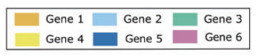

</left>

<mid style="flex: 1; padding-right: 10px;background-color:rgb(255, 255, 255); font-size:20pt" markdown="span">

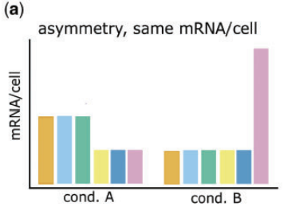

</mid>

<right id="col_right" style="flex: 1; padding-left: 10px;background-color:rgb(255, 255, 255);font-size:20pt" markdown="span">

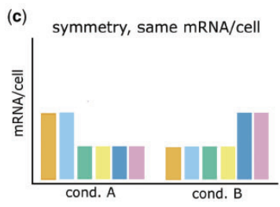

</right>
</main>

----

### Read Count Normalization: Normalization by Library Size

<tb id="tb" style="background-color:rgb(255, 255, 255);font-size:18pt" markdown="span">

| **Metric** | **Name**                                   | **Calculation**                                                     | **Purpose**                                                                                                    |
|------------|---------------------------------------------|---------------------------------------------------------------------|----------------------------------------------------------------------------------------------------------------|
| **RPKM**   | Reads Per Kilobase (kb) per Million         | (Read count × 10⁶) / (Total reads × Gene length in kb)            | Normalizes for sequencing depth and gene length (often for single-end data). |
| **FPKM**   | Fragments Per Kilobase per Million          | Same as RPKM but for paired-end reads                              | Accounts for paired-end sequencing data.                                     |
| **TPM**    | Transcripts Per Million                     | (Read count / Gene length) ÷ (Sum of all RPK values) × 10⁶         | Normalizes within a sample to allow better comparability of expression levels across genes.                     |
| **CPM**    | Counts Per Million                          | (Read count × 10⁶) / (Total mapped reads)                          | Normalizes only for sequencing depth (not gene length).                                                        |

</tb>

---

### Read Count Normalization: Normalization by Distribution[2]

<tb id="tb" style="background-color:rgb(255, 255, 255);font-size:16pt" markdown="span">

| | **Details** |
|---------------|------------|
| **Use Case**  | When there is symmetry in sample sizes, even if total mRNA levels differ across conditions. |
| **Assumptions** | - DE & non-DE genes behave similarly (technical effects are the same).   - Balanced expression: approximately equal numbers of up- and down-regulated genes across conditions. |
| **Advantages** | Can handle small asymmetry (e.g., a few highly expressed genes) or differences in total mRNA/cell. |
| **Limitations** | Fails to correct global shifts in expression (large asymmetry). |

</tb>
<main id="main" style="display: flex; border: 1px; padding: 1px;">

<left style="flex: 1; padding-right: 10px;background-color:rgb(255, 255, 255); font-size:20pt" markdown="span">

</left>

<right id="col_right" style="flex: 2; padding-left: 10px;background-color:rgb(255, 255, 255);font-size:20pt" markdown="span">

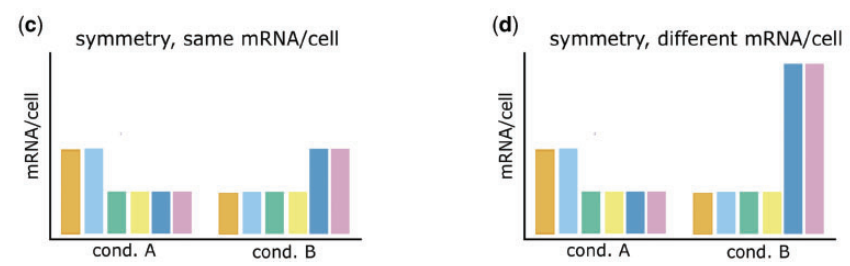

</right>

</main>

---

### Read Count Normalization: Normalization by Distribution[2]

<tb id="tb" style="background-color:rgb(255, 255, 255);font-size:20pt" markdown="span">

| **Method**                     | **Key Idea**                                                                                                              |
|--------------------------------|----------------------------------------------------------------------------------------------------------------------------|
| **Quantile Normalization**     | Forces the distribution of gene expression values (e.g., read counts or log-transformed counts) to match across samples.  |
| **Median/Upper Quartile**      | Normalizes counts based on a specified quantile (e.g., 50th or 75th percentile) rather than the total number of reads.    |
| **TMM (Trimmed Mean of M-values)** | Trims extreme values (highly expressed genes) and calculates scale factors using average log-fold changes (M-values).   |
| **PoissonSeq / DEGES**         | Iteratively identifies non-differentially expressed (non-DE) genes and estimates scaling factors using those genes only.   |

</tb>

---

### Read Count Normalization: Normalization by Controls[2]

<tb id="tb" style="background-color:rgb(255, 255, 255);font-size:16pt" markdown="span">

|    | **Details** |
|---------------|------------|
| **Use Case**  | When suitable controls exist that remain unaffected by biological conditions and behave consistently across samples. |
| **Assumptions** | - Controls exist and are non-DE in the context of the experiment.   - Controls reflect technical effects for all genes. |
| **Advantages** | Corrects for variations in sequencing depth and technical effects using robust controls. |
| **Limitations** | - Requires reliable and representative controls.   - Cannot correct global shifts in expression if controls do not reflect all genes. |

</tb>

  

  
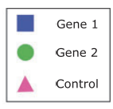

    

  

  

  

    
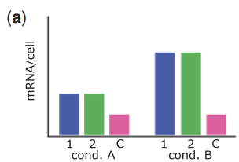

  

  

      
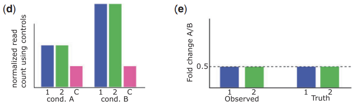

  

----

### Read Count Normalization: Normalization by Controls[2]

| **Method**             | **Key Idea**                                                                                                        |
|------------------------|----------------------------------------------------------------------------------------------------------------------|
| **Using Control Genes** | Normalizes data based on a set of genes known (or assumed) to have **constant** expression across samples (non-DE).  |
| **Spike-in Controls**   | Uses known amounts of external RNA spikes (added to each sample) to determine and correct for technical biases. |

----

## Read Count Transformation: Why do we need to do this?

- **RNA-seq count data is highly skewed** (due to differences in sequencing depth, expression levels, and variance).
- **Standard log transformation (log2(count + 1)) is not sufficient** due to heteroscedasticity (high variance for highly expressed genes), so we use **VST** and **rlog** to help stabilize variance

<tb id="tb" style="background-color:rgb(255, 255, 255);font-size:18pt" markdown="span">

| Feature                     | Variance Stabilizing Transformation (VST) | Regularized Log Transformation (rlog) |
|-----------------------------|-------------------------------------------|---------------------------------------|
| **Purpose**         | Stabilizes variance for high-count genes | Shrinks differences between low-count genes while preserving higher count relationships |
| **Assumes Variance-Mean Relationship?** | Yes, variance increases with mean expression | Yes, but applies stronger shrinkage for low counts |

</tb>

---

<tb id="tb" style="background-color:rgb(255, 255, 255);font-size:18pt" markdown="span">

| Feature                     | Variance Stabilizing Transformation (VST) | Regularized Log Transformation (rlog) |
|-----------------------------|-------------------------------------------|---------------------------------------|
| **Dataset size** | Optimized for large samples | Computationally expensive for large datasets |
| **Computational Speed** | Fast| Slower due to Bayesian shrinkage |
| **Handles Low-Count Genes Well?** | Partially, but less aggressive | Yes, applies stronger shrinkage |
| **Normalization** | Assumes normalized counts (DESeq2 size factors) | Assumes normalized counts (DESeq2 size factors) |
| **Use Case** | Large-scale RNA-seq datasets, differential expression analysis | Small RNA-seq datasets, noise reduction in low-count genes |

</tb>

----

## Gene Filtering Strategies

- Expression Threshold (Minimum Counts or CPM/TPM)
- Sample Proportion
- Variance or Coefficient of Variation (CV) Filtering
- Filtering by Group-Specific Expression

----

## Gene Filtering Strategies
### Expression Threshold (Minimum Counts or CPM/TPM)

- Remove genes that do not meet a minimum read count or transcripts per million (TPM) / counts per million (CPM) threshold in a certain fraction of samples.
- **Example**: Genes must have a CPM ≥ 1 or 2 in at least X samples, where X could be the size of the smallest experimental group
- Genes with extremely low expression are more prone to noise and can inflate multiple testing corrections.

----

## Gene Filtering Strategies
### Sample Proportion

- Retain only those genes that are “detected” (above a given expression threshold) in a specific percentage (e.g., 50%, 75%, etc.) of the samples, or in all samples of at least one condition.
- If a gene is detected in only one or two samples, it may not be informative across biological replicates or conditions.
- **Example**: A gene must have a minimum of 1 read per million in at least 50% of all samples

----

## Gene Filtering Strategies

### Variance or Coefficient of Variation (CV) Filtering

- Filter out genes whose expression values show very little variation across all samples (e.g., genes that are nearly constant).
- Genes that do not vary much are unlikely to be differentially expressed between conditions.
- Compute the standard deviation or CV of normalized expression across samples > remove genes below a certain variance threshold (e.g., “remove the bottom 20% of genes by variance”).

----

## Gene Filtering Strategies

### Filtering by Group-Specific Expression

- Ensure that a gene is expressed in at least one experimental group to a certain minimum level.
- Require that the gene has a minimum of X counts in at least Y replicates of at least one condition (e.g., “At least 5 counts in ≥2 samples in at least one group”).

----

## Gene Set Enrichment Analysis [3]

- The **gene sets** are defined based on prior biological knowledge, e.g., published information about biochemical pathways or coexpression in previous experiments.
- Goal: Determine whether members of a gene set S tend to occur toward the top (or bottom) of the list L, in which case the gene set is correlated with the phenotypic class distinction.

[3]:(https://doi.org/10.1073/pnas.050658010) "A. Subramanian, P. Tamayo, V.K. Mootha, S. Mukherjee, B.L. Ebert, M.A. Gillette, A. Paulovich, S.L. Pomeroy, T.R. Golub, E.S. Lander, J.P. Mesirov, Gene set enrichment analysis: A knowledge-based approach for interpreting genome-wide expression profiles, Proc. Natl. Acad. Sci. U.S.A. 102 (43) 15545-15550"

----
|   **Tool**    | **GSEA**                                                                                                                                              |
|-------------------|----------------------------------------------------------------------------------------------------------------------------------------------------------|
| **Function**  | Tests whether predefined sets of genes (e.g., pathways) show statistically significant, coordinated differences between two biological states.           |
| **Key Features**  | - Uses a ranked list of all genes (no initial cutoff)   - Outputs metrics like **NES**, **Nominal p-value**, and **FDR**   - Permutation-based approach for robust p-value estimation |
| **Use Case** | - Integrating RNA-seq (or microarray) data to identify enriched biological processes   - Evaluating curated gene signatures (e.g., hallmark pathways) |
----

## Gene Set Enrichment Analysis

**Question**: Which biological pathways or processes are altered under specific conditions?
- **Example**: A group of genes involved in a specific pathway (e.g., oxidative phosphorylation, immune response, cell cycle) is collectively up- or down-regulated in your samples.
- Identifying enriched pathways can help us understand the mechanisms underlying the biological response to a perturbation (e.g., drug treatment, disease state, environmental stimulus).

----

### Gene Set Enrichment Analysis

**Question**: Do known disease-related gene signatures correlate with a sample phenotype?

- **Example**: Previously characterized gene signatures (e.g., for certain cancers, metabolic diseases, or immune disorders) show coordinated changes in your samples.
- Validates (or not) existing clinical or biological hypotheses (e.g., whether a new set of patient samples displays a “classic” cancer signature or a novel subtype).

----

## Gene Set Enrichment Analysis
**Question**: How can we prioritize functional follow-up experiments?
- Knowing the the most relevant (enriched) processes or pathways associated with a treatment response can help guide focused functional studies (e.g., targeted knockdowns/knockouts).

----

## Gene Set Enrichment Analysis
**Question**: (Exploratory) What new hypotheses can we generate about disease mechanisms or drug actions?
- **Example**: A drug designed to target one pathway may be found to also enrich gene sets related to metabolic processes.
- Discovery of unexpected connections between conditions and pathways can lead to new lines of research into off-target drug effects, polypharmacology, or novel disease mechanisms.

----

## Gene Set Enrichment Analysis

<main id="main" style="display: flex; border: 1px; padding: 1px;">

<left style="flex: 0.6; padding-right: 10px;background-color:rgb(255, 255, 255); font-size:20pt" markdown="span">

- **Enrichment Score (ES)** measures how overrepresented (positively) or underrepresented (negatively) a gene set is at the top or bottom of a ranked list of genes.

- **Normalized Enrichment Score (NES)** adjusts the raw ES to account for gene set size and other dataset-specific factors so it is more comparable across gene sets of different sizes and across different experiments.

</left>
<right id="col_right" style="flex: 0.4; padding-left: 10px;background-color:rgb(255, 255, 255);" markdown="span">

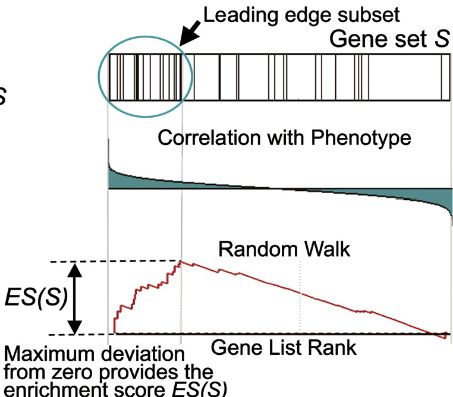

</right>
</main>

----

## Gene Set Enrichment Analysis

- **False Discovery Rate (FDR)**: the estimated probability that a set with a given NES represents a false positive finding
- An FDR q-value of 0.05 means that, among all gene sets called significant, approximately 5% are expected to be false positives.
  - We want to control the proportion of false positives
- When reporting results, NES with FDR < 0.05 (or a user-defined cutoff) is often the statistical threshold for calling a gene set “significantly enriched.”

----

## Gene Set Enrichment Analysis

- The **nominal p-value** estimates how likely it is to observe an enrichment score for a gene set based on permutation tests.
- It does not account for multiple testing across many gene sets.
- Even if the nominal p-value is small, the FDR may not be significant if many gene sets are tested or the dataset is large.

----

## Gene Set Database/Tools

|  | **Description**                                                                                                         |
|-----------------------|-------------------------------------------------------------------------------------------------------------------------|
| [MSigDB](https://www.gsea-msigdb.org/gsea/msigdb)  | A comprehensive collection of annotated gene sets designed for use with Gene Set Enrichment Analysis (GSEA).        |
| [mulea](https://cran.r-project.org/package=mulea)   | An R package for multi-level enrichment analysis, providing flexible tools for gene set enrichment and annotation.    |
| [Enrichr](https://maayanlab.cloud/Enrichr)          | A user-friendly web-based tool for gene set enrichment analysis, offering a broad range of libraries and visualizations. |

----

## Over-representation Analysis 

- Identifies whether certain biological categories (e.g., pathways, Gene Ontology terms, functional clusters) are statistically overrepresented in a user-defined list of “interesting” genes (commonly differentially expressed genes). 
- Use it as a **hypothesis-generating tool** rather than definitive proof of pathway activation.

### Usage Limitations  
  - Best applied to a well-defined gene list (e.g., significantly DE genes).  
  - Requires an appropriate background set of genes for statistical comparison (often all genes measured).  
  - Requires multiple testing correction (e.g., FDR, Bonferroni) when testing many gene sets.

----

## Over-representation Analysis 
### Interpretation Limitations 
  - **Depends on annotation quality**. If databases (GO, KEGG, etc.) are incomplete or outdated, results may be misleading.  
  - Some enriched terms can be overly general (e.g., “metabolic process”) 
  - **Biological Complexity**. ORA treats genes independently; so it doesn’t capture pathway interactions or gene-gene dependencies.  
  - **Cutoff Bias**. The initial gene selection criteria (e.g., p-value thresholds) can influence which categories appear enriched.  
  - **No Directionality**. Traditional ORA doesn’t distinguish between up- or down-regulation within a gene set—just the presence or absence of genes.  

----

## Over-representation Analysis 
**Question**: Which biological processes are most prominent in my gene list?
**Context**: You have identified a set of up- or down-regulated genes under a specific condition (e.g., disease state vs. control).
**Interpretation**: If immune-system-related terms (e.g., “inflammatory response,” “T cell activation”) are significantly overrepresented, it signals that immune processes could be key drivers of the phenotype.

----

## Over-representation Analysis
**Question**: Do certain pathways show significant sverrepresentation?
- Many gene sets are curated as “pathways” (e.g., KEGG pathways, Reactome, WikiPathways).

**Example**: In a cancer study, ORA might flag the “p53 signaling pathway” when multiple p53 target genes show differential expression, implicating aberrant p53 regulation in tumor progression.

----
## Over-representation Analysis
**Question**: Are there functional categories linking my genes of interest?
- ORA can also consider categories such as Cellular Components (e.g., “mitochondrial membrane”) or Molecular Functions (e.g., “ATPase activity”).

**Example**: A cluster of newly identified genes in the sample is enriched for “transcription factor activity.” 
**Interpretation**: These genes are part of a transcriptional regulatory network driving the observed phenotype.

----
## Over-representation Analysis
**Question**: How do known disease gene signatures map onto the data?
- Many gene sets are curated around specific diseases or traits (e.g., OMIM, DisGeNET, or published disease signature gene sets).

**Example**: The significant gene list from a new mouse model of neurodegeneration overlaps strongly with a known Alzheimer’s disease genes.
**Interpretation**: The experimental model captures key disease mechanisms relevant to  Alzheimer’s disease.

----

## Tools for functional analysis

|       | **clusterProfiler**                                                                                                                                                                                             |
|-------------------|---------------------------------------------------------------------------------------------------------------------------------------------------------------------------------------------------------|
| **Puporse**  | An R package that performs over-representation analysis (ORA), GSEA, and other enrichment methods using multiple annotation databases (e.g., GO, KEGG).                                                  |
| **Key Features**  | - Highly flexible for various enrichment methods (ORA, GSEA, etc.)   - Supports multiple species and annotation sources   - Generates publication-ready visualizations (dot plots, bar plots, network plots) |
| **Usage** | - Annotate and visualize enriched pathways in R   - Customize analyses with user-defined gene lists and annotation sets                                                                |