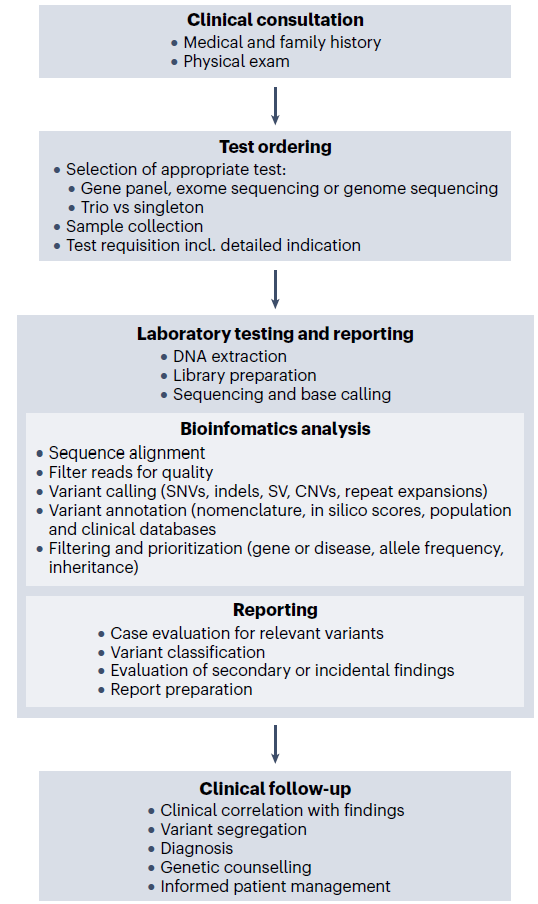
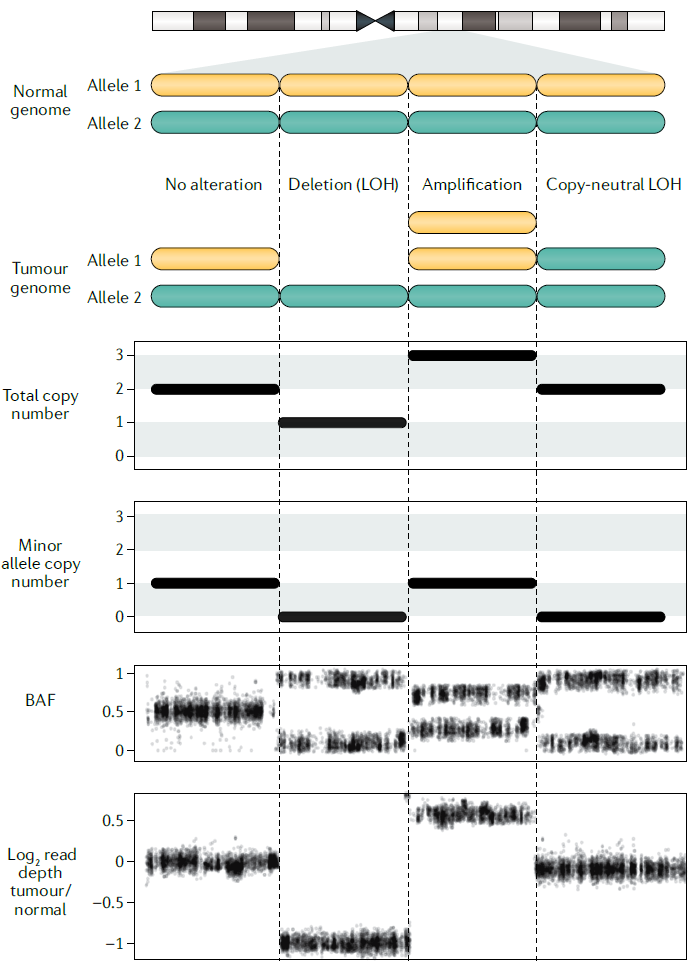

Kernohan, K.D., Boycott, K.M. The expanding diagnostic toolbox for rare genetic diseases. Nat Rev Genet 25, 401–415 (2024). https://doi.org/10.1038/s41576-023-00683-w

----

In a diploid region with no alteration, there is one copy of each of the maternal and
paternal alleles (alleles 1 and 2), so the total copy number is 2, the minor allele copy
number is 1, the B-allele frequency (BAF) profile is centred on 0.5 and the read depth is
approximately the same between the tumour and normal samples. In the event of
a deletion, the total copy number decreases to 1 and the minor allele copy number to 0.
The coverage of that region in the tumour sample drops, and the BAF of heterozygous
single-nucleotide polymorphisms becomes either 0 or 1, with deviation towards 0.5
due to the infiltration of normal tissue. An amplification leads to an increase in the
total copy number to 3, but the copy number of the minor allele remains 1 because
the non-amplified allele is not altered. The BAF profile shifts towards 1/3 and 2/3,
corresponding to the fractions of reads covering the non-amplified or amplified allele,
respectively. Finally, the total copy number for copy-neutral loss of heterozygosity (LOH)
events, where one allele is amplified and the other is lost, is 2, and the minor copy
number is 0, reflecting the loss of one allele. Thus, the BAF profile is similar to that
of a deletion, although the read depth of the tumour relative to the normal sample
is not altered. These examples illustrate the importance of integrating depth of
coverage and BAF information to fully characterize copy number alterations.

More advanced methods for detecting
CNAs incorporate the frequencies of minor alleles,
termed the B-allele frequency (BAF), which are inferred
from heterozygous SNPs, for segmentation, and also
detect allele-specific CNAs and copy-neutral LOH events
(Fig. 4). The BAF profile, for instance, can help identify
copy-neutral LOH events, which have comparable read
depth with the non-altered regions of the genome

----

## Variant calling

1. **Germline variant calling**:
    - VAF is close to 0.5 for heterozygous variants, and ~1 for homozygous variants.
2. **Somatic variant calling**: 
    - VAF is often substantially lower than 0.5 and depends on the tumour purity, copy number at the candidate location and intra-tumour heterogeneity

----

Upon mapping paired-end
sequencing reads from the tumour genome to the reference
genome, SVs are identified by the presence of
split reads and clusters of discordant read pairs (Fig. 5)

----

Analysis of sequence homology at SV breakpoints can
reveal the DNA repair mechanisms operative in human
cancers193. For instance, microhomology and templated
insertions at the breakpoints suggest the involvement
of replication-associated mechanisms, such as
microhomology-mediated break-induced replication200.
Examining the number of SVs categorized by type (deletion,
insertion, inversion or translocation), size and
whether they are clustered or not can also give mechanistic
insights131. Similar to mutational signature analysis
using SNVs, the observed spectrum can be decomposed
into signatures that might be linked to specific biological
processes. Other features, such as background SV rates
and copy number information18,201, can also be incorporated
into SV signature analysis. Some of the SV signatures
have been shown to be relevant clinically, for example,
the presence of indels showing microhomology indicates
defects in homologous recombination202.

---
References:

- Coverage and Read Recommendations by Variants of Interest ([link](https://genohub.com/recommended-sequencing-coverage-by-application/))