

# Module 8: Variant Calling and Annotation (Part 1)

----

## Anouncements

- **Group Assignment #2 (5%)**:due on **June 29**
- **Lab 4**: due on **July 6**
- Lab 2 marks

----

## Key Concepts

- Quality control
  - Read Quality
  - Alignment Quality
- Pre-processing steps
- Read mapping
- Variant calling

----

<main id="main" style="display: flex; border: 1px; padding: 1px;">

<left style="flex: 0.25; padding-right: 1px;background-color:rgb(255, 255, 255); font-size:20pt" markdown="span">

## Where does variant calling and annotation fit in the big picture? [1]

</left>

<right id="col_right" style="flex: 0.75; padding-left: 1px;background-color:rgb(255, 255, 255);font-size:20pt" markdown="span">

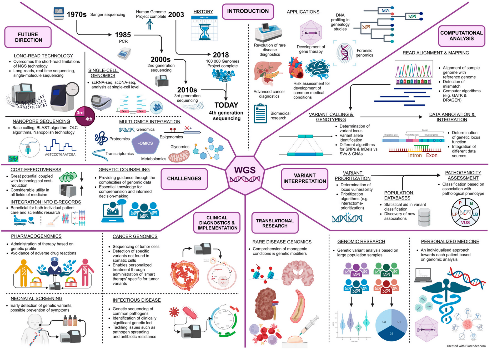

</right>
</main>

[1]:(https://doi.org/10.3390/cells13060504) "Brlek *et al.* (2024). Implementing Whole Genome Sequencing (WGS) in Clinical Practice: Advantages, Challenges, and Future Perspectives. Cells, 13(6), 504."
----

<main id="main" style="display: flex; border: 1px; padding: 1px;">

<left style="flex: 0.75; padding-right: 1px;background-color:rgb(255, 255, 255); font-size:20pt" markdown="span">

</left>

<right id="col_right" style="flex: 0.25; padding-left: 1px;background-color:rgb(255, 255, 255);font-size:20pt" markdown="span">

</right>
</main>

----

## Sequence Data: Types of sequencing methods [2]

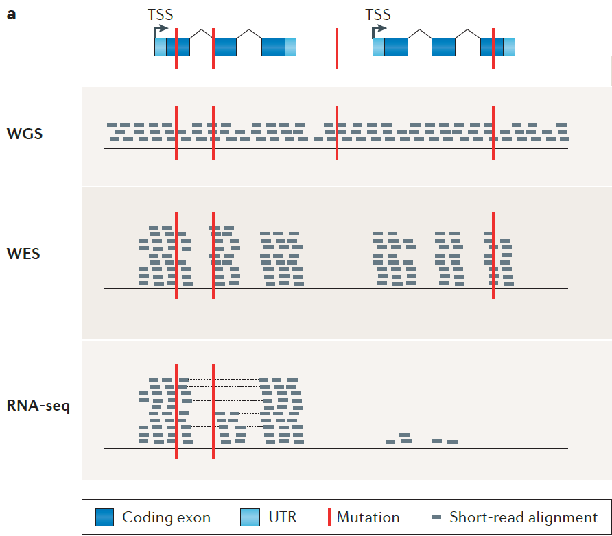

[2]:(https://doi.org/10.1038/nrg3745) "Schneeberger, K. Using next-generation sequencing to isolate mutant genes from forward genetic screens. Nat Rev Genet 15, 662–676 (2014)."

----

## Sequence Data: Types of sequencing methods [3]

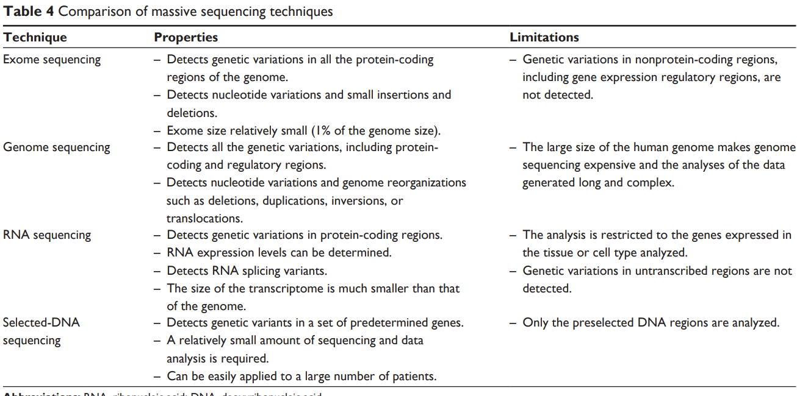

[3]:(http://dx.doi.org/10.2147/AGG.S39108)

----

## Quality Control

<main id="main" style="display: flex; border: 1px; padding: 1px;">

<left style="flex: 0.65; padding-right: 1px;background-color:rgb(255, 255, 255); font-size:20pt" markdown="span">

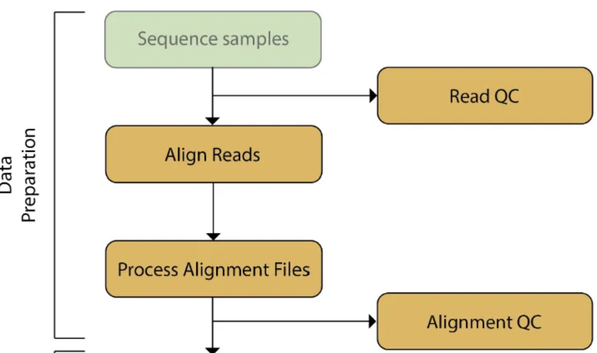

</left>

<right id="col_right" style="flex: 0.35; padding-left: 1px;background-color:rgb(255, 255, 255);font-size:20pt" markdown="span">

- Reduces false positives by filtering out low-quality bases, adapters, and contaminants.

</right>
</main>

----

## Quality Control - Read QC tools

1. **FastQC**   : Generates summary metrics (per-base quality, GC content, adapter content, sequence duplication).  
    - **Do we need trimming or other preprocessing?**

3. **fastp**: Performs both QC and automated read trimming/correction in a single step.  
   - Removes adapters, filters out low-quality reads, corrects mismatches in overlapping paired-end  reads.  

----

## Quality Control - Read QC Evaluation Metrics

**Almost identical to Lab 2: RNA Sequencing**

- Sequence Quality (PHRED score)
- GC content
- Insert size distribution
- Read Duplicates
- Overrepresented sequences

----

## Quality Control - Read QC Evaluation Metrics

**Exception for WES**: The average GC content of the human genome is **~41%**, but GC-content is **higher** in **genic** regions than **intergenic** regions; so **a slightly higher % GC is normal**.

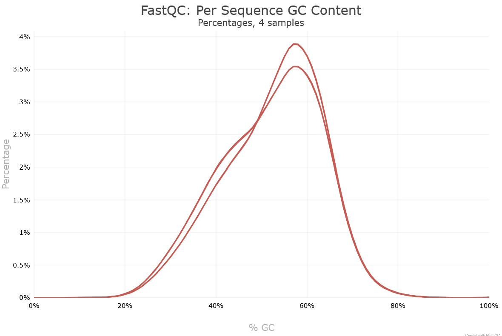

----

## Read Alignment

<main id="main" style="display: flex; border: 1px; padding: 1px;">

<left style="flex: 0.65; padding-right: 1px;background-color:rgb(255, 255, 255); font-size:20pt" markdown="span">

</left>

<right id="col_right" style="flex: 0.35; padding-left: 1px;background-color:rgb(255, 255, 255);font-size:22pt" markdown="span">

- After pre-processing (trimming, quality filtering), reads need to be aligned to a reference genome.
- **Alignment tools**: `bwa`, `bwa-mem2`, `dragmap`

</right>
</main>

----

## Why should we be selective about the tools we use? [4]

- **Time and computing cost**. Average costs per patient on AWS batch for `nf-core/sarek`.
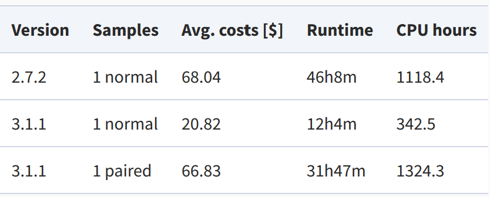

[4]:(https://doi.org/10.1093/nargab/lqae031) "Friederike Hanssen, Maxime U Garcia, Lasse Folkersen, Anders Sune Pedersen, Francesco Lescai, Susanne Jodoin, Edmund Miller, Matthias Seybold, Oskar Wacker, Nicholas Smith, Gisela Gabernet, Sven Nahnsen, Scalable and efficient DNA sequencing analysis on different compute infrastructures aiding variant discovery, NAR Genomics and Bioinformatics, Volume 6, Issue 2, June 2024, lqae031"

----

## Why should we be selective about the tools we use?

**Not all tools are equal.** The optimal tool depends on:
1. what information do you what to get out of using it, 
2. the underlying assumptions of the algorithms used by the tools, and
3. the nature of the data that you are processing.

----

## Read Alignment: Tool Performance for Germline WGS [4]

- Negligible difference in variant calling precision, recall, and F1 metrics between the different alignment tools.

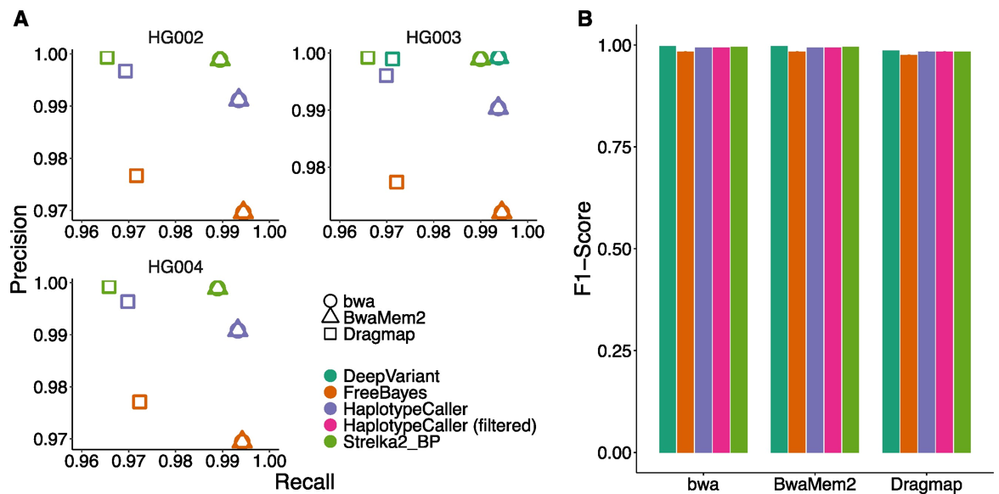

----

## Read Alignment: Tool Performance for Somatic WES (Tumor-Normal Pairs) [4]

- No difference in variant calling precision, recall, and F1 metrics between the different alignment tools.

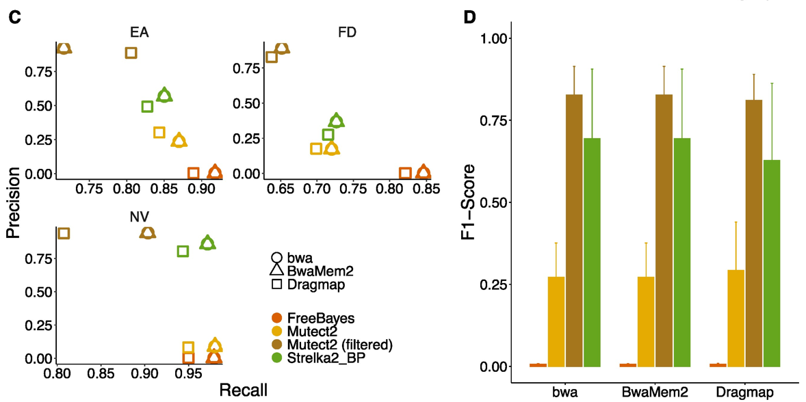

----

## SAM/BAM/CRAM Output Files

<main id="main" style="display: flex; border: 1px; padding: 1px;">

<left style="flex: 0.5; padding-right: 1px;background-color:rgb(255, 255, 255); font-size:20pt" markdown="span">

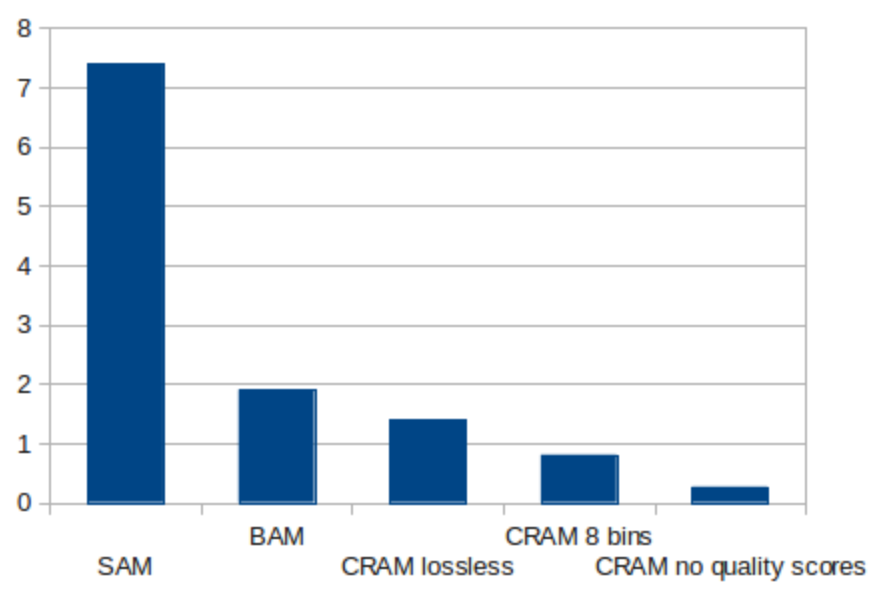

[Source](https://blog.gene-test.com/cram-format-notes/)

</left>

<right id="col_right" style="flex: 0.5; padding-left: 1px;background-color:rgb(255, 255, 255);font-size:22pt" markdown="span">

- **SAM**: Sequence Alignment Map containing alignment information
- **BAM**: Binary-encoded (compressed) version of SAM;
- **CRAM**: Compressed version of BAM
- BAM/CRAM files are usually ‘indexed’ for fast retrieval of alignments
  - A `.bai` file will be found beside the `.bam` file

</right>
</main>

----

## What’s Inside a SAM/BAM/CRAM?

1. **Header section**: provides general information about the alignment strategy
2. **Alignment Section**: provides details for each read alignment

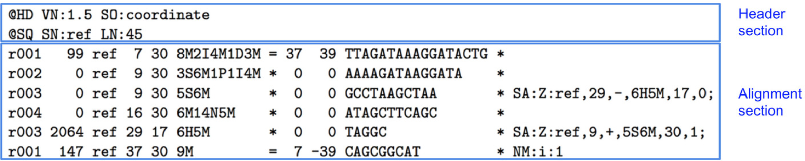

----

## What’s Inside a SAM/BAM/CRAM?

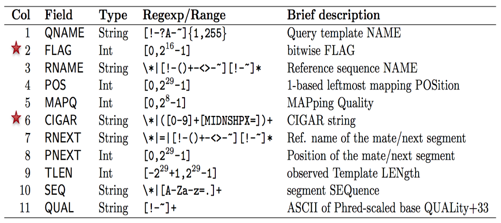

----

## What’s Inside a SAM/BAM/CRAM?

- Flag is a number representing the condition of a read alignment.
- https://samformat.pages.dev/sam-format-flag

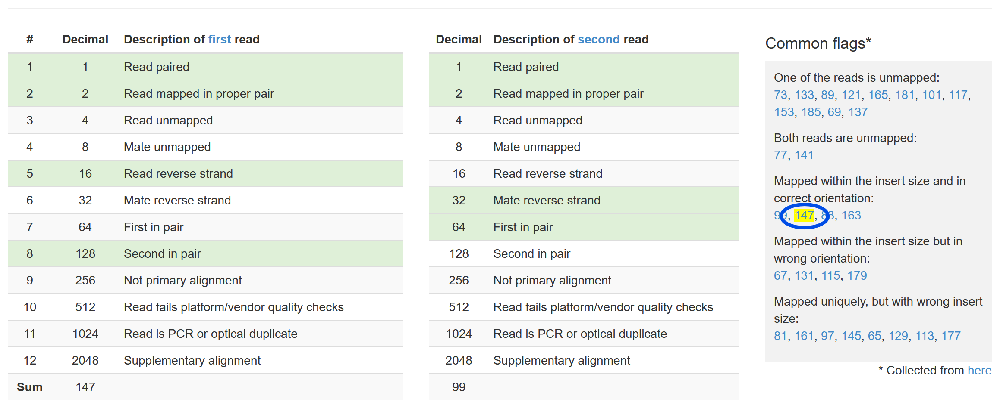

----

## What’s Inside a SAM/BAM/CRAM? [5]

- CIGAR strings explain how the query (or “read”) sequence aligns to the reference genome.

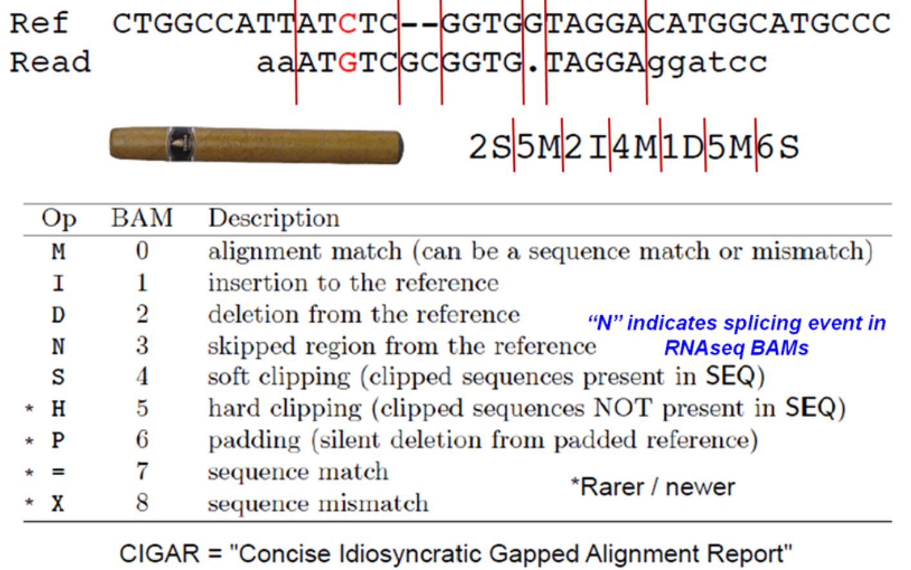

[5]:(https://bookdown.org/ggiaever/wrangling-genomics/variant-calling-workflow.html)
----

<main id="main" style="display: flex; border: 1px; padding: 1px;">

<left style="flex: 0.5; padding-right: 1px;background-color:rgb(255, 255, 255); font-size:20pt" markdown="span">

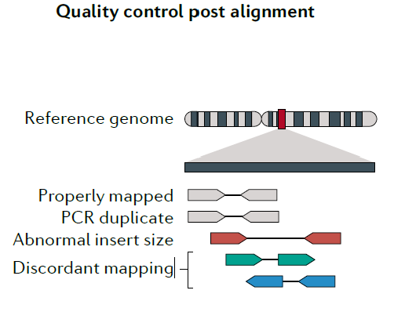

[Cortés-Ciriano et al. 2022](https://doi.org/10.1038/s41576-021-00431-y)

</left>

<right id="col_right" style="flex: 0.5; padding-left: 1px;background-color:rgb(255, 255, 255);font-size:24pt" markdown="span">

## Post Alignment QC Metrics - Mapping Quality

1. Mapping Rate
2. Coverage Depth
3. Duplication Levels
4. Insert Size Distribution

</right>
</main>

----

## Mapping Quality (MAPQ)

- **A score that indicates how likely it is that a read is misaligned**
`MAPQ = −10log10(p)`, where p is the misalignment probability
- Ranges from 0 to 60 in many aligners (though some can exceed 60).
- **Higher** values indicate **greater** confidence that the read is aligned correctly and uniquely.  

### Why do we care?

- Reads with low MAPQ are more likely to be mapped to the wrong location or align equally well to multiple regions.  
- Many pipelines filter out alignments below a certain MAPQ threshold (e.g., 20 or 30) to improve confidence in variant calling or downstream analyses.

----

## Mapping Rate

- Percentage of reads successfully aligned to the reference.

**Why do we care?**

- Low mapping rate may indicate contamination, poor-quality reads, or reference-genome mismatch affecting variant-calling accuracy.

**Tool** : `samtools flagstat`  

- Provides quick statistics on the number of mapped reads, properly paired reads, duplicates, etc.  

----

## Mapping Rate

**What to look for**: A high proportion of properly paired reads (for paired-end) and minimal unmapped reads.

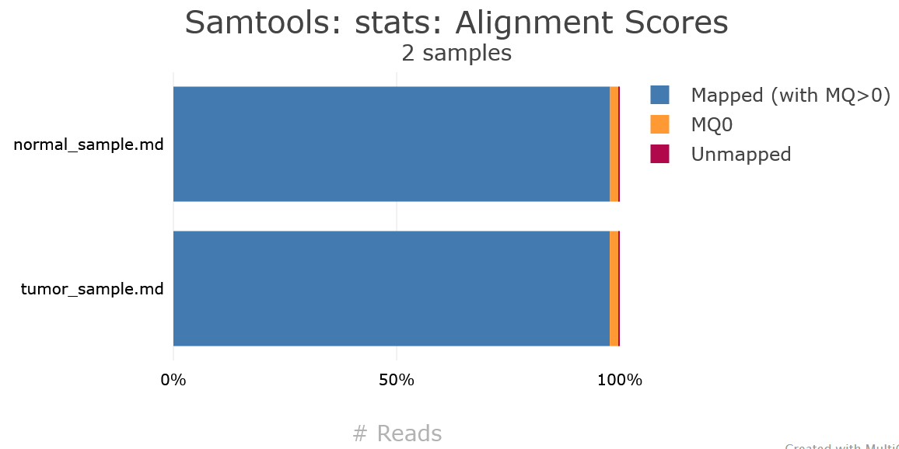

---

## Coverage Depth

- Average number of reads covering each base or region.

**Why do we care?**

- We want regions of interest (e.g., exons, target panels) to have sufficient reads for variant detection. **Increasing sequencing depth** can increase the power to detect variants  and **reduce the false-discovery rate** for variant calling.[6]
- “Coverage gaps” might call for re-sequencing or caution in biological interpretation.

**Tool**: `mosdepth`  

- Calculates coverage depth across genome or targeted regions.  

[6]:(https://doi.org/10.1038/s41576-021-00431-y) "Cortés-Ciriano, I., Gulhan, D.C., Lee, J.JK. et al. Computational analysis of cancer genome sequencing data. Nat Rev Genet 23, 298–314 (2022)."

----

## Coverage Depth - (WGS) What to look for [6]

- WGS provides **nearly uniform depth of coverage** (~30–60×) across the genome.
- Subclonal SNVs may be missed when the number of reads containing the mutation is too small or comparable with the number of reads containing artefacts.

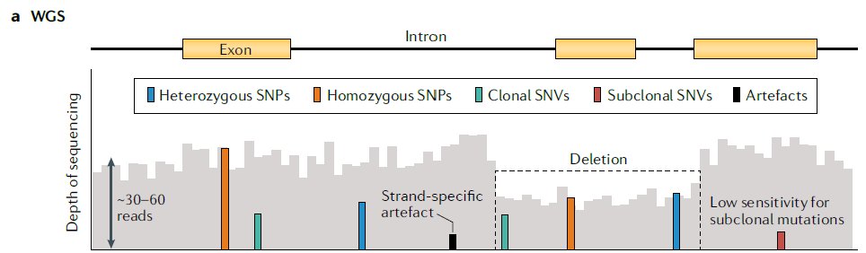

----

## Coverage Depth - (WES/TGS) What to look for [6]

- **It is normal for exome sequence coverage to have gaps in untranslated regions.**
- Exome sequencing (~100–200×) and gene panel sequencing of cancer-related
genes (~500–1,000×) have higher depth of sequencing

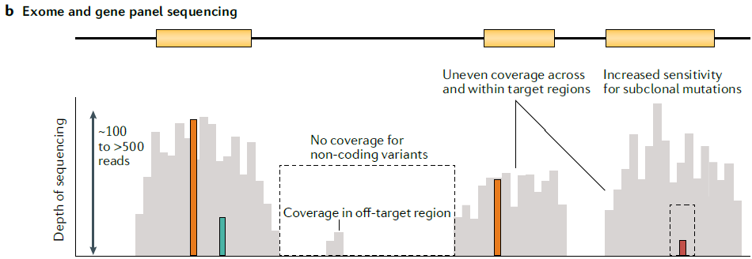

---

## Read Duplication

- Fraction of reads that appear to be duplicates (often from PCR amplification).

**Why do we care?**

- Removing duplicates improves true coverage to ensure variant calling accuracy. 
- A high duplication rate be caused by over-amplification in library prep or technical bias.

**Tool**: `Picard MarkDuplicates` flags or removes duplicates

---

## Read Duplication

**What to look for**: The ideal read duplicate % is **<30%**.[7]

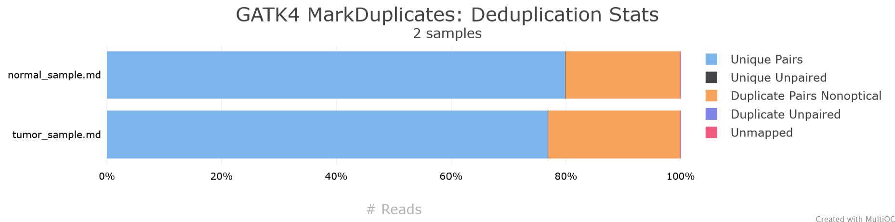

[7]:(https://doi.org/10.1038/s41587-021-00994-5) "Xiao, W., Ren, L., Chen, Z. et al. Toward best practice in cancer mutation detection with whole-genome and whole-exome sequencing. Nat Biotechnol 39, 1141–1150 (2021)."

---

## Insert Size Distribution (Paired-End)

- Measures the fragment length between forward and reverse read pairs.

**Why do we care?**

- Abnormal insert sizes could indicate contamination, structural variants, or library prep inconsistencies.

**Tool**: `samtools stats` provides detailed alignment statistics, including insert size and base composition.

**What to look for**: Do the observed insert sizes match library prep method?

----

## Variant Filtering: Base recalibration

**Base quality scores**: per-base PHRED score indicating how confident the sequencing machine was at calling the correct base each time

- Short variant calling algorithms rely heavily on the quality score as a hard filter

**What could go wrong?**
The scores produced by the machines are subject to various sources of systematic (non-random) technical error, leading to over- or under-estimated base quality scores in the data. 
- **Over-estimated quality scores can lead to false postive detection of variants.**  
- **Under-estimated scores can mask low-frequency variants.**

----
## Variant Filtering: Base Quality Score Recalibration (BQSR)

<main id="main" style="display: flex; border: 1px; padding: 1px;">

<left style="flex: 0.5; padding-right: 1px;background-color:rgb(255, 255, 255); font-size:20pt" markdown="span">

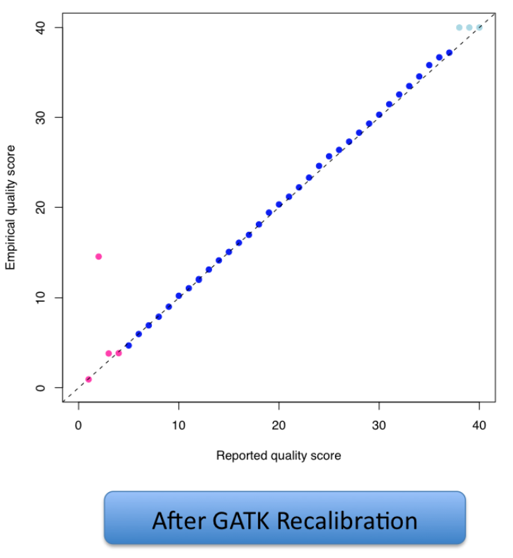

[GATK](https://github.com/broadinstitute/gatk-docs/blob/master/gatk3-methods-and-algorithms/Base_Quality_Score_Recalibration_%28BQSR%29.md)

</left>

<right id="col_right" style="flex: 0.5; padding-left: 1px;background-color:rgb(255, 255, 255);font-size:20pt" markdown="span">

1. **BaseRecalibrator**:  
    - Uses reference genome to distinguish true mismatches from sequencer biases.  
    - Creates a recalibration table by comparing observed versus expected error rates across multiple covariates (e.g., read cycle, sequence context).  
2. **ApplyBQSR**:  
    - Adjusts base quality scores in the BAM/CRAM using the recalibration table.  

</right>
</main>

---

## Variant Filtering: Variant Quality Score Recalibration (VQSR) 

<main id="main" style="display: flex; border: 1px; padding: 1px;">

<left style="flex: 0.4; padding-right: 1px;background-color:rgb(255, 255, 255); font-size:20pt" markdown="span">

**Not in `nf-core/sarek`**

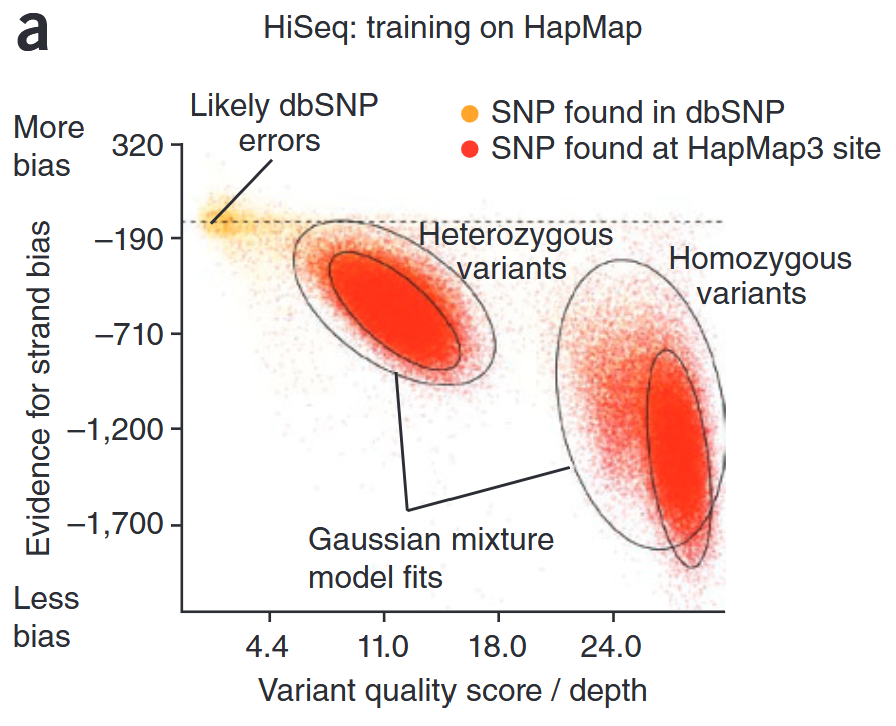

[DePristo et al. 2011](https://doi.org/10.1038/ng.806)

</left>

<right id="col_right" style="flex: 0.6; padding-left: 1px;background-color:rgb(255, 255, 255);font-size:22pt" markdown="span">

1. **VariantRecalibrator** 
- Learns the distribution of annotation values for high-confidence “true” variant sites using reference variant data as training sets. --> **maintains sensitivity**
- Constructs a Gaussian mixture model that differentiates likely true variants from false positives.  

</right>
</main>

----
## Variant Filtering: Variant Quality Score Recalibration (VQSR) 

<main id="main" style="display: flex; border: 1px; padding: 1px;">

<left style="flex: 0.4; padding-right: 1px;background-color:rgb(255, 255, 255); font-size:20pt" markdown="span">

**Not in `nf-core/sarek`**

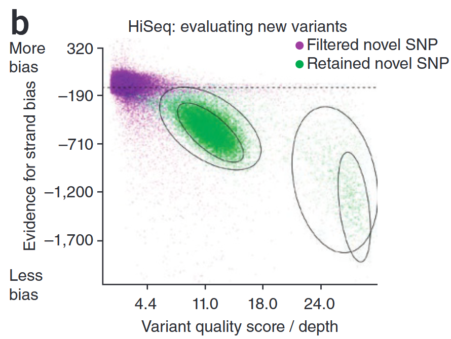

[DePristo et al. 2011](https://doi.org/10.1038/ng.806)

</left>

<right id="col_right" style="flex: 0.6; padding-left: 1px;background-color:rgb(255, 255, 255);font-size:22pt" markdown="span">

2. **ApplyVQSR** 
- Applies the model to the full variant set to produces recalibrated scores or filters that retain high-confidence variants and remove suspicious calls.
-  Fewer false positives by penalizing variants with suspicious annotation profiles.->**better specificity**

</right>
</main>

----

## Variant Filtering: BQSR + VQSR

1. Perform **Read-Level Correction (BQSR)** after alignment, before variant calling.  
   - Make sure base qualities fed into the variant caller accurately reflect real sequencing errors.

2. Perform **Variant-Level Refinement (VQSR)** after generating raw variant calls
   - Use reference variant data to make sure the scores for false positive variants are penalized.

**Why do we need this?**

- BQSR and VQSR together increase the accuracy of base quality scores used in variant calling algorithms.

----

## Variant Calling

- The process of identifying genetic variants—differences from a reference genome—in sequencing data

- Typically focuses on SNPs (Single Nucleotide Polymorphisms) and indels (insertions/deletions), although some pipelines also address structural variants.

----

## Variant calling

1. **Germline variant calling**: the process of calling variants that are ubiquitous across the organism (i.e. almost all cells carry these variants)

2. **Somatic variant calling**: the process of calling variants that differ between cells within a single organism and these variants are not passed through the germline.
    - More difficult than germline variant calling because low frequency variants and sequencing artifacts are difficult to distinguish from sequencing errors.

----

## Germline Variant Callers

<tb id="tb" style="background-color:rgb(255, 255, 255);font-size:16pt" markdown="span">

| **Characteristic**         | **Germline Variant Callers**                                                                                                                                      |
|----------------------------|-------------------------------------------------------------------------------------------------------------------------------------------------------------------|
| **Purpose**                | Identify inherited variants present in all cells; assume a stable, diploid (or polyploid) genome.                                                                |
| **Allele Frequency**       | Expect high allele fractions: heterozygous (~50%) or homozygous (~100%).                                                                                          |
| **Data Requirements**      | Typically run on single samples or cohorts; analyses are usually unpaired.                                                                                        |
| **Statistical Models**     | Rely on models that assume a fixed ploidy and well-defined genotype priors.                                                                                        |
| **Variant Filtering**      | Use population databases (e.g., dbSNP, 1kGP) and quality metrics to filter out sequencing artifacts.                                                              |

</tb>

----

## Somatic Variant Callers

<tb id="tb" style="background-color:rgb(255, 255, 255);font-size:16pt" markdown="span">

| **Characteristic**         | **Somatic Variant Callers**                                                                                                                                       |
|----------------------------|-------------------------------------------------------------------------------------------------------------------------------------------------------------------|
| **Purpose**                | Detect variants acquired in specific tissues (e.g., tumors); variants may be present in only a subset of cells.                                                   |
| **Allele Frequency**       | Often exhibit low and variable allele frequencies due to tumor heterogeneity, subclonality, or mosaicism.                                                            |
| **Data Requirements**      | Frequently require tumor-normal paired samples to distinguish somatic mutations from germline variants.                                                             |
| **Statistical Models**     | Must account for mixed cell populations, variable purity, and complex copy number alterations.                                                                     |
| **Variant Filtering**      | Incorporate filters for strand bias, low variant allele frequency, and tumor-specific artifacts.                                                                    |

</tb>

----

### `nf-core/sarek` has a table of summary for tool compatibility [8]

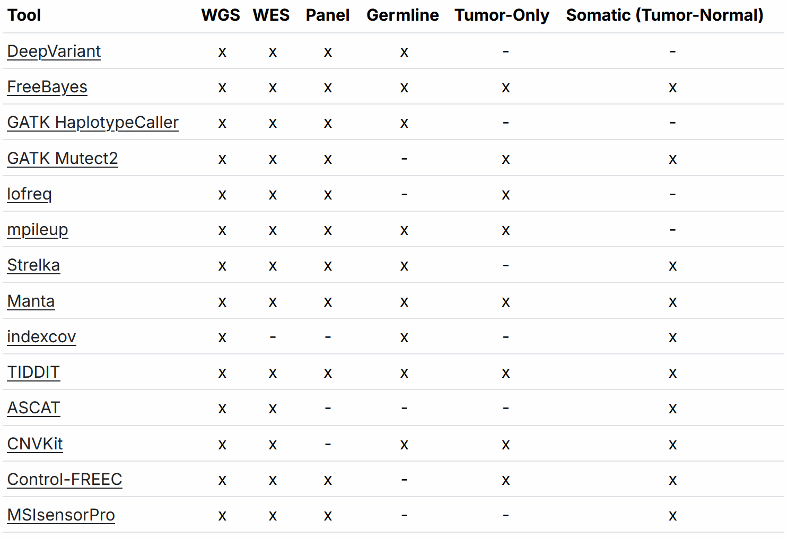

[8]:(https://nf-co.re/sarek/3.5.1/docs/usage/#which-variant-calling-tool-is-implemented-for-which-data-type)

----

### How to use this table? 
- Pick at least one tool for detecting each of SNPs/indels, structural variants, and copy-number. 

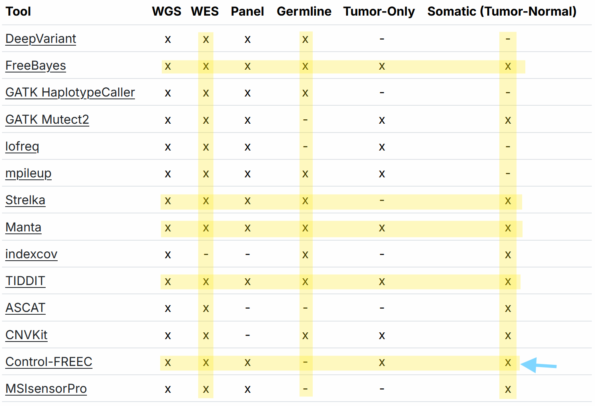
