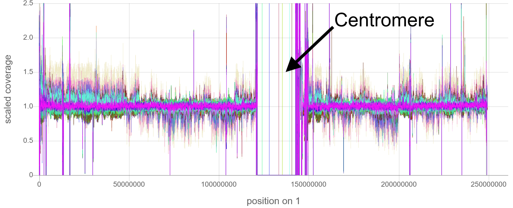
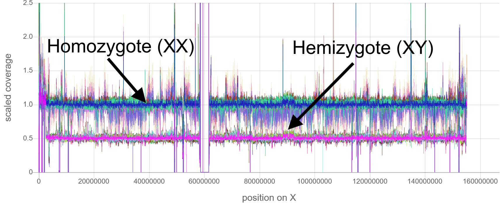
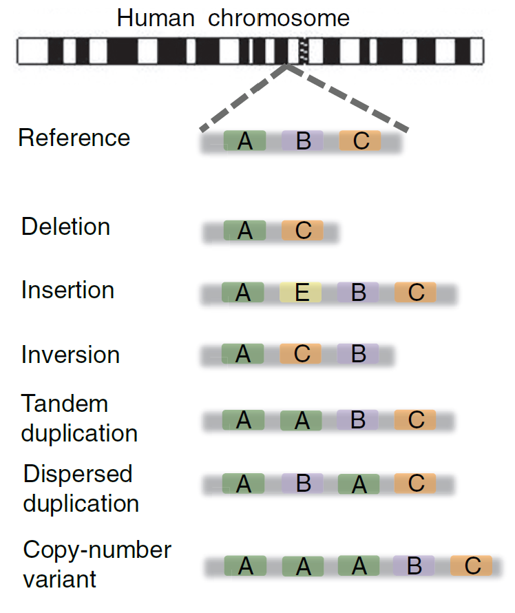
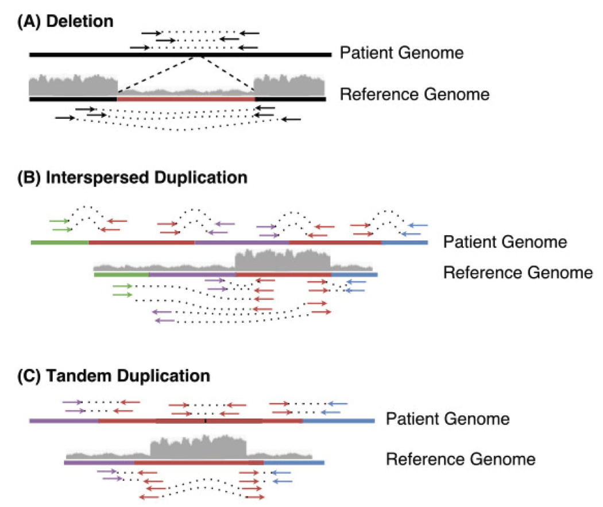
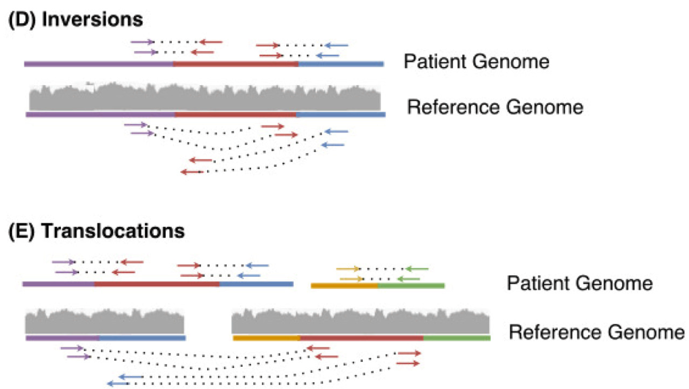
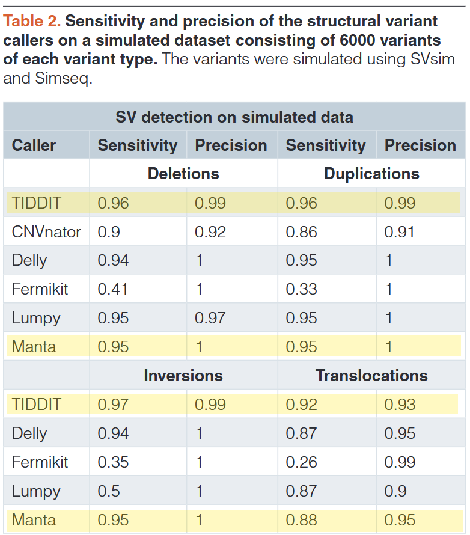
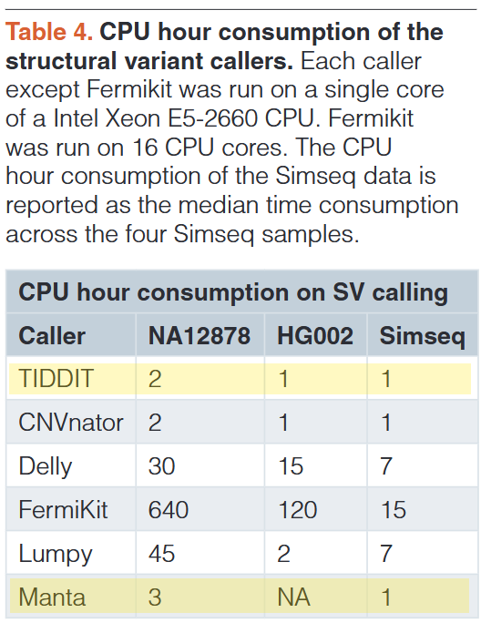
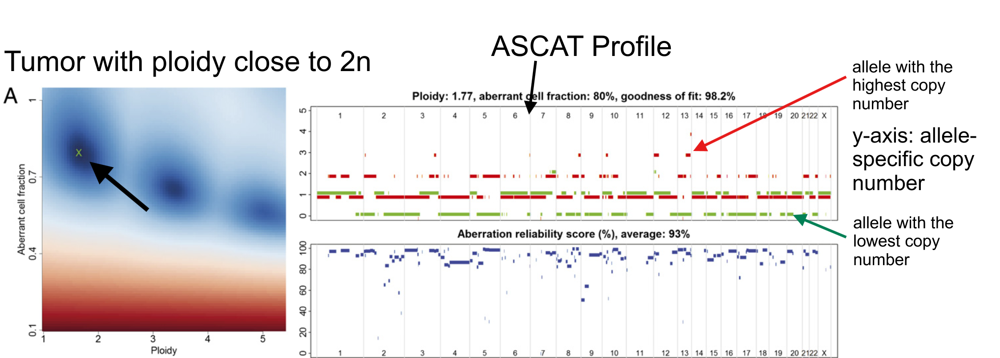
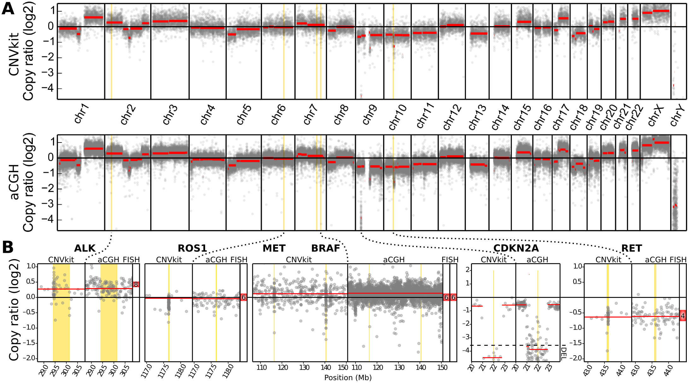
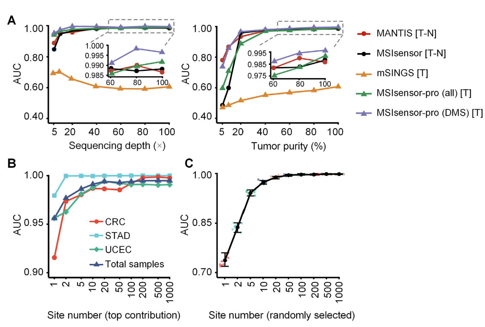

# Module 9: Variant Calling and Annotation (Part 2)

----

## Key Concepts
- Variant Calling
- Variant Annotation
- Types of input and output files
- Databases for clinical variants

----
<main id="main" style="display: flex; border: 1px; padding: 1px;">

<left style="flex: 0.6; padding-right: 1px;background-color:rgb(255, 255, 255); font-size:20pt" markdown="span">

## Variant Calling: Structural Variants
### Tool: Indexcov [1]

</left>
<right id="col_right" style="flex: 0.4; padding-left: 1px;background-color:rgb(255, 255, 255);font-size:20pt" markdown="span">

</right>
</main>

- Quickly estimate coverage from a **WGS** bam or cram index.
- A long stretch with values of 1.5 would be a heterozygous duplication. 

<main id="main" style="display: flex; border: 1px; padding: 1px;">

<left style="flex: 0.5; padding-right: 1px;background-color:rgb(255, 255, 255); font-size:20pt" markdown="span">

</left>
<right id="col_right" style="flex: 0.5; padding-left: 1px;background-color:rgb(255, 255, 255);font-size:20pt" markdown="span">

</right>
</main>

[1]:(https://doi.org/doi:10.1093/bioinformatics/btv710) "Chen, Xiaoyu et al. “Manta: rapid detection of structural variants and indels for germline and cancer sequencing applications.” Bioinformatics (Oxford, England) vol. 32,8 (2016): 1220-2."

----

<main id="main" style="display: flex; border: 1px; padding: 1px;">

<left style="flex: 0.6; padding-right: 1px;background-color:rgb(255, 255, 255); font-size:20pt" markdown="span">

## Variant Calling: Structural Variants
### Tool: Indexcov [1]

</left>
<right id="col_right" style="flex: 0.4; padding-left: 1px;background-color:rgb(255, 255, 255);font-size:20pt" markdown="span">

</right>
</main>

<tb id="tb" style="background-color:rgb(255, 255, 255);font-size:18pt" markdown="span">

|            |                                   Description                                                                                                   |
|---------------------------|----------------------------------------------------------------------------------------------------------------------------------------------------|
| **Purpose**               | Quickly estimates genome-wide coverage using BAM file index data.                                                                                 |
| **Usage**                 | Identifies regions with abnormal coverage levels, flagging potential large deletions, duplications, or aneuploidies.                                |
| **Key Feature**           | Provides a fast QC overview of structural changes without full-scale variant calling.                                                              |
| **Assumptions/Limitations** | Assumes that index data accurately reflects read depth; cannot detect balanced rearrangements or provide detailed breakpoint information.         |

</tb>

----

## Variant Calling: Structural Variants

### Tool: Manta[2]

<tb id="tb" style="background-color:rgb(255, 255, 255);font-size:18pt" markdown="span">

|          | Description                                                                                                                                       |
|---------------------------|-------------------------------------------------------------------------------------------------------------------------------------------------------|
| **Purpose**               | Detects a variety of SVs, including deletions, insertions, inversions, and translocations.                                                           |
| **Usage**                 | - Joint analysis of small sets of diploid individuals (where 'small' means family-scale <10 samples)   - Subtractive analysis of a matched tumor/normal sample pair   - Analysis of an individual tumor sample |
| **Key Feature**           | High sensitivity and specificity; suitable for clinical diagnostics and research.                                                                   |

</tb>

----

<main id="main" style="display: flex; border: 1px; padding: 1px;">

<left style="flex: 0.65; padding-right: 1px;background-color:rgb(255, 255, 255); font-size:22pt" markdown="span">

## Variant Calling: Structural Variants

### Tool: Manta[2]

**Assumptions/Limitations**: Cannot detect 
- small inversions (<200bp), 
-  fully-assembled large insertions > 2 x read-pair fragment size, 
- dispersed duplications 

Does not support mate-pair libraries from public 
data sets

</left>
<right id="col_right" style="flex: 0.4; padding-left: 1px;background-color:rgb(255, 255, 255);font-size:20pt" markdown="span">

</right>
</main>

[2]:(https://doi.org/10.1038/nmeth.1858) "Baker, M. Structural variation: the genome's hidden architecture. Nat Methods 9, 133–137 (2012)." 

----

## Variant Calling: Structural Variants

### Tool: TIDDIT[3]

- Detects many structural variants

<main id="main" style="display: flex; border: 1px; padding: 1px;">

<left style="flex: 0.5; padding-right: 1px;background-color:rgb(255, 255, 255); font-size:22pt" markdown="span">

</left>

<right id="col_right" style="flex: 0.5; padding-left: 1px;background-color:rgb(255, 255, 255);font-size:20pt" markdown="span">

</right>
</main>

[3]:(https://doi.org/10.12688/f1000research.11168.2) "Eisfeldt J, Vezzi F, Olason P, Nilsson D, Lindstrand A. TIDDIT, an efficient and comprehensive structural variant caller for massive parallel sequencing data. F1000Res. 2017 May 10;6:664. doi: . PMID: 28781756; PMCID: PMC5521161."

----

## Variant Calling: Structural Variants

### Tool: TIDDIT[3]

<tb id="tb" style="background-color:rgb(255, 255, 255);font-size:18pt" markdown="span">

|              | Description                                                                                                                                                      |
|---------------------------|-----------------------------------------------------------------------------------------------------------------------------------------------------------------|
| **Usage**                 | - Uses discordant pairs and split reads to detect the genomic location of structural variants   - Uses the read depth information for classification and quality assessment of the variants                              |
| **Key Feature**           |- Distributed with a database functionality SVDB (Structural Variant DataBase) to create structural variant frequency databases   - Uses SVDB to call and evaluate rare disease causing structural variants                                               |
| **Assumptions/Limitations** | Does **not** perform well on **small variants** but performs really well on **large variants**, especially **balanced variants** (translocations) |

</tb>

----

## Variant Calling: Structural Variants

### Tool: TIDDIT[3]

<main id="main" style="display: flex; border: 1px; padding: 1px;">

<left style="flex: 0.5; padding-right: 1px;background-color:rgb(255, 255, 255); font-size:22pt" markdown="span">

</left>
<right id="col_right" style="flex: 0.5; padding-left: 1px;background-color:rgb(255, 255, 255);font-size:20pt" markdown="span">

</right>
</main>

----

## Variant Calling: Copy Number Variation (CNV)

### Tool: ASCAT[4]

<tb id="tb" style="background-color:rgb(255, 255, 255);font-size:18pt" markdown="span">

|           | Description                                                                                                                                                      |
|---------------------------|------------------------------------------------------------------------------------------------------------------------------------------------------------------|
| **Purpose**               | Allele-specific copy number analysis of tumors from WGS, WES, and TGS                                                                                                             |
| **How**                 | Uses allele-specific frequencies to estimate copy number changes while accounting for tumor purity and ploidy in complex tumor genomes.                              |
| **Key Feature**           | Profiles tumor ploidy, non-aberrant cell admixture, and frequency of gains, losses, LOH, and copy number-neutral events in heteregeneous tumor samples.                                                                              |
| **Assumptions/Limitations** | - Assumes availability of high-quality SNP data and matched normal samples   - May be less reliable with low tumor purity or highly rearranged genomes.             |

</tb>

----

## Variant Calling: Copy Number Variation (CNV)

### Tool: ASCAT[4]

- The position of the green cross is selected based on the basis of the goodness of fit--for the estimation of ploidy of the tumor cells.

[4]:(https://doi.org/10.1093/bioinformatics/btaa538) "Ross, Edith M et al. “Allele-specific multi-sample copy number segmentation in ASCAT.” Bioinformatics (Oxford, England) vol. 37,13 (2021): 1909-1911." 

----

## Variant Calling: Copy Number Variation (CNV)

### Tool: CNVKit

<tb id="tb" style="background-color:rgb(255, 255, 255);font-size:18pt" markdown="span">

|              | Description                                                                                                                                                         |
|---------------------------|----------------------------------------------------------------------------------------------------------------------------------------------------------------------|
| **Purpose**               | Detects copy number variations from targeted sequencing data (exomes, gene panels).                                                                                 |
| **How**                 | - Combines on-target and off-target read data to create CN profiles   - Correct for biases in sequencing read depth: GC content, target footprint size and spacing, and repetitive sequences.      |
| **Key Feature**           | Optimized for germline copy number variants (CNVs) and somatic copy number alterations  (SCNAs) in WES and TGS                                                                                         |
| **Assumptions/Limitations** | - Assumes that off-target reads provide sufficient coverage   - May be sensitive to capture biases and not as robust when applied to whole-genome data without modifications. |

</tb>

----

## Variant Calling: Copy Number Variation (CNV)

### Tool: CNVKit

----

## Variant Calling: Copy Number Variation (CNV)

### Tool: Control-FREEC

<tb id="tb" style="background-color:rgb(255, 255, 255);font-size:18pt" markdown="span">

|              | Description                                                                                                                            |
|---------------------------|-----------------------------------------------------------------------------------------------------------------------------------------------------------------------------|
| **Purpose**               | Detects CNVs and allelic imbalances from whole-genome or exome sequencing data.                                                                                            |
| **How**                 | Normalizes read depth (accounting for GC-content) and segments the genome.                                            |
| **Key Feature**           | You can use this with or without a matched normal sample                                                                                   |
| **Assumptions/Limitations** | - Assumes that read depth variations correlate with copy number changes   - May struggle in regions with extreme GC content or highly repetitive sequences.                     |

</tb>

----

## Variant Calling: Microsatellite Instability

### Tool: MSIsensorPro

- MSI is a molecular marker for DNA mismatch repair (MMR) defects, which can lead to cancer    

<tb id="tb" style="background-color:rgb(255, 255, 255);font-size:16pt" markdown="span">

|            | Description                                                                                                                                                                   |
|--------------------------|--------------------------------------------------------------------------------------------------------------------------------------------------------------------------------------|
| **Purpose**              | Detects microsatellite instability (MSI) by comparing microsatellite regions between tumor and normal samples.                                                                |
| **How**                | Analyzes repeat length distributions at defined microsatellite loci to compute an MSI score that reflects the level of instability.                                                   |
| **Key Feature**          | Provides a sensitive and specific measure of MSI status                                                                             |
| **Assumptions/Limitations** | - Assumes sufficient coverage at microsatellite loci and availability of matched normal data (or a reliable reference)   - Sensitivity may be impacted by sequencing quality. |

</tb>

----

## Variant Calling: Microsatellite Instability

### Tool: MSIsensorPro

----

## Variant Annotation Tools

<tb id="tb" style="background-color:rgb(255, 255, 255);font-size:16pt" markdown="span">

| | **snpEff**                                                                                         | **VEP (Variant Effect Predictor)**                                                                                                                                         | **bcftools**                                                                                         |
|--------------|----------------------------------------------------------------------------------------------------|----------------------------------------------------------------------------------------------------------------------------------------------------------------------------|------------------------------------------------------------------------------------------------------|
| **Purpose**  | Predicts variant effects (e.g., missense, nonsense, frameshift) on genes.                          | Provides comprehensive variant annotations using Ensembl data.                                                                                                           | Primarily a variant processing tool that also offers basic annotation capabilities.                   |
| **Features** | Uses pre-built databases for many organisms; highly configurable for custom annotations.           | Annotates variants with gene, transcript, and regulatory information; integrates population frequency data and supports custom plugins.                                  | Can add custom INFO tags and combine external annotations to VCF files.                              |
| **Usage**    | Ideal for quick, high-throughput annotation of SNPs and small indels.                              | Suitable when extensive, detailed annotation is required and integration with Ensembl resources is desired.                                                                | Useful for post-calling processing and integrating annotations from other tools into your workflow.  |

</tb>

----

## Variant Calling: File Types

### PON (Panel of Normals)
  - Aggregated file (often in VCF format) created from multiple normal samples 
  - Used in somatic variant calling to filter out false positives by comparing tumor data against a baseline.
  - Improves specificity by removing systematic errors.
  - **Limitations:** Quality depends on the number and quality of normal samples; may not capture all artifacts.

----

## Variant Calling and Annotation: File Types

<tb id="tb" style="background-color:rgb(255, 255, 255);font-size:16pt" markdown="span">

| **Property**           | **VCF (Variant Call Format)**                                                                                                  | **MAF (Mutation Annotation Format)**                                                                                                     |
|------------------------|---------------------------------------------------------------------------------------------------------------------------------|-------------------------------------------------------------------------------------------------------------------------------------------|
| **Description**        | Text-based format for storing variant calls.                                                                                  | Tab-delimited format, commonly used in cancer genomics.                                                                                  |
| **Key Fields / Features** | CHROM, POS, ID, REF, ALT, QUAL, FILTER, INFO, FORMAT.                                                                          | Contains curated annotations (e.g., gene name, variant classification, sample-specific details).                                          |
| **Usage**              | Widely used for both germline and somatic variant calls.                                                                       | Ideal for generating human-readable, standardized reports of somatic mutations.                                                           |
| **Strengths**          | Extensible with custom annotations; standard format in many pipelines.                                                          | Focused on detailed mutation annotation; facilitates downstream interpretation.                                                         |
| **Limitations**        | Can become large with extensive annotations; requires proper indexing for efficient querying.                                  | Less common for germline variants; may need conversion from VCF.                                                                          |

</tb>

----

## File Types in Variant Calling and Annotation

  - **Alignment Files (BAM/CRAM):** For mapping reads and ensuring quality alignments.
    - BAM is standard but large; CRAM offers better compression.
  - **Variant Files (VCF/MAF):** For storing and interpreting variant calls.
    - VCF and MAF provide variant-level annotations with MAF offering more cancer-specific details.
  - **PON:** For filtering out recurrent artifacts, especially in somatic pipelines.

----

## Variant Databases

<tb id="tb" style="background-color:rgb(255, 255, 255);font-size:16pt" markdown="span">

|         | **gnomAD**                                                                                                     |
|-----------------------|----------------------------------------------------------------------------------------------------------------|
| **Description**       | Aggregates large-scale exome and genome sequencing data from diverse populations.                              |
| **Purpose**           | Provides allele frequency data to distinguish common variants from rare variants.                              |
| **Usage**             | Used for filtering variants based on population frequency; supports studies in population genetics and variant prioritization. |
| **Key Points**        | - Extensive dataset with rigorous quality filters.  - Continuously updated with diverse sample representation. |
| **Limitations**       | - Lacks detailed clinical annotation.  - May not capture all sub-population specific variants.              |

</tb>

----

## Variant Databases

<tb id="tb" style="background-color:rgb(255, 255, 255);font-size:16pt" markdown="span">

|        | **ClinVar**                                                                                                   |
|-----------------------|----------------------------------------------------------------------------------------------------------------|
| **Description**       | A public archive aggregating information about the relationships between human variants and phenotypes.        |
| **Purpose**           | Provides clinical significance and supporting evidence for genetic variants.                                 |
| **Usage**             | Essential for clinical interpretation; used to assess variant pathogenicity and inform diagnostics.            |
| **Key Points**        | - Curated submissions from clinical laboratories and research groups.  - Integrates multiple clinical assertions and evidence. |
| **Limitations**       | - May contain conflicting interpretations.  - Focused primarily on clinically relevant variants.           |

</tb>

----

## Variant Databases

<tb id="tb" style="background-color:rgb(255, 255, 255);font-size:16pt" markdown="span">

|        | **dbGaP (Database of Genotypes and Phenotypes)**                                                              |
|-----------------------|----------------------------------------------------------------------------------------------------------------|
| **Description**       | A controlled-access repository for genotype and phenotype data from a wide array of studies.                     |
| **Purpose**           | Facilitates research by providing access to raw and processed genomic and phenotypic data.                        |
| **Usage**             | Used for large-scale genomic studies, variant-disease association research, and validation of genetic findings.   |
| **Key Points**        | - Contains data from diverse study cohorts.  - Access is governed by ethical and legal restrictions.         |
| **Limitations**       | - Data access is restricted and may require approval.  - May require additional processing and harmonization.  |

</tb>