

# Module 9: Somatic Variants

----

----

## Choosing Variant Caller by Algorithm

<tb id="tb" style="background-color:rgb(255, 255, 255);font-size:16pt" markdown="span">

| **Approach / Type**                                | **Pros**                                                                                                                                                                           | **Cons**                                                                                                                                                                                                  |
|----------------------------------------------------|--------------------------------------------------------------------------------------------------------------------------------------------------------------------------------------|------------------------------------------------------------------------------------------------------------------------------------------------------------------------------------------------------------|
| **Local Reassembly-Based** (e.g., GATK HaplotypeCaller, Mutect2, FreeBayes, Strelka) | - Higher accuracy in complex regions (indels, multi-allelic sites) - Reduced false positives via local haplotype reconstruction - Strong community support and documentation | - Computationally heavy (higher CPU/RAM) - Longer runtime due to local assembly - More parameters to tune                                                                                           |
| **Pileup-Based** (e.g., bcftools, LoFreq)       | - Faster and more lightweight - Simpler, straightforward implementation - Flexible (some specialize in low-frequency detection)                                               | - May struggle with large indels or repetitive regions - Limited contextual insight (no local reassembly) - Can require careful threshold tuning in complex or high-coverage datasets             |

</tb>

----

## Choosing Variant Caller by Algorithm

<tb id="tb" style="background-color:rgb(255, 255, 255);font-size:16pt" markdown="span">

| **Approach / Type**                                | **Pros**                                                                                                                                                                           | **Cons**                                                                                                                                                                                                  |
|----------------------------------------------------|--------------------------------------------------------------------------------------------------------------------------------------------------------------------------------------|------------------------------------------------------------------------------------------------------------------------------------------------------------------------------------------------------------|
| **Deep Learning-Based** (e.g., DeepVariant)     | - High accuracy due to complex pattern recognition - Adaptable to multiple sequencing platforms (Illumina, PacBio, ONT) - Rapidly evolving with potential for further gains    | - Resource-intensive (GPU/CPU for training/inference) - Dependent on quality and representativeness of training data - More complex setup (ML frameworks, dependencies)                             |
| **Commercial Solutions** (e.g., Sentieon)       | - Often faster with lower memory usage vs. open-source references - Paid support and regular updates (useful in clinical/regulatory settings) - Deterministic, reproducible runs | - License fees and usage restrictions - Closed-source (limited transparency/customization) - Community support may be smaller or tied to vendor                                                    |

</tb>

----

## Germline Variant Calling

<tb id="tb" style="background-color:rgb(255, 255, 255);font-size:14pt" markdown="span">

| **Germline \ Approach**   | **Local Reassembly-Based**                                                                                                               | **Pileup-Based**                                                    | **Deep Learning**                                          | **Commercial Solutions**                                               |
|---------------------------|-------------------------------------------------------------------------------------------------------------------------------------------|---------------------------------------------------------------------|------------------------------------------------------------|------------------------------------------------------------------------|
| **Tools**                | - GATK **HaplotypeCaller** - **FreeBayes**                                                                                             | - **bcftools**                                                      | - **DeepVariant**                                           | - **Sentieon DNAscope** - **Sentieon Haplotyper**                   |
| **Data Type**            | - Mostly short-read Illumina - FreeBayes can handle some long-read with tuning - Single-sample or cohort                            | - Primarily short-read Illumina - Single or multi-sample         | - Short or long reads (separate models) - Typically single-sample   | - Mostly short-read Illumina - Single or multi-sample                |
| **Resources**            | - Moderate/high CPU & RAM (HaplotypeCaller tends to be heavier)                                                                         | - Lightweight, fast execution                                       | - Requires GPU or multi-CPU for best performance                     | - Optimized for speed & lower RAM than GATK                          |
| **License**              | - GATK: free for academic (commercial restrictions) - FreeBayes: open-source (MIT)                                                     | - bcftools: open-source (MIT/BSD)                                    | - DeepVariant: open-source (Apache 2.0)                               | - Sentieon: commercial (paid license)                                   |

</tb>

----

## Somatic Variant Calling

<tb id="tb" style="background-color:rgb(255, 255, 255);font-size:14pt" markdown="span">

| **Somatic \ Approach**   | **Local Reassembly-Based**                                                                                                  | **Pileup-Based**                                              | **Commercial Solutions**                                  |
|--------------------------|------------------------------------------------------------------------------------------------------------------------------|----------------------------------------------------------------|-----------------------------------------------------------|
| **Tools**               | - GATK **Mutect2** - **Strelka** (somatic mode)                                                                           | - **bcftools** (less common) - **LoFreq** (also somatic)    | **Sentieon TNScope**      |
| **Data Type**           | - Short-read Illumina - Typically tumor-normal pair (Strelka can do tumor-only in some modes)                             | - Short-read Illumina - LoFreq also good for low-freq somatic  | - Short-read Illumina, tumor-normal                       |
| **Resources**           | - Mutect2: moderate/high CPU - Strelka: relatively fast                                                                    | - bcftools: lightweight - LoFreq: moderate resource use      | - Faster than Mutect2, lower RAM usage                    |
| **License**             | - GATK: free for academic use (commercial restrictions may apply) - Strelka: open source (BSD)                            | - bcftools: open source - LoFreq: open source (BSD)          | - Sentieon: commercial (paid license)                     |

</tb>

**Note**: LoFreq is often used for low-frequency somatic variants, but it can also be applied in standard somatic calling.

----

## Low Frequency Variant Calling

<tb id="tb" style="background-color:rgb(255, 255, 255);font-size:16pt" markdown="span">

| **Low-Frequency \ Approach** | **Local Reassembly-Based**                                                   | **Pileup-Based**                                  |
|------------------------------|-------------------------------------------------------------------------------|---------------------------------------------------|
| **Tools**                    | - GATK **Mutect2** (subclonal detection) - **Strelka** (supports low VAF)  | - **LoFreq** (optimized for rare alleles)         |
| **Data Type**                | - Short-read Illumina - High coverage for subclonal detection             | - Short-read Illumina - Viral or subclonal     |
| **Resources**                | - Similar to general somatic calling - Higher coverage requires more CPU/Time | - Moderate resource usage; scales with coverage  |
| **License**                  | - GATK: free for academic - Strelka: open source (BSD)                    | - LoFreq: open source (BSD)                       |

</tb>

----

----
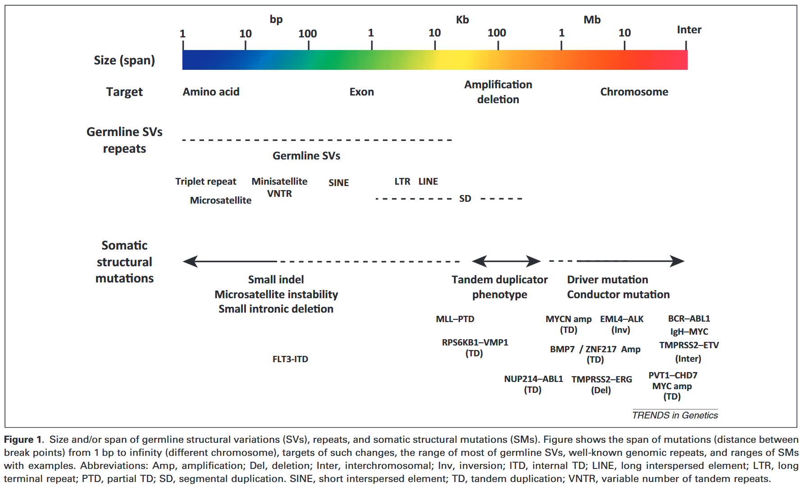

Source: Inaki, K. & Liu, E. T. Structural mutations in cancer: mechanistic and functional insights. Trends in Genetics 28, 550-559 (2012). <https://doi.org/https://doi.org/10.1016/j.tig.2012.07.002>

Furthermore, the span distributions of the intrachromosomal events (i.e., distance between two break points) of SVs and SMs are different, in that normal SVs have smaller span lengths than do cancer SMs.
Some of the normal small SVs ranging up to
10 kb are thought to be caused by recombination at repeats in the genome, such as long interspersed elements (LINEs) and short interspersed elements (SINEs).

Source: Campbell, P.J. et al. (2008) Identification of somatically acquired
rearrangements in cancer using genome-wide massively parallel paired-end sequencing. Nat. Genet. 40, 722–729

----
A comparison of the number of SMs and germline structural variants (SVs) in healthy cells revealed that most deletions, inversions, and insertions are germline SVs. By contrast, cancer cells are marked by an overrepresentation of TDs, unpaired inversions, and translocations.
Source: Hillmer, A.M. et al. (2011) Comprehensive long-span paired-end-tag mapping reveals characteristic patterns of structural variations in epithelial cancer genomes. Genome Res. 21, 665–675

----

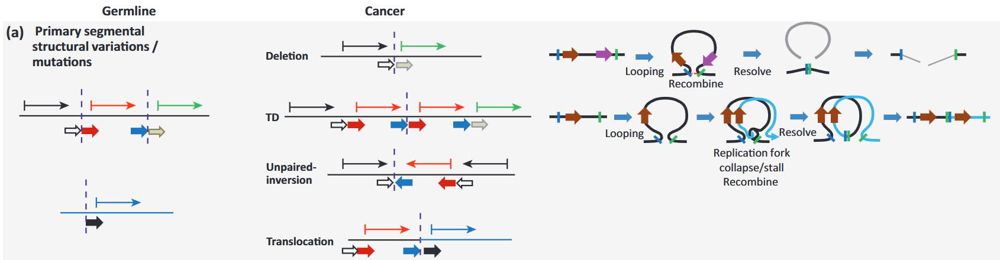

Source: Inaki, K. & Liu, E. T. Structural mutations in cancer: mechanistic and functional insights. Trends in Genetics 28, 550-559 (2012). <https://doi.org/https://doi.org/10.1016/j.tig.2012.07.002>

----

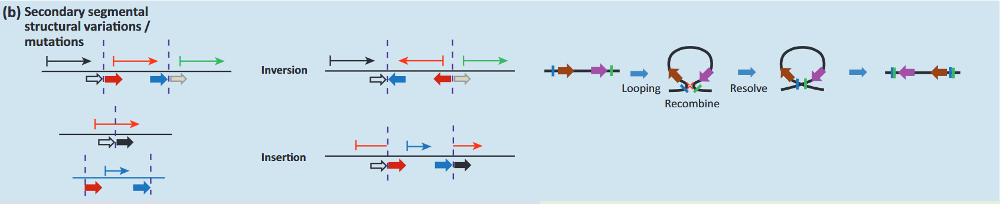

----

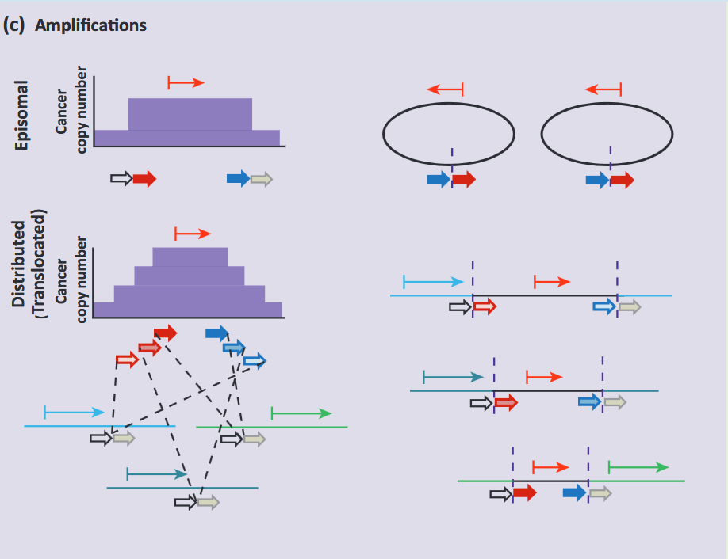

----

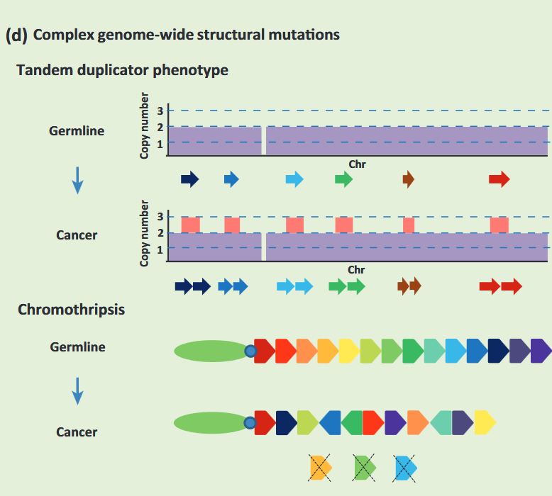

Source: Yi and Ju Experimental & Molecular Medicine (2018) 50:98 DOI 10.1038/s12276-018-0112-3

----
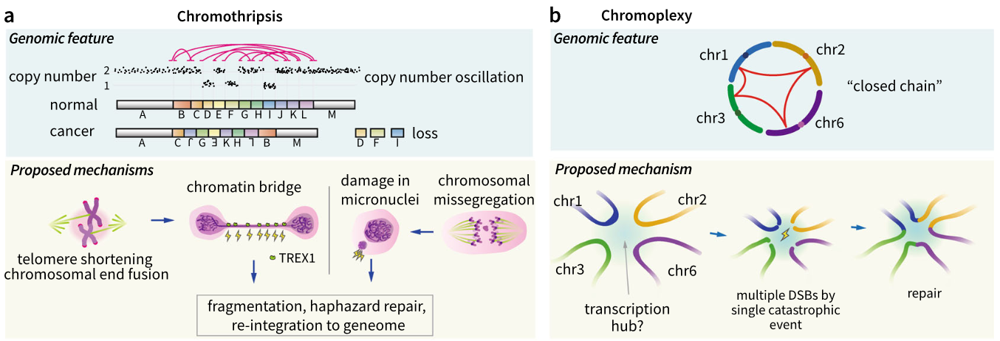

Source: Yi and Ju Experimental & Molecular Medicine (2018) 50:98 DOI 10.1038/s12276-018-0112-3

----

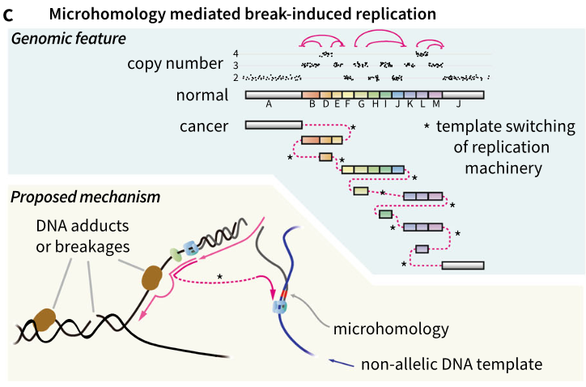

Source: Yi and Ju Experimental & Molecular Medicine (2018) 50:98 DOI 10.1038/s12276-018-0112-3

----

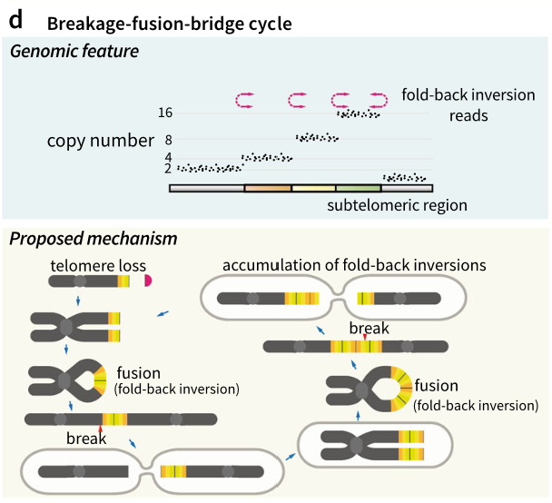

Source: Yi and Ju Experimental & Molecular Medicine (2018) 50:98 DOI 10.1038/s12276-018-0112-3

----
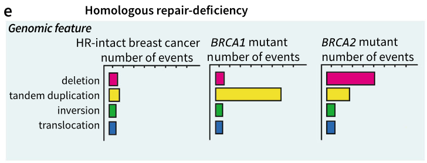

Source: Yi and Ju Experimental & Molecular Medicine (2018) 50:98 DOI 10.1038/s12276-018-0112-3
----

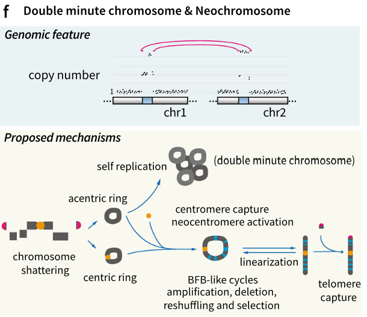

Source: Yi and Ju Experimental & Molecular Medicine (2018) 50:98 DOI 10.1038/s12276-018-0112-3

----

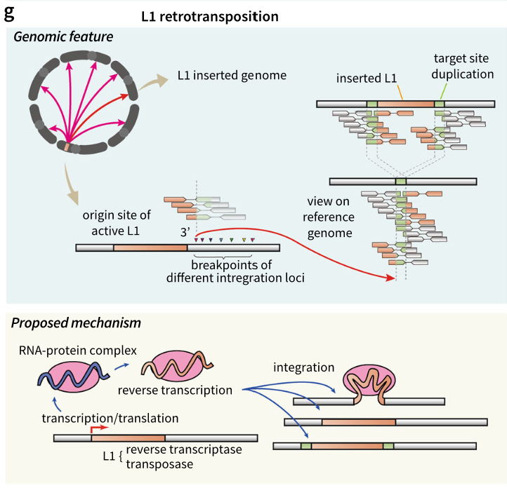

Source: Yi and Ju Experimental & Molecular Medicine (2018) 50:98 DOI 10.1038/s12276-018-0112-3

----

Source: Yi and Ju Experimental & Molecular Medicine (2018) 50:98 DOI 10.1038/s12276-018-0112-3 

----

Towards an evidence-based process
for the clinical interpretation of copy number
variation

----

----

Figure 1. Size and/or span of germline structural variations (SVs), repeats, and somatic structural mutations (SMs). Figure shows the span of mutations (distance between break points) from 1 bp to infinity (different chromosome), targets of such changes, the range of most of germline SVs, well-known genomic repeats, and ranges of SMs
with examples.

Source: Inaki, K. & Liu, E. T. Structural mutations in cancer: mechanistic and functional insights. Trends in Genetics 28, 550-559 (2012). <https://doi.org/https://doi.org/10.1016/j.tig.2012.07.002>

Quality control Sequence Quality
 GC Content
 Overrepresented sequences (K-mers)
 Duplicates
 Tools: fastQC, DupRadar, Picard, Qualimap, RSeqC, samtools

Applications Alternative splicing events
 Structural variant detection
Variable expression of polygenic diseases Gene-environment interactions
 Epigenetics in complex diseases

 --
QC screenshots

 https://nf-co.re/eager/2.4.1/docs/output